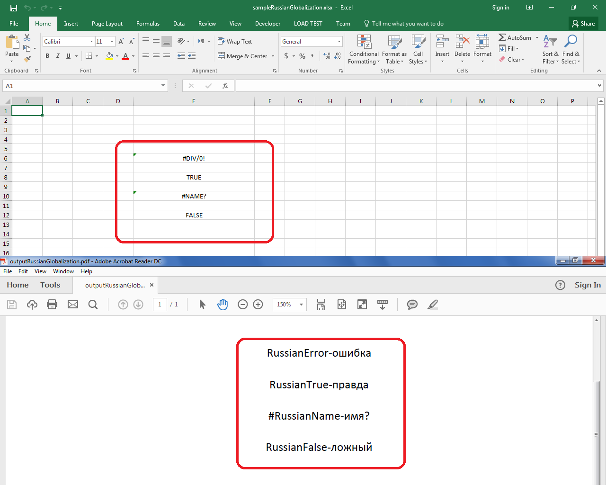

## **Possible Usage Scenarios**

If you are using Microsoft Excel in Russian Locale or Language or any other Locale or Language, it will display Errors and Boolean values according to that Locale or Language. You can achieve a similar behavior using Aspose.Cells for JavaScript via C++ by using the [**WorkbookSettings.globalizationSettings**](https://reference.aspose.com/cells/javascript-cpp/workbooksettings/#globalizationSettings--) property. You will have to override the following methods of the [**GlobalizationSettings**](https://reference.aspose.com/cells/javascript-cpp/globalizationsettings) class.

- [**GlobalizationSettings.errorValueString(string)**](https://reference.aspose.com/cells/javascript-cpp/globalizationsettings/#errorValueString-string-)
- [**GlobalizationSettings.booleanValueString(boolean)**](https://reference.aspose.com/cells/javascript-cpp/globalizationsettings/#booleanValueString-boolean-)

## **Implement Errors and Boolean Value in Russian or Any Other Language**

The following sample code illustrates how to implement Errors and Boolean Value in Russian or Any Other Language. Please check the [Sample Excel File](73990159.xlsx) used in this code and its [Output PDF](73990160.pdf). The screenshot shows the difference between Sample Excel File and the Output PDF for a reference.



## **Sample Code**

```html
<!DOCTYPE html>
<html>
    <head>
        <title>Aspose.Cells Example</title>
        <meta charset="utf-8" />
        <style>
            body { font-family: Arial, sans-serif; margin: 20px; }
            #downloadLink { display: none; margin-top: 10px; display: inline-block; }
            #result p { margin: 8px 0; }
        </style>
    </head>
    <body>
        <h1>Russian Globalization Example</h1>
        <input type="file" id="fileInput" accept=".xls,.xlsx" />
        <button id="runExample">Run Example</button>
        <a id="downloadLink">Download Result</a>
        <div id="result"></div>
    </body>

    <script src="aspose.cells.js.min.js"></script>
    <script type="text/javascript">
        const { Workbook, SaveFormat } = AsposeCells;

        AsposeCells.onReady({
            license: "/lic/aspose.cells.enc",
            fontPath: "/fonts/",
            fontList: [
                "arial.ttf",
                "NotoSansSC-Regular.ttf"
            ]
        }).then(() => {
            console.log("Aspose.Cells initialized");
        });

        // Russian Globalization
        class RussianGlobalization extends AsposeCells.GlobalizationSettings {
            errorValueString(err) {
                switch (err.toUpperCase()) {
                    case "#NAME?":
                        return "#RussianName-имя?";
                }
                return "RussianError-ошибка";
            }

            booleanValueString(bv) {
                return bv ? "RussianTrue-правда" : "RussianFalse-ложный";
            }
        }

        document.getElementById('runExample').addEventListener('click', async () => {
            const fileInput = document.getElementById('fileInput');
            const resultDiv = document.getElementById('result');
            resultDiv.innerHTML = '';

            if (!fileInput.files.length) {
                resultDiv.innerHTML = '<p style="color: red;">Please select an Excel file.</p>';
                return;
            }

            const file = fileInput.files[0];
            const arrayBuffer = await file.arrayBuffer();

            // Load the source workbook
            const workbook = new Workbook(new Uint8Array(arrayBuffer));

            // Set GlobalizationSettings in Russian Language
            workbook.settings.globalizationSettings = new RussianGlobalization();

            // Calculate the formula
            workbook.calculateFormula();

            // Save the workbook in pdf format
            const outputData = workbook.save(SaveFormat.Pdf);
            const blob = new Blob([outputData], { type: 'application/pdf' });
            const downloadLink = document.getElementById('downloadLink');
            downloadLink.href = URL.createObjectURL(blob);
            downloadLink.download = 'outputRussianGlobalization.pdf';
            downloadLink.style.display = 'inline-block';
            downloadLink.textContent = 'Download PDF File';

            resultDiv.innerHTML = '<p style="color: green;">Operation completed successfully! Click the download link to get the PDF.</p>';
        });
    </script>
</html>
```