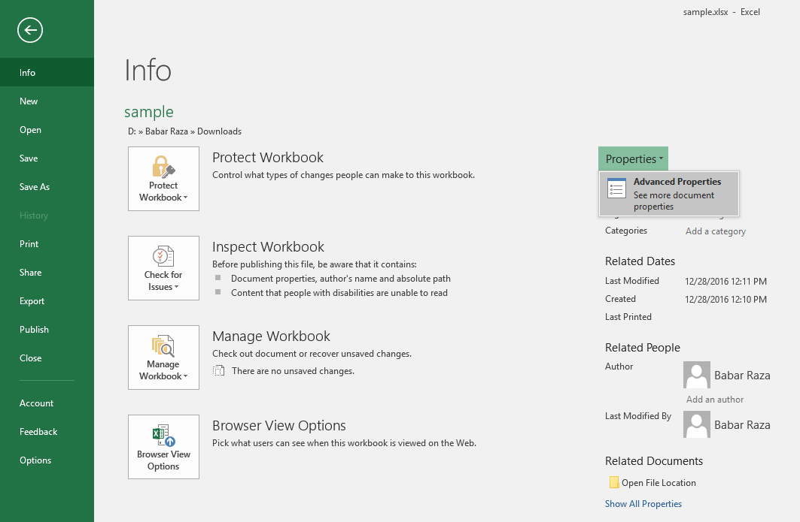

## **Introduction**

Microsoft Excel provides the ability to add properties to spreadsheet files. These document properties provide useful information and are divided into two categories as detailed below.

- System-defined (built‑in) properties: Built‑in properties contain general information about the document such as the document title, author name, document statistics, and so on.
- User-defined (custom) properties: Custom properties are defined by the end user in the form of a name‑value pair.

{}

The most important point to know about built‑in and custom properties is that built‑in properties can be accessed and modified, but not created or removed. However, custom properties can be created and managed.

{}

## **How to Manage Document Properties Using Microsoft Excel**

Microsoft Excel allows you to manage the document properties of the Excel files in a WYSIWYG manner. Please follow the below steps to open the **Properties** dialog in Excel 2016.

1. From the **File** menu, select **Info**.

|**Selecting Info Menu**|
| :- |
||
2. Click on the **Properties** heading and select **Advanced Properties**.

|**Clicking Advanced Properties Selection**|
| :- |
||
3. Manage the file's document properties.

|**Properties Dialog**|
| :- |
||
In the Properties dialog, there are different tabs, such as General, Summary, Statistics, Contents, and **Custom**. Each tab helps configure different kinds of information related to the file. The Custom tab is used to manage custom properties.

## **How to Work with Document Properties Using Aspose.Cells**

Developers can dynamically manage the document properties using the Aspose.Cells APIs. This feature helps developers store useful information along with the file, such as when the file was received, processed, time‑stamped, and so on.

{}

Aspose.Cells for JavaScript via C++ directly writes the information about API and version number in output documents. For example, upon rendering a document to PDF, Aspose.Cells for JavaScript via C++ populates the **Application** field with the value *Aspose.Cells* and the **PDF Producer** field with the value, e.g., *Aspose.Cells v17.9*.

Please note that you cannot instruct Aspose.Cells for JavaScript via C++ to change or remove this information from output documents.

{}

### **How to Access Document Properties**

Aspose.Cells APIs support both types of document properties, built‑in and custom. Aspose.Cells' [**Workbook**](https://reference.aspose.com/cells/javascript-cpp/workbook) class represents an Excel file and, like an Excel file, the [**Workbook**](https://reference.aspose.com/cells/javascript-cpp/workbook) class can contain multiple worksheets, each represented by the [**Worksheet**](https://reference.aspose.com/cells/javascript-cpp/worksheet) class, whereas the collection of worksheets is represented by the [**WorksheetCollection**](https://reference.aspose.com/cells/javascript-cpp/worksheetcollection) class.

Use the [**WorksheetCollection**](https://reference.aspose.com/cells/javascript-cpp/worksheetcollection) to access the file's document properties as described below.

- To access built‑in document properties, use [**WorksheetCollection.builtInDocumentProperties()**](https://reference.aspose.com/cells/javascript-cpp/worksheetcollection/#builtInDocumentProperties--).
- To access custom document properties, use [**WorksheetCollection.customDocumentProperties()**](https://reference.aspose.com/cells/javascript-cpp/worksheetcollection/#customDocumentProperties--).

Both the [**WorksheetCollection.builtInDocumentProperties()**](https://reference.aspose.com/cells/javascript-cpp/worksheetcollection/#builtInDocumentProperties--) and [**WorksheetCollection.customDocumentProperties()**](https://reference.aspose.com/cells/javascript-cpp/worksheetcollection/#customDocumentProperties--) return an instance of [**Aspose.Cells.Properties.DocumentPropertyCollection**](https://reference.aspose.com/cells/javascript-cpp/documentpropertycollection/). This collection contains [**Aspose.Cells.Properties.DocumentProperty**](https://reference.aspose.com/cells/javascript-cpp/documentproperty/) objects, each of which represents a single built‑in or custom document property.

It is up to the application requirement how to access a property; that is, by using the index or name of the property from the [**DocumentPropertyCollection**](https://reference.aspose.com/cells/javascript-cpp/documentpropertycollection/) as demonstrated in the example below.

```html
<!DOCTYPE html>
<html>
    <head>
        <title>Aspose.Cells Example - Document Properties</title>
    </head>
    <body>
        <h1>Document Properties Example</h1>
        <input type="file" id="fileInput" accept=".xls,.xlsx,.csv" />
        <button id="runExample">Load Document Properties</button>
        <a id="downloadLink" style="display: none;">Download Result</a>
        <div id="result"></div>
    </body>

    <script src="aspose.cells.js.min.js"></script>
    <script type="text/javascript">
        const { Workbook, SaveFormat } = AsposeCells;
        
        AsposeCells.onReady({
            license: "/lic/aspose.cells.enc",
            fontPath: "/fonts/",
            fontList: [
                "arial.ttf",
                "NotoSansSC-Regular.ttf"
            ]
        }).then(() => {
            console.log("Aspose.Cells initialized");
        });

        document.getElementById('runExample').addEventListener('click', async () => {
            const resultEl = document.getElementById('result');
            const fileInput = document.getElementById('fileInput');
            if (!fileInput.files.length) {
                resultEl.innerHTML = '<p style="color: red;">Please select an Excel file.</p>';
                return;
            }

            const file = fileInput.files[0];
            const arrayBuffer = await file.arrayBuffer();

            // Instantiating a Workbook object and opening the Excel file
            const workbook = new Workbook(new Uint8Array(arrayBuffer));

            // Retrieve a list of all custom document properties of the Excel file
            const customProperties = workbook.customDocumentProperties;

            // Accessing a custom document property by using the property name
            const customProperty1 = customProperties.get("ContentTypeId");
            // Accessing the same custom document property by using the property index
            const customProperty2 = customProperties.get(0);

            const outputs = [];
            if (customProperty1) {
                outputs.push(`<p>${customProperty1.name} ${customProperty1.value}</p>`);
            }
            if (customProperty2) {
                outputs.push(`<p>${customProperty2.name} ${customProperty2.value}</p>`);
            }
            if (!outputs.length) {
                resultEl.innerHTML = '<p style="color: orange;">No custom document properties found.</p>';
            } else {
                resultEl.innerHTML = outputs.join('');
            }
        });
    </script>
</html>
```

The [**Aspose.Cells.Properties.DocumentProperty**](https://reference.aspose.com/cells/javascript-cpp/documentproperty/) class allows you to retrieve the name, value, and type of the document property:

- To get the property name, use [**DocumentProperty.name()**](https://reference.aspose.com/cells/javascript-cpp/documentproperty/#name--).
- To get the property value, use [**DocumentProperty.value()**](https://reference.aspose.com/cells/javascript-cpp/documentproperty/#value--). This returns the value as an object.
- To get the property type, use [**DocumentProperty.type()**](https://reference.aspose.com/cells/javascript-cpp/documentproperty/#type--). This returns one of the [**PropertyType**](https://reference.aspose.com/cells/javascript-cpp/propertytype/) enumeration values. After you obtain the property type, use one of the **DocumentProperty.ToXXX** methods to retrieve the value in the appropriate type instead of using **DocumentProperty.value()**. The **DocumentProperty.ToXXX** methods are described in the table below.

{}

The [**DocumentProperty**](https://reference.aspose.com/cells/javascript-cpp/documentproperty/) class also provides a set of methods that return the values of other data types.

{}

|**Member Name**|**Description**|**ToXXX Method**|
| :- | :- | :- |
|Boolean|The property data type is Boolean|ToBool|
|Date|The property data type is DateTime. Note that Microsoft Excel stores only <br>the date portion; no time can be stored in a custom property of this type|ToDateTime|
|Float|The property data type is Double|ToDouble|
|Number|The property data type is Int32|ToInt|
|String|The property data type is string|ToString|

```html
<!DOCTYPE html>
<html>
    <head>
        <title>Aspose.Cells Example</title>
    </head>
    <body>
        <h1>Retrieve Custom Document Properties Example</h1>
        <input type="file" id="fileInput" accept=".xls,.xlsx,.csv" />
        <button id="runExample">Run Example</button>
        <a id="downloadLink" style="display: none;">Download Result</a>
        <div id="result"></div>
    </body>

    <script src="aspose.cells.js.min.js"></script>
    <script type="text/javascript">
        const { Workbook, SaveFormat, Worksheet, Cell } = AsposeCells;
        
        AsposeCells.onReady({
            license: "/lic/aspose.cells.enc",
            fontPath: "/fonts/",
            fontList: [
                "arial.ttf",
                "NotoSansSC-Regular.ttf"
            ]
        }).then(() => {
            console.log("Aspose.Cells initialized");
        });

        document.getElementById('runExample').addEventListener('click', async () => {
            const fileInput = document.getElementById('fileInput');
            const resultDiv = document.getElementById('result');
            resultDiv.innerHTML = '';

            if (!fileInput.files.length) {
                resultDiv.innerHTML = '<p style="color: red;">Please select an Excel file.</p>';
                return;
            }

            const file = fileInput.files[0];
            const arrayBuffer = await file.arrayBuffer();

            // Instantiate a Workbook object by opening the uploaded Excel file
            const workbook = new Workbook(new Uint8Array(arrayBuffer));

            // Retrieve a list of all custom document properties of the Excel file
            const customProperties = workbook.customDocumentProperties;

            let outputHtml = '<h2>Custom Document Properties</h2>';

            // Accessing a custom document property (first)
            const customProperty1 = customProperties.get(0);
            if (customProperty1) {
                // Storing the value of the document property as an object
                const objectValue = customProperty1.value;
                outputHtml += `<p><strong>${customProperty1.name}</strong> (type: ${customProperty1.type}) : ${objectValue}</p>`;
            } else {
                outputHtml += '<p>No first custom property found.</p>';
            }

            // Accessing a custom document property (second)
            const customProperty2 = customProperties.get(1);
            if (customProperty2) {
                // Checking the type of the document property and then storing the value according to that type
                if (customProperty2.type === AsposeCells.PropertyType.String) {
                    const value = customProperty2.value.toString();
                    outputHtml += `<p>${customProperty2.name} : ${value}</p>`;
                } else {
                    outputHtml += `<p>${customProperty2.name} (type: ${customProperty2.type}) : ${customProperty2.value}</p>`;
                }
            } else {
                outputHtml += '<p>No second custom property found.</p>';
            }

            resultDiv.innerHTML = outputHtml;
        });
    </script>
</html>
```

### **How to Add or Remove Custom Document Properties**

As described earlier, developers cannot add or remove built‑in properties because they are system‑defined, but it is possible to add or remove custom properties because they are user‑defined.

### **How to Add Custom Properties**

Aspose.Cells APIs expose the `add(string, string)` method for the [**CustomDocumentPropertyCollection**](https://reference.aspose.com/cells/javascript-cpp/customdocumentpropertycollection/) class in order to add custom properties to the collection. The `add(string, string)` method adds the property to the Excel file and returns a reference for the new document property as an [**Aspose.Cells.Properties.DocumentProperty**](https://reference.aspose.com/cells/javascript-cpp/documentproperty/) object.

```html
<!DOCTYPE html>
<html>
    <head>
        <title>Aspose.Cells Example</title>
    </head>
    <body>
        <h1>Aspose.Cells Example - Add Custom Document Property</h1>
        <input type="file" id="fileInput" accept=".xls,.xlsx,.csv" />
        <button id="runExample">Run Example</button>
        <a id="downloadLink" style="display: none;">Download Result</a>
        <div id="result"></div>
    </body>

    <script src="aspose.cells.js.min.js"></script>
    <script type="text/javascript">
        const { Workbook, SaveFormat } = AsposeCells;
        
        AsposeCells.onReady({
            license: "/lic/aspose.cells.enc",
            fontPath: "/fonts/",
            fontList: [
                "arial.ttf",
                "NotoSansSC-Regular.ttf"
            ]
        }).then(() => {
            console.log("Aspose.Cells initialized");

            document.getElementById('runExample').addEventListener('click', async () => {
                const fileInput = document.getElementById('fileInput');
                if (!fileInput.files.length) {
                    document.getElementById('result').innerHTML = '<p style="color: red;">Please select an Excel file.</p>';
                    return;
                }

                const file = fileInput.files[0];
                const arrayBuffer = await file.arrayBuffer();

                // Instantiating a Workbook object and opening the Excel file
                const workbook = new Workbook(new Uint8Array(arrayBuffer));

                // Retrieve a list of all custom document properties of the Excel file
                const customProperties = workbook.customDocumentProperties;

                // Adding a custom document property to the Excel file
                customProperties.add("Publisher", "Aspose");

                // Saving the modified Excel file
                const outputData = workbook.save(SaveFormat.Xlsx);
                const blob = new Blob([outputData]);
                const downloadLink = document.getElementById('downloadLink');
                downloadLink.href = URL.createObjectURL(blob);
                downloadLink.download = 'out_sample-document-properties.xlsx';
                downloadLink.style.display = 'block';
                downloadLink.textContent = 'Download Modified Excel File';

                document.getElementById('result').innerHTML = '<p style="color: green;">Custom property added successfully! Click the download link to get the modified file.</p>';
            });
        });
    </script>
</html>
```

### **How to Configure a “Link to Content” Custom Property**

To create a custom property linked to the content of a given range, call the `CustomDocumentPropertyCollection.addLinkToContent(string, string)` method and pass the property name and source. You can check whether a property is configured as linked to content using the `DocumentProperty.isLinkedToContent()` property. Moreover, it is also possible to get the source range using the `source()` property of the `DocumentProperty` class.

We use a simple template Microsoft Excel file in the example. The workbook has a defined named range labeled **MyRange**, which refers to a cell value.

```html
<!DOCTYPE html>
<html>
    <head>
        <title>Aspose.Cells Example</title>
    </head>
    <body>
        <h1>Aspose.Cells Example - Custom Document Properties</h1>
        <input type="file" id="fileInput" accept=".xls,.xlsx,.csv" />
        <button id="runExample">Run Example</button>
        <a id="downloadLink" style="display: none;">Download Result</a>
        <div id="result"></div>
    </body>

    <script src="aspose.cells.js.min.js"></script>
    <script type="text/javascript">
        const { Workbook, SaveFormat } = AsposeCells;
        
        AsposeCells.onReady({
            license: "/lic/aspose.cells.enc",
            fontPath: "/fonts/",
            fontList: [
                "arial.ttf",
                "NotoSansSC-Regular.ttf"
            ]
        }).then(() => {
            console.log("Aspose.Cells initialized");
        });

        document.getElementById('runExample').addEventListener('click', async () => {
            const fileInput = document.getElementById('fileInput');
            const resultEl = document.getElementById('result');
            if (!fileInput.files.length) {
                resultEl.innerHTML = '<p style="color: red;">Please select an Excel file.</p>';
                return;
            }

            const file = fileInput.files[0];
            const arrayBuffer = await file.arrayBuffer();

            // Instantiate a Workbook by loading the uploaded file
            const workbook = new Workbook(new Uint8Array(arrayBuffer));

            // Retrieve a list of all custom document properties of the Excel file
            const customProperties = workbook.worksheets.customDocumentProperties;

            // Add link to content.
            customProperties.addLinkToContent("Owner", "MyRange");

            // Accessing the custom document property by using the property name
            const customProperty1 = customProperties.get("Owner");

            // Check whether the property is linked to content
            const isLinkedToContent = customProperty1.isLinkedToContent;

            // Get the source for the property
            const source = customProperty1.source;

            // Save the file
            const outputData = workbook.save(SaveFormat.Xlsx);
            const blob = new Blob([outputData]);
            const downloadLink = document.getElementById('downloadLink');
            downloadLink.href = URL.createObjectURL(blob);
            downloadLink.download = 'out_sample-document-properties.xlsx';
            downloadLink.style.display = 'block';
            downloadLink.textContent = 'Download Modified Excel File';

            resultEl.innerHTML = `<p style="color: green;">Operation completed successfully! Property linked: ${isLinkedToContent}. Source: ${source}. Click the download link to get the modified file.</p>`;
        });
    </script>
</html>
```

### **How to Remove Custom Properties**

To remove custom properties using Aspose.Cells, call the `DocumentPropertyCollection.remove(string)` method and pass the name of the document property to be removed.

```html
<!DOCTYPE html>
<html>
    <head>
        <title>Remove Custom Document Property Example</title>
    </head>
    <body>
        <h1>Remove Custom Document Property Example</h1>
        <input type="file" id="fileInput" accept=".xls,.xlsx,.csv" />
        <button id="runExample">Run Example</button>
        <a id="downloadLink" style="display: none;">Download Result</a>
        <div id="result"></div>
    </body>

    <script src="aspose.cells.js.min.js"></script>
    <script type="text/javascript">
        const { Workbook, SaveFormat } = AsposeCells;
        
        AsposeCells.onReady({
            license: "/lic/aspose.cells.enc",
            fontPath: "/fonts/",
            fontList: [
                "arial.ttf",
                "NotoSansSC-Regular.ttf"
            ]
        }).then(() => {
            console.log("Aspose.Cells initialized");
        });

        document.getElementById('runExample').addEventListener('click', async () => {
            const fileInput = document.getElementById('fileInput');
            if (!fileInput.files.length) {
                document.getElementById('result').innerHTML = '<p style="color: red;">Please select an Excel file.</p>';
                return;
            }

            const file = fileInput.files[0];
            const arrayBuffer = await file.arrayBuffer();

            // Instantiate a Workbook object by opening the uploaded Excel file
            const workbook = new Workbook(new Uint8Array(arrayBuffer));

            // Retrieve a list of all custom document properties of the Excel file
            const customProperties = workbook.customDocumentProperties;

            // Removing a custom document property named "Publisher"
            customProperties.remove("Publisher");

            // Save the file and provide a download link
            const outputData = workbook.save(SaveFormat.Xlsx);
            const blob = new Blob([outputData]);
            const downloadLink = document.getElementById('downloadLink');
            downloadLink.href = URL.createObjectURL(blob);
            downloadLink.download = 'out_sample-document-properties.xlsx';
            downloadLink.style.display = 'block';
            downloadLink.textContent = 'Download Modified Excel File';

            document.getElementById('result').innerHTML = '<p style="color: green;">Custom property removed successfully! Click the download link to get the modified file.</p>';
        });
    </script>
</html>
```

## **Advanced topics**
- [Adding Custom Properties visible inside Document Information Panel](/cells/javascript-cpp/adding-custom-properties-visible-inside-document-information-panel/)
- [Setting ScaleCrop and LinksUpToDate properties of Built‑In Document Properties](/cells/javascript-cpp/setting-scalecrop-and-linksuptodate-properties-of-built-in-document-properties/)
- [Specify Document Version of the Excel File using BuiltIn Document Properties](/cells/javascript-cpp/specify-document-version-of-the-excel-file-using-builtin-document-properties/)
- [Specify the Language of the Excel File using BuiltIn Document Properties](/cells/javascript-cpp/specify-the-language-of-the-excel-file-using-builtin-document-properties/)