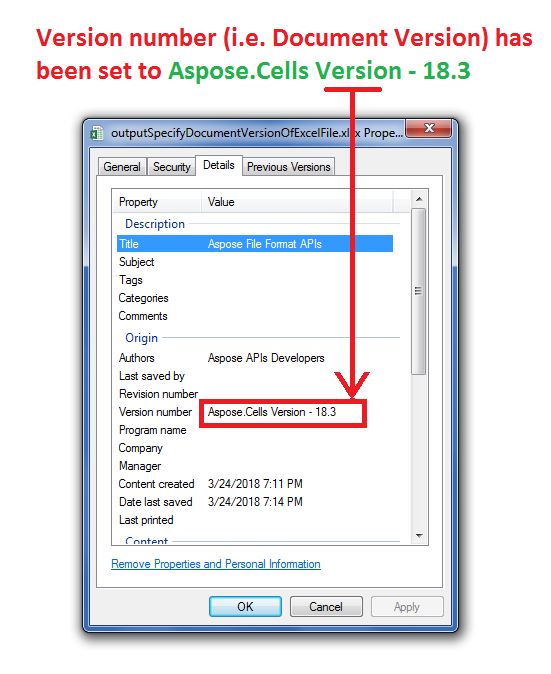

## **Possible Usage Scenarios**  

You can change the **Version number** of an Excel file by right-clicking the file and then selecting Properties > Details and then editing the **Version number** field. Please use [**BuiltInDocumentPropertyCollection.documentVersion**](https://reference.aspose.com/cells/javascript-cpp/builtindocumentpropertycollection/#documentVersion--) property to change it programmatically using Aspose.Cells APIs.  

## **Specify Document Version of the Excel File using BuiltIn Document Properties**  

The following sample code creates a workbook and changes its built-in document properties that include Title, Authors, and Version number. Please see the [output Excel file](64716811.xlsx) generated by the code and screenshot that shows the modified Version number by [**BuiltInDocumentPropertyCollection.documentVersion**](https://reference.aspose.com/cells/javascript-cpp/builtindocumentpropertycollection/#documentVersion--) property.  

  

## **Sample Code**  

```html
<!DOCTYPE html>
<html>
    <head>
        <title>Aspose.Cells Example</title>
    </head>
    <body>
        <h1>Specify Document Version Example</h1>
        <input type="file" id="fileInput" accept=".xls,.xlsx,.csv" />
        <button id="runExample">Run Example</button>
        <a id="downloadLink" style="display: none;">Download Result</a>
        <div id="result"></div>
    </body>

    <script src="aspose.cells.js.min.js"></script>
    <script type="text/javascript">
        const { Workbook, SaveFormat } = AsposeCells;
        
        AsposeCells.onReady({
            license: "/lic/aspose.cells.enc",
            fontPath: "/fonts/",
            fontList: [
                "arial.ttf",
                "NotoSansSC-Regular.ttf"
            ]
        }).then(() => {
            console.log("Aspose.Cells initialized");
        });

        document.getElementById('runExample').addEventListener('click', async () => {
            // Create workbook object
            const wb = new Workbook();

            // Access built-in document property collection
            const bdpc = wb.builtInDocumentProperties;

            // Set the title
            bdpc.title = "Aspose File Format APIs";

            // Set the author
            bdpc.author = "Aspose APIs Developers";

            // Set the document version
            bdpc.documentVersion = "Aspose.Cells Version - 18.3";

            // Save the workbook in xlsx format
            const outputData = wb.save(SaveFormat.Xlsx);
            const blob = new Blob([outputData]);
            const downloadLink = document.getElementById('downloadLink');
            downloadLink.href = URL.createObjectURL(blob);
            downloadLink.download = 'outputSpecifyDocumentVersionOfExcelFile.xlsx';
            downloadLink.style.display = 'block';
            downloadLink.textContent = 'Download Excel File';

            document.getElementById('result').innerHTML = '<p style="color: green;">Workbook created and prepared for download. Click the download link to get the file.</p>';
        });
    </script>
</html>
```