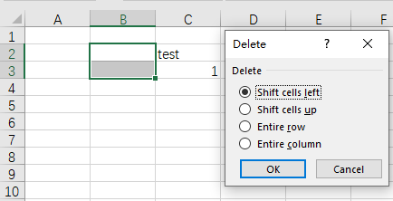

## **Introduction**  

In Excel, you can select a range, then delete it and shift other data left or up.  

****  

## **Delete Ranges Using Aspose.Cells for JavaScript via C++**  

Aspose.Cells provides [Cells.deleteRange(number, number, number, number, ShiftType)](https://reference.aspose.com/cells/javascript-cpp/cells/#deleteRange-number-number-number-number-shifttype-) method to delete a range.  

## **Delete Ranges and Shift Cells Left**  

Delete a range and shift cells left using the following code with Aspose.Cells for JavaScript via C++:  

```html
<!DOCTYPE html>
<html>
    <head>
        <title>Aspose.Cells Example</title>
    </head>
    <body>
        <h1>Aspose.Cells Example</h1>
        <input type="file" id="fileInput" accept=".xls,.xlsx,.csv" />
        <button id="runExample">Run Example</button>
        <a id="downloadLink" style="display: none;">Download Result</a>
        <div id="result"></div>
    </body>

    <script src="aspose.cells.js.min.js"></script>
    <script type="text/javascript">
        const { Workbook, SaveFormat } = AsposeCells;
        
        AsposeCells.onReady({
            license: "/lic/aspose.cells.enc",
            fontPath: "/fonts/",
            fontList: [
                "arial.ttf",
                "NotoSansSC-Regular.ttf"
            ]
        }).then(() => {
            console.log("Aspose.Cells initialized");

            document.getElementById('runExample').addEventListener('click', async () => {
                const fileInput = document.getElementById('fileInput');
                const resultDiv = document.getElementById('result');
                if (!fileInput.files.length) {
                    resultDiv.innerHTML = '<p style="color: red;">Please select an Excel file.</p>';
                    return;
                }

                const file = fileInput.files[0];
                const arrayBuffer = await file.arrayBuffer();

                // Loads the workbook which contains hidden external links (from uploaded file)
                const workbook = new Workbook(new Uint8Array(arrayBuffer));

                // Instantiate a new Workbook.
                const newWorkbook = new Workbook();

                // Get all the worksheets in the book.
                const worksheets = newWorkbook.worksheets;

                // Get the first worksheet in the worksheets collection.
                const worksheet = newWorkbook.worksheets.get(0);

                // Gets cells.
                const cells = worksheet.cells;

                // Input some data with some formatting into a few cells in the range.
                cells.get("C2").value = "C2";
                cells.get("C3").value = "C3";

                const ca = AsposeCells.CellArea.createCellArea("B2", "B3");
                cells.deleteRange(ca.startRow, ca.startColumn, ca.endRow, ca.endColumn, AsposeCells.ShiftType.Left);

                const check = worksheet.cells.get("B2").stringValue === "C2";

                // Save the modified newWorkbook and provide download link
                const outputData = newWorkbook.save(SaveFormat.Xlsx);
                const blob = new Blob([outputData]);
                const downloadLink = document.getElementById('downloadLink');
                downloadLink.href = URL.createObjectURL(blob);
                downloadLink.download = 'output.xlsx';
                downloadLink.style.display = 'block';
                downloadLink.textContent = 'Download Modified Excel File';

                resultDiv.innerHTML = `<p style="color: green;">Operation completed successfully! Check result: ${check}</p>`;
            });
        });
    </script>
</html>
```  

## **Delete Ranges and Shift Cells Up**  

Delete a range and shift cells up using the following code with Aspose.Cells for JavaScript via C++:  

```html
<!DOCTYPE html>
<html>
    <head>
        <title>Aspose.Cells Example</title>
    </head>
    <body>
        <h1>Aspose.Cells Example</h1>
        <input type="file" id="fileInput" accept=".xls,.xlsx,.csv" />
        <button id="runExample">Run Example</button>
        <a id="downloadLink" style="display: none;">Download Result</a>
        <div id="result"></div>
    </body>

    <script src="aspose.cells.js.min.js"></script>
    <script type="text/javascript">
        const { Workbook, SaveFormat } = AsposeCells;
        
        AsposeCells.onReady({
            license: "/lic/aspose.cells.enc",
            fontPath: "/fonts/",
            fontList: [
                "arial.ttf",
                "NotoSansSC-Regular.ttf"
            ]
        }).then(() => {
            console.log("Aspose.Cells initialized");
        });

        document.getElementById('runExample').addEventListener('click', async () => {
            const fileInput = document.getElementById('fileInput');
            if (!fileInput.files.length) {
                document.getElementById('result').innerHTML = '<p style="color: red;">Please select an Excel file.</p>';
                return;
            }

            const file = fileInput.files[0];
            const arrayBuffer = await file.arrayBuffer();

            // Loads the workbook which contains hidden external links
            const workbook = new Workbook(new Uint8Array(arrayBuffer));

            // Instantiate a new Workbook.
            const newWorkbook = new Workbook();

            // Get all the worksheets in the book.
            const worksheets = newWorkbook.worksheets;

            // Get the first worksheet in the worksheets collection.
            const worksheet = newWorkbook.worksheets.get(0);

            // Gets cells.
            const cells = worksheet.cells;

            // Input some data with some formatting into
            // a few cells in the range.
            const cellB4 = cells.get("B4");
            cellB4.value = "B4";
            const cellB5 = cells.get("B5");
            cellB5.value = "B5";

            const ca = AsposeCells.CellArea.createCellArea("B2", "B3");
            cells.deleteRange(ca.startRow, ca.startColumn, ca.endRow, ca.endColumn, AsposeCells.ShiftType.Up);

            const check = cells.get("B2").stringValue === "B4";
            console.log(check);

            const outputData = newWorkbook.save(SaveFormat.Xlsx);
            const blob = new Blob([outputData]);
            const downloadLink = document.getElementById('downloadLink');
            downloadLink.href = URL.createObjectURL(blob);
            downloadLink.download = 'output.xlsx';
            downloadLink.style.display = 'block';
            downloadLink.textContent = 'Download Modified Excel File';

            document.getElementById('result').innerHTML = `<p style="color: green;">Operation completed successfully! Check result: ${check}</p>`;
        });
    </script>
</html>
```