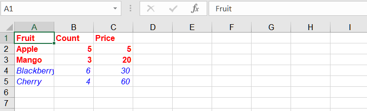

## **Possible Usage Scenarios**  
When you need to apply a style to a range, you can use range formatting.  

## **How to format a Range in Excel**  

To format a range of cells in Excel, you can use the built-in formatting options provided by Excel. Here's how you can format a range of cells directly in Excel:  

1. Open Excel and open the workbook that contains the range you want to format.  

2. Select the range of cells you want to format. You can click and drag to select the range, or you can use keyboard shortcuts like Shift + Arrow keys to extend the selection.  

3. Once the range is selected, right-click on the selected range and choose "Format Cells" from the context menu. Alternatively, you can go to the Home tab in the Excel ribbon, click on the "Format" dropdown in the "Cells" group, and select "Format Cells".  

4. The "Format Cells" dialog box will appear. Here, you can choose various formatting options to apply to the selected range. For example, you can change the font style, font size, font color, number format, borders, background color, etc. Explore the different tabs in the dialog box to access various formatting options.  

5. After making the desired formatting changes, click the "OK" button to apply the formatting to the selected range.  

## **How to format a Range Using JavaScript**  

To format a range using Aspose.Cells for JavaScript via C++, you can use the following methods:  
1. [Range.applyStyle(style, flag)](https://reference.aspose.com/cells/javascript-cpp/range/#applyStyle-style-styleflag-)  
2. [Range.style](https://reference.aspose.com/cells/javascript-cpp/range/#style-style-)  
3. [Range.style](https://reference.aspose.com/cells/javascript-cpp/range/#style-style-)  

## **Sample Code**  
In this example, we create an Excel workbook, add some sample data, access the first worksheet, and define two ranges("A1:C3" and "A4:C5"). Then, we create new styles, set various formatting options (e.g., font color, bold), and apply the style to the range. Finally, we save the workbook to a new file.  
<br>  
  

```html
<!DOCTYPE html>
<html>
    <head>
        <title>Aspose.Cells Example</title>
    </head>
    <body>
        <h1>Aspose.Cells Example</h1>
        <input type="file" id="fileInput" accept=".xls,.xlsx,.csv" />
        <button id="runExample">Run Example</button>
        <a id="downloadLink" style="display: none;">Download Result</a>
        <div id="result"></div>
    </body>

    <script src="aspose.cells.js.min.js"></script>
    <script type="text/javascript">
        const { Workbook, SaveFormat } = AsposeCells;
        
        AsposeCells.onReady({
            license: "/lic/aspose.cells.enc",
            fontPath: "/fonts/",
            fontList: [
                "arial.ttf",
                "NotoSansSC-Regular.ttf"
            ]
        }).then(() => {
            console.log("Aspose.Cells initialized");
        });

        document.getElementById('runExample').addEventListener('click', async () => {
            const fileInput = document.getElementById('fileInput');
            if (!fileInput.files.length) {
                document.getElementById('result').innerHTML = '<p style="color: red;">Please select an Excel file.</p>';
                return;
            }

            const file = fileInput.files[0];
            const arrayBuffer = await file.arrayBuffer();

            // Create the workbook from the uploaded file
            const workbook = new Workbook(new Uint8Array(arrayBuffer));

            // Get the first worksheet
            const ws = workbook.worksheets.get(0);

            const cells = ws.cells;

            // Setting the value to the cells (converted putValue -> value)
            let cell = cells.get("A1");
            cell.value = "Fruit";
            cell = cells.get("B1");
            cell.value = "Count";
            cell = cells.get("C1");
            cell.value = "Price";

            cell = cells.get("A2");
            cell.value = "Apple";
            cell = cells.get("A3");
            cell.value = "Mango";
            cell = cells.get("A4");
            cell.value = "Blackberry";
            cell = cells.get("A5");
            cell.value = "Cherry";

            cell = cells.get("B2");
            cell.value = 5;
            cell = cells.get("B3");
            cell.value = 3;
            cell = cells.get("B4");
            cell.value = 6;
            cell = cells.get("B5");
            cell.value = 4;

            cell = cells.get("C2");
            cell.value = 5;
            cell = cells.get("C3");
            cell.value = 20;
            cell = cells.get("C4");
            cell.value = 30;
            cell = cells.get("C5");
            cell.value = 60;

            // Access the worksheet (already have ws, but keep variable for clarity)
            const worksheet = workbook.worksheets.get(0);

            // Define the range
            const range = worksheet.cells.createRange("A1:C3");

            // Apply formatting to the range
            const style = workbook.createStyle();
            style.font.color = AsposeCells.Color.Red;
            style.font.isBold = true;

            const flag = new AsposeCells.StyleFlag();
            flag.font = true;
            range.applyStyle(style, flag);

            // Define the range
            const range2 = worksheet.cells.createRange("A4:C5");

            // Apply formatting to the range
            const style2 = workbook.createStyle();
            style2.font.color = AsposeCells.Color.Blue;
            style2.font.isItalic = true;
            range2.setStyle(style2);

            // Save the modified workbook and provide download link
            const outputData = workbook.save(SaveFormat.Xlsx);
            const blob = new Blob([outputData]);
            const downloadLink = document.getElementById('downloadLink');
            downloadLink.href = URL.createObjectURL(blob);
            downloadLink.download = 'output.xlsx';
            downloadLink.style.display = 'block';
            downloadLink.textContent = 'Download Excel File';

            document.getElementById('result').innerHTML = '<p style="color: green;">Workbook modified successfully! Click the download link to get the modified file.</p>';
        });
    </script>
</html>
```