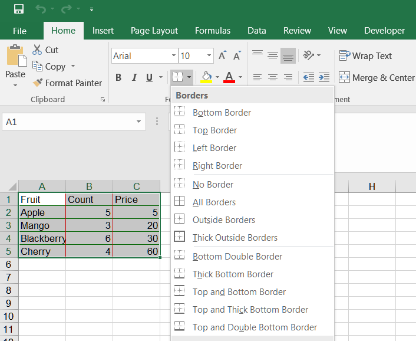

## **Possible Usage Scenarios**  
When you want to set the border for a range, you don't need to set each cell individually. You can set the border on the range. Aspose.Cells for JavaScript via C++ offers this feature.  
This article provides a sample code that uses Aspose.Cells for JavaScript via C++ to set range border.  

## **Set Range border in Excel**  
To set the border of a range in Excel, you can follow these steps:  
1. Select the range of cells that you want to apply the border to.  
2. In the "Home" tab of the ribbon, locate the "Font" group.  
3. Within the "Font" group, click on the "Borders" drop-down button.  
<br>  
  
4. Choose the type of border that you want to apply from the options in the drop-down menu. You can choose from preset border styles or customize your own border.  
5. Once you have selected the desired border style, the border will be applied to the selected range of cells.  

## **Set Range border using Aspose.Cells for JavaScript via C++**  
This example shows how to:  

1. Create a workbook.  
2. Add data to cells in the first worksheet.  
3. Create a [**Range**](https://reference.aspose.com/cells/javascript-cpp/range).  
4. Set inner border of the range.  
5. Set outer border of the range.  

```html
<!DOCTYPE html>
<html>
    <head>
        <title>Aspose.Cells Example</title>
    </head>
    <body>
        <h1>Aspose.Cells Create Workbook Example</h1>
        <input type="file" id="fileInput" accept=".xls,.xlsx,.csv" />
        <button id="runExample">Run Example</button>
        <a id="downloadLink" style="display: none;">Download Result</a>
        <div id="result"></div>
    </body>

    <script src="aspose.cells.js.min.js"></script>
    <script type="text/javascript">
        const { Workbook, SaveFormat, Worksheet, Cell } = AsposeCells;
        
        AsposeCells.onReady({
            license: "/lic/aspose.cells.enc",
            fontPath: "/fonts/",
            fontList: [
                "arial.ttf",
                "NotoSansSC-Regular.ttf"
            ]
        }).then(() => {
            console.log("Aspose.Cells initialized");
        });

        document.getElementById('runExample').addEventListener('click', async () => {
            // Instantiate a new workbook
            const workbook = new Workbook();
            // Obtaining the reference of the newly added worksheet
            const ws = workbook.worksheets.get(0);
            const cells = ws.cells;

            // Setting the value to the cells
            let cell = cells.get("A1");
            cell.putValue("Fruit");
            cell = cells.get("B1");
            cell.putValue("Count");
            cell = cells.get("C1");
            cell.putValue("Price");

            cell = cells.get("A2");
            cell.putValue("Apple");
            cell = cells.get("A3");
            cell.putValue("Mango");
            cell = cells.get("A4");
            cell.putValue("Blackberry");
            cell = cells.get("A5");
            cell.putValue("Cherry");

            cell = cells.get("B2");
            cell.putValue(5);
            cell = cells.get("B3");
            cell.putValue(3);
            cell = cells.get("B4");
            cell.putValue(6);
            cell = cells.get("B5");
            cell.putValue(4);

            cell = cells.get("C2");
            cell.putValue(5);
            cell = cells.get("C3");
            cell.putValue(20);
            cell = cells.get("C4");
            cell.putValue(30);
            cell = cells.get("C5");
            cell.putValue(60);

            // Create a range (A1:C5).
            const range = cells.createRange("A1", "C5");

            // set inner border of range
            const innerColor = workbook.createCellsColor();
            innerColor.color = AsposeCells.Color.Red;
            range.insideBorders = {
                borderType: AsposeCells.BorderType.Vertical,
                cellBorderType: AsposeCells.CellBorderType.Thin,
                color: innerColor
            };
            innerColor.color = AsposeCells.Color.Green;
            range.insideBorders = {
                borderType: AsposeCells.BorderType.Horizontal,
                cellBorderType: AsposeCells.CellBorderType.Thin,
                color: innerColor
            };

            // set outer border of range
            const outerColor = workbook.createCellsColor();
            outerColor.color = AsposeCells.Color.Blue;
            range.outlineBorders = {
                cellBorderType: AsposeCells.CellBorderType.Thin,
                color: outerColor
            };

            // Saving the modified Excel file and provide download link
            const outputData = workbook.save(SaveFormat.Xlsx);
            const blob = new Blob([outputData]);
            const downloadLink = document.getElementById('downloadLink');
            downloadLink.href = URL.createObjectURL(blob);
            downloadLink.download = 'out.xlsx';
            downloadLink.style.display = 'block';
            downloadLink.textContent = 'Download Excel File';

            document.getElementById('result').innerHTML = '<p style="color: green;">Workbook created successfully! Click the download link to get the file.</p>';
        });
    </script>
</html>
```