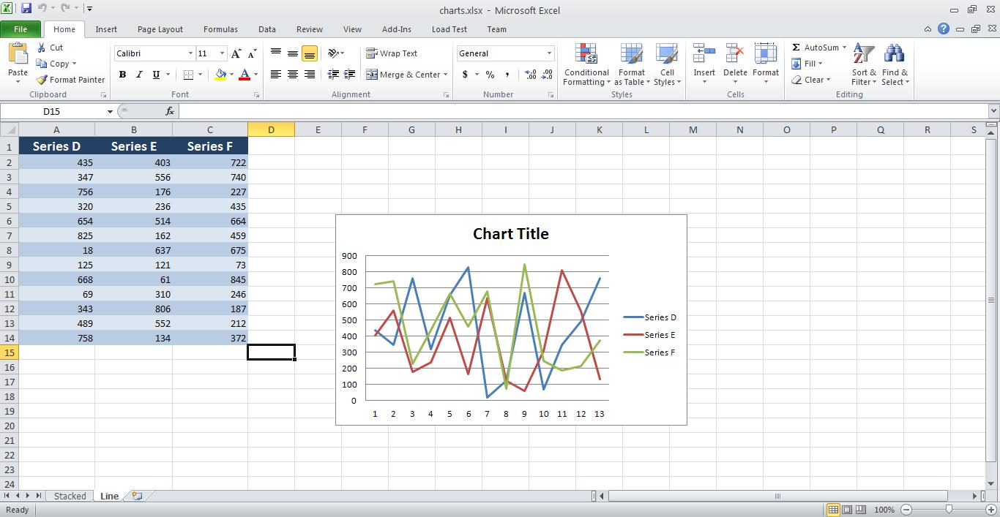

{}

Sometimes, you need to combine workbooks with various content like images, charts and data into a single workbook. Aspose.Cells for JavaScript via C++ supports this feature. This article shows how to create a console application and combine workbooks with a few, simple lines of code using Aspose.Cells.

{}

## **Combining Workbooks with Images and Charts**

The example code combines two workbooks into a single workbook using Aspose.Cells for JavaScript via C++. The code loads the source workbooks, uses the [**Workbook.combine(Workbook)**](https://reference.aspose.com/cells/javascript-cpp/workbook/#combine-workbook-) method to combine them, and saves the output workbook.

### **Source Workbooks**

- [charts.xlsx](5473097.xlsx)
- [picture.xlsx](5473096.xlsx)

### **Output Workbooks**

- [combined.xlsx](5473095.xlsx)

### **Screenshots**

Below are screenshots of the source and output workbooks.

{}

You can use any source workbooks. These images are just for illustration purposes.

{}

**The first worksheet of the charts workbook - stacked** 


**Second worksheet of charts workbook - line** 



**First worksheet of the picture workbook - picture** 


**All three worksheets in the combined workbook - stacked, line, picture** 


```html
<!DOCTYPE html>
<html>
    <head>
        <title>Combine Workbooks Example</title>
    </head>
    <body>
        <h1>Combine Workbooks Example</h1>
        <p>Select two Excel files to combine:</p>
        <input type="file" id="fileInput1" accept=".xls,.xlsx" />
        <input type="file" id="fileInput2" accept=".xls,.xlsx" />
        <button id="runExample">Combine Workbooks</button>
        <a id="downloadLink" style="display: none;">Download Result</a>
        <div id="result"></div>
    </body>

    <script src="aspose.cells.js.min.js"></script>
    <script type="text/javascript">
        const { Workbook, SaveFormat, Worksheet, Cell } = AsposeCells;
        
        AsposeCells.onReady({
            license: "/lic/aspose.cells.enc",
            fontPath: "/fonts/",
            fontList: [
                "arial.ttf",
                "NotoSansSC-Regular.ttf"
            ]
        }).then(() => {
            console.log("Aspose.Cells initialized");
        });

        document.getElementById('runExample').addEventListener('click', async () => {
            const fileInput1 = document.getElementById('fileInput1');
            const fileInput2 = document.getElementById('fileInput2');

            if (!fileInput1.files.length || !fileInput2.files.length) {
                document.getElementById('result').innerHTML = '<p style="color: red;">Please select two Excel files.</p>';
                return;
            }

            const file1 = fileInput1.files[0];
            const file2 = fileInput2.files[0];

            const arrayBuffer1 = await file1.arrayBuffer();
            const arrayBuffer2 = await file2.arrayBuffer();

            // Open the first excel file.
            const sourceBook1 = new Workbook(new Uint8Array(arrayBuffer1));

            // Open the second excel file.
            const sourceBook2 = new Workbook(new Uint8Array(arrayBuffer2));

            // Combining the two workbooks
            sourceBook1.combine(sourceBook2);

            // Save the combined workbook and provide download link
            const outputData = sourceBook1.save(SaveFormat.Xlsx);
            const blob = new Blob([outputData]);
            const downloadLink = document.getElementById('downloadLink');
            downloadLink.href = URL.createObjectURL(blob);
            downloadLink.download = 'Combined.out.xlsx';
            downloadLink.style.display = 'block';
            downloadLink.textContent = 'Download Combined Excel File';

            document.getElementById('result').innerHTML = '<p style="color: green;">Workbooks combined successfully! Click the download link to get the combined file.</p>';
        });
    </script>
</html>
```

## **Advance topics**
- [Combine Multiple Worksheets into a Single Worksheet](/cells/javascript-cpp/combine-multiple-worksheets-into-a-single-worksheet/)
- [Merge Files](/cells/javascript-cpp/merge-files/)