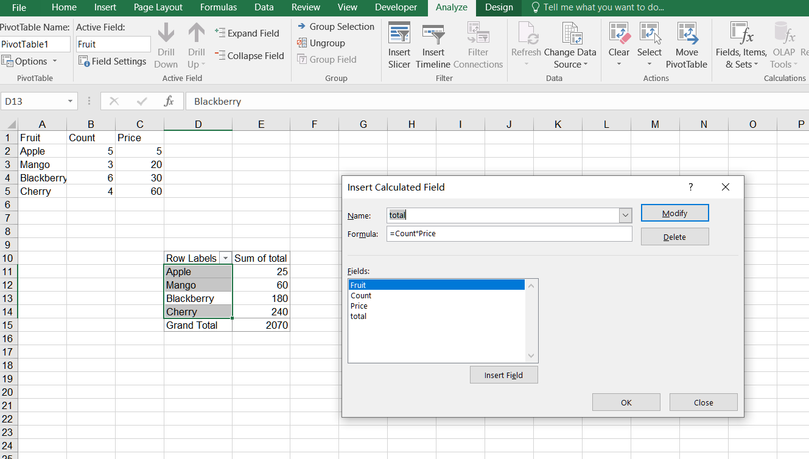

## **Possible Usage Scenarios**
When you create a pivot table based on known data, you may find that the data it contains is not what you need. The desired data is often a combination of the original data. For example, you might need to add, subtract, multiply, or divide the original values before obtaining the final result. In such cases, you need to create a calculated field and set the appropriate formula for the calculation. You can then perform statistics and other operations on the calculated field.

## **How to Add a Calculated Field in a Pivot Table in Excel**
To insert a calculated field in a PivotTable in Excel, follow these steps:

1. Select the PivotTable to which you want to add a calculated field.  
2. Go to the **PivotTable Analyze** tab on the ribbon.  
3. Click **Fields, Items, & Sets** and then select **Calculated Field** from the drop‑down menu.  
4. In the **Name** field, enter a name for the calculated field.  
5. In the **Formula** field, enter the formula for the calculation you want to perform using the appropriate PivotTable field names and mathematical operators.  
   <br>
   
6. Click **OK** to create the calculated field.  
7. The new calculated field will appear in the PivotTable Field List under the **Values** section.  
8. Drag the calculated field to the **Values** section of the PivotTable to display the calculated values.  
   <br>
   

## **How to Add a Calculated Field in a Pivot Table Using Aspose.Cells for JavaScript via C++ Library**
Add a calculated field to an Excel file using Aspose.Cells for JavaScript via C++. Please see the following sample code. After executing the example code, a pivot table with a calculated field is added to the worksheet.

1. Set the original data and create a pivot table.  
2. Create the calculated field based on the existing PivotField in the pivot table.  
3. Add the calculated field to the data area.  
4. Finally, save the workbook in the [output XLSX](out.xlsx) format.  

## **Sample Code**
```html
<!DOCTYPE html>
<html>
    <head>
        <title>Aspose.Cells Example</title>
    </head>
    <body>
        <h1>PivotTable Example</h1>
        <input type="file" id="fileInput" accept=".xls,.xlsx,.csv" />
        <button id="runExample">Run Example</button>
        <a id="downloadLink" style="display: none;">Download Result</a>
        <div id="result"></div>
    </body>

    <script src="aspose.cells.js.min.js"></script>
    <script type="text/javascript">
        const { Workbook, SaveFormat, PivotFieldType, Utils } = AsposeCells;
        
        AsposeCells.onReady({
            license: "/lic/aspose.cells.enc",
            fontPath: "/fonts/",
            fontList: [
                "arial.ttf",
                "NotoSansSC-Regular.ttf"
            ]
        }).then(() => {
            console.log("Aspose.Cells initialized");
        });

        document.getElementById('runExample').addEventListener('click', async () => {
            // Instantiate a new Workbook
            const workbook = new Workbook();

            // Obtain the reference of the newly added worksheet
            const ws = workbook.worksheets.get(0);
            const cells = ws.cells;

            // Setting the value to the cells (converted putValue -> value)
            let cell = cells.get("A1");
            cell.value = "Fruit";
            cell = cells.get("B1");
            cell.value = "Count";
            cell = cells.get("C1");
            cell.value = "Price";
            cell = cells.get("A2");
            cell.value = "Apple";
            cell = cells.get("A3");
            cell.value = "Mango";
            cell = cells.get("A4");
            cell.value = "Blackberry";
            cell = cells.get("A5");
            cell.value = "Cherry";
            cell = cells.get("B2");
            cell.value = 5;
            cell = cells.get("B3");
            cell.value = 3;
            cell = cells.get("B4");
            cell.value = 6;
            cell = cells.get("B5");
            cell.value = 4;
            cell = cells.get("C2");
            cell.value = 5;
            cell = cells.get("C3");
            cell.value = 20;
            cell = cells.get("C4");
            cell.value = 30;
            cell = cells.get("C5");
            cell.value = 60;

            // Adding a PivotTable to the worksheet (converted getPivotTables -> pivotTables)
            const i = ws.pivotTables.add("=A1:C5", "D10", "PivotTable1");
            // Accessing the instance of the newly added PivotTable
            const pivotTable = ws.pivotTables.get(i);
            pivotTable.addFieldToArea(PivotFieldType.Row, 0);
            // Adding a calculated field to the PivotTable and dragging it to the data area.
            pivotTable.addCalculatedField("total", "=Count*Price", true);
            pivotTable.refreshData();
            pivotTable.calculateData();

            // Saving the modified Excel file
            const outputData = workbook.save(SaveFormat.Xlsx);
            const blob = new Blob([outputData]);
            const downloadLink = document.getElementById('downloadLink');
            downloadLink.href = URL.createObjectURL(blob);
            downloadLink.download = 'out.xlsx';
            downloadLink.style.display = 'block';
            downloadLink.textContent = 'Download Excel File';

            document.getElementById('result').innerHTML = '<p style="color: green;">PivotTable created successfully! Click the download link to get the file.</p>';
        });
    </script>
</html>
```