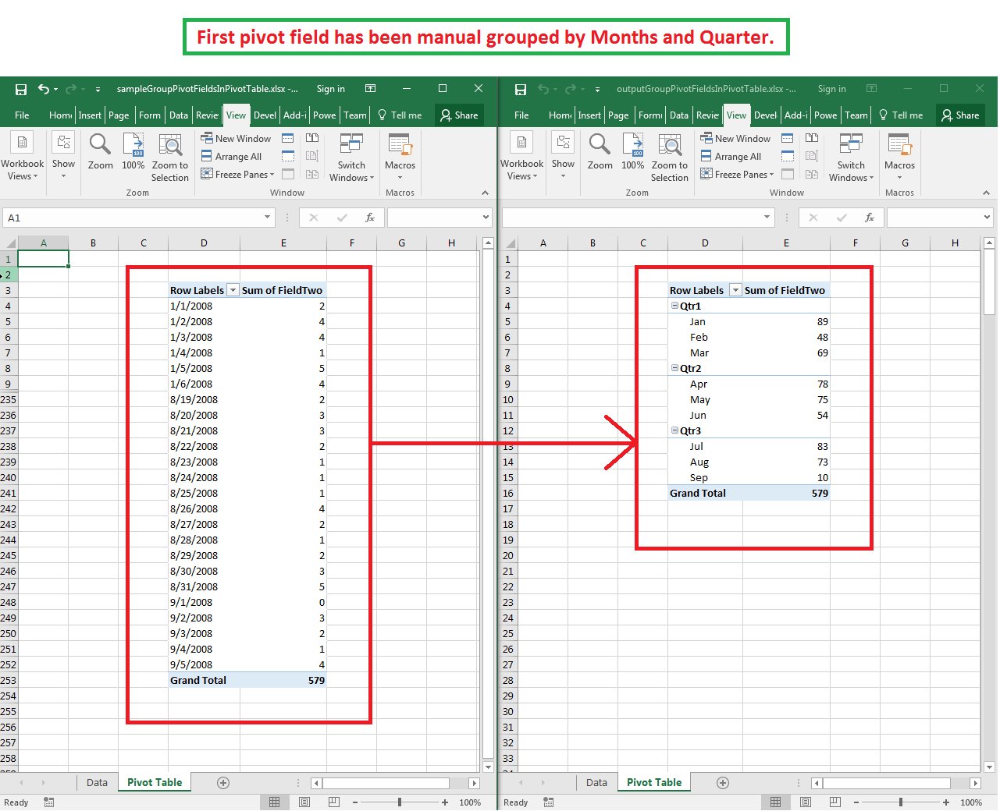

## **Possible Usage Scenarios**

Microsoft Excel allows you to group pivot fields of the pivot table. When there is a large amount of data related to a pivot field, it is often useful to group them into sections. Aspose.Cells for JavaScript via C++ also provides this feature using the [**PivotTable.groupBy()**](https://reference.aspose.com/cells/javascript-cpp/pivotfield/#groupBy-date-date-pivotgroupbytypearray-number-boolean-) method.

## **How to Group Pivot Fields in the Pivot Table**

The following sample code loads the [sample Excel file](64716818.xlsx) and performs grouping on the first pivot field using the [**PivotTable.groupBy()**](https://reference.aspose.com/cells/javascript-cpp/pivotfield/#groupBy-date-date-pivotgroupbytypearray-number-boolean-) method. It then refreshes and calculates data of the pivot table and saves the workbook as [output Excel file](64716817.xlsx). The screenshot shows the effect of the sample code on the sample Excel file. As you can see in the screenshot, the first pivot field is now grouped by months and quarters.



## **Sample Code**

```html
<!DOCTYPE html>
<html>
    <head>
        <title>Group Pivot Fields Example</title>
    </head>
    <body>
        <h1>Group Pivot Fields in PivotTable</h1>
        <input type="file" id="fileInput" accept=".xls,.xlsx,.csv" />
        <button id="runExample">Run Example</button>
        <a id="downloadLink" style="display: none;">Download Result</a>
        <div id="result"></div>
    </body>

    <script src="aspose.cells.js.min.js"></script>
    <script type="text/javascript">
        const { Workbook, SaveFormat, PivotGroupByType } = AsposeCells;
        
        AsposeCells.onReady({
            license: "/lic/aspose.cells.enc",
            fontPath: "/fonts/",
            fontList: [
                "arial.ttf",
                "NotoSansSC-Regular.ttf"
            ]
        }).then(() => {
            console.log("Aspose.Cells initialized");
        });

        document.getElementById('runExample').addEventListener('click', async () => {
            const fileInput = document.getElementById('fileInput');
            if (!fileInput.files.length) {
                document.getElementById('result').innerHTML = '<p style="color: red;">Please select an Excel file.</p>';
                return;
            }

            const file = fileInput.files[0];
            const arrayBuffer = await file.arrayBuffer();

            // Load workbook from uploaded file
            const wb = new Workbook(new Uint8Array(arrayBuffer));

            // Access the second worksheet
            const ws = wb.worksheets.get(1);

            // Access the pivot table
            const pt = ws.pivotTables.get(0);

            // Specify the start and end date time
            const dtStart = new Date(2008, 1, 1);
            const dtEnd = new Date(2008, 9, 5);

            // Specify the group type list, we want to group by months and quarters
            const groupTypeList = [PivotGroupByType.Months, PivotGroupByType.Quarters];

            // Apply the grouping on first pivot field
            const field = pt.rowFields.get(0);
            field.groupBy(dtStart, dtEnd, groupTypeList, 1, true);

            // Refresh and calculate pivot table
            pt.refreshDataFlag = true;
            pt.refreshData();
            pt.calculateData();
            pt.refreshDataFlag = false;

            // Save the output Excel file
            const outputData = wb.save(SaveFormat.Xlsx);
            const blob = new Blob([outputData]);
            const downloadLink = document.getElementById('downloadLink');
            downloadLink.href = URL.createObjectURL(blob);
            downloadLink.download = 'outputGroupPivotFieldsInPivotTable.xlsx';
            downloadLink.style.display = 'block';
            downloadLink.textContent = 'Download Modified Excel File';

            document.getElementById('result').innerHTML = '<p style="color: green;">Operation completed successfully! Click the download link to get the modified file.</p>';
        });
    </script>
</html>
```