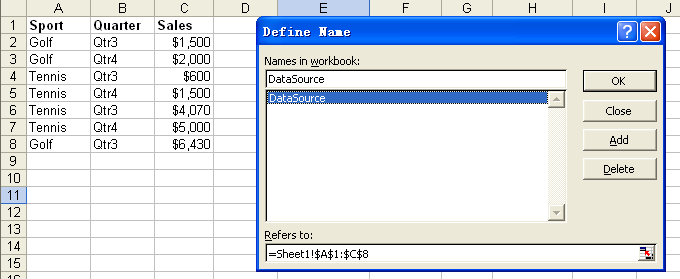
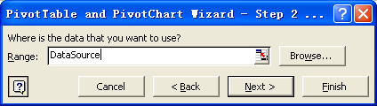

## **Pivot Table Source Data**

There are times when you want to create Microsoft Excel reports with pivot tables that take data from different data sources (such as a database) that are not known at design time. This article provides an approach to dynamically change a pivot table's data source.

### **Changing a Pivot Table's Source Data**

1. Creating a new designer template.  
   1. Create a new designer template file as shown in the screenshot below.  
   1. Then define a named range, **DataSource**, which refers to this range of cells.

   **Creating a designer template & defining a named range, DataSource**  

   

2. Creating a Pivot Table based on this named range.  
   1. In Microsoft Excel, choose **Data**, then **PivotTable** and **PivotChart Report**.  
   1. Create a pivot table based on the named range created in the first step.

   **Creating a pivot table based on the named range, DataSource**  

   

   1. Drag the corresponding fields to the pivot table rows and columns, then create the resulting pivot table as shown in the screenshot below.

   **Creating a pivot table based on a corresponding field**  

   

3. Right‑click the pivot table and select **Table Options**.  
   1. Check **Refresh on open** in the **Data options** settings.

   **Setting the pivot table options**  

   

Now you can save this file as your designer template file.

4. Populating new data and changing the source data of a pivot table.  
   1. Once the designer template is created, use the following code to change the source data of the pivot table.

Executing the example code below changes the source data of the pivot table.

```html
<!DOCTYPE html>
<html>
    <head>
        <title>Aspose.Cells Example</title>
    </head>
    <body>
        <h1>Aspose.Cells Example</h1>
        <input type="file" id="fileInput" accept=".xls,.xlsx,.csv" />
        <button id="runExample">Run Example</button>
        <a id="downloadLink" style="display: none;">Download Result</a>
        <div id="result"></div>
    </body>

    <script src="aspose.cells.js.min.js"></script>
    <script type="text/javascript">
        const { Workbook, SaveFormat, Utils } = AsposeCells;
        
        AsposeCells.onReady({
            license: "/lic/aspose.cells.enc",
            fontPath: "/fonts/",
            fontList: [
                "arial.ttf",
                "NotoSansSC-Regular.ttf"
            ]
        }).then(() => {
            console.log("Aspose.Cells initialized");
        });

        document.getElementById('runExample').addEventListener('click', async () => {
            const fileInput = document.getElementById('fileInput');
            if (!fileInput.files.length) {
                document.getElementById('result').innerHTML = '<p style="color: red;">Please select an Excel file.</p>';
                return;
            }

            const file = fileInput.files[0];
            const arrayBuffer = await file.arrayBuffer();

            // Instantiating a Workbook object using the uploaded file
            const workbook = new Workbook(new Uint8Array(arrayBuffer));

            // Accessing the first worksheet in the Excel file
            const worksheet = workbook.worksheets.get(0);

            // Populating new data in the worksheet cells
            worksheet.cells.get("A9").value = "Golf";
            worksheet.cells.get("B9").value = "Qtr4";
            worksheet.cells.get("C9").value = 7000;

            // Changing named range "DataSource"
            const range = worksheet.cells.createRange(0, 0, 9, 3);
            range.name = "DataSource";

            // Saving the modified Excel file
            const outputData = workbook.save(SaveFormat.Excel97To2003);
            const blob = new Blob([outputData]);
            const downloadLink = document.getElementById('downloadLink');
            downloadLink.href = URL.createObjectURL(blob);
            downloadLink.download = 'output.xls';
            downloadLink.style.display = 'block';
            downloadLink.textContent = 'Download Modified Excel File';

            document.getElementById('result').innerHTML = '<p style="color: green;">Operation completed successfully! Click the download link to get the modified file.</p>';
        });
    </script>
</html>
```