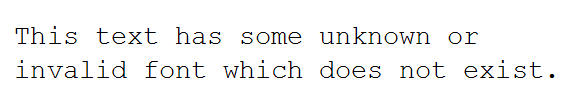

{}

Please use the [**ImageOrPrintOptions.defaultFont**](https://reference.aspose.com/cells/javascript-cpp/imageorprintoptions/#defaultFont--) property to set the default font while rendering spreadsheets to images. This property will only be effective when the default font of the workbook could not render your characters. The default font specified with [**ImageOrPrintOptions.defaultFont**](https://reference.aspose.com/cells/javascript-cpp/imageorprintoptions/#defaultFont--) property is used for all those cells which have invalid or non-existent fonts.

{}

## Set Default Font while rendering spreadsheet to images

The following sample code creates a workbook, adds some text in cell A4 of the first worksheet, and sets its font to an invalid or non-existent font. Then, it takes two images of the worksheet. The first image is taken by setting the [**ImageOrPrintOptions.defaultFont**](https://reference.aspose.com/cells/javascript-cpp/imageorprintoptions/#defaultFont--) property to *Courier New* and the second image is taken by setting the [**ImageOrPrintOptions.defaultFont**](https://reference.aspose.com/cells/javascript-cpp/imageorprintoptions/#defaultFont--) property to *Times New Roman*.

This is the output image after setting the [**ImageOrPrintOptions.defaultFont**](https://reference.aspose.com/cells/javascript-cpp/imageorprintoptions/#defaultFont--) property to *Courier New*.



This is the output image after setting the [**ImageOrPrintOptions.defaultFont**](https://reference.aspose.com/cells/javascript-cpp/imageorprintoptions/#defaultFont--) property to *Times New Roman*.


## Sample Code

```html
<!DOCTYPE html>
<html>
    <head>
        <title>Aspose.Cells Example</title>
    </head>
    <body>
        <h1>Aspose.Cells Example - Render Worksheet to Images with Default Fonts</h1>
        <input type="file" id="fileInput" accept=".xls,.xlsx,.csv" />
        <button id="runExample">Run Example</button>
        <div>
            <a id="downloadLink1" style="display: none; margin-right: 10px;">Download Courier New Image</a>
            <a id="downloadLink2" style="display: none;">Download Times New Roman Image</a>
        </div>
        <div id="result"></div>
    </body>

    <script src="aspose.cells.js.min.js"></script>
    <script type="text/javascript">
        const { Workbook, SaveFormat, ImageOrPrintOptions, ImageType, SheetRender } = AsposeCells;
        
        AsposeCells.onReady({
            license: "/lic/aspose.cells.enc",
            fontPath: "/fonts/",
            fontList: [
                "arial.ttf",
                "NotoSansSC-Regular.ttf"
            ]
        }).then(() => {
            console.log("Aspose.Cells initialized");
        });

        document.getElementById('runExample').addEventListener('click', async () => {
            const fileInput = document.getElementById('fileInput');
            const result = document.getElementById('result');
            const downloadLink1 = document.getElementById('downloadLink1');
            const downloadLink2 = document.getElementById('downloadLink2');

            if (!fileInput.files.length) {
                result.innerHTML = '<p style="color: red;">Please select an Excel file.</p>';
                return;
            }

            // Read the selected file
            const file = fileInput.files[0];
            const arrayBuffer = await file.arrayBuffer();

            // Instantiate Workbook from uploaded file
            const wb = new Workbook(new Uint8Array(arrayBuffer));

            // Set default font of the workbook to none
            let s = wb.defaultStyle;
            s.font.name = "";
            wb.defaultStyle = s;

            // Access first worksheet.
            const ws = wb.worksheets.get(0);

            // Access cell A4 and add some text inside it.
            const cell = ws.cells.get("A4");
            cell.value = "This text has some unknown or invalid font which does not exist.";

            // Set the font of cell A4 which is unknown.
            let st = cell.style;
            st.font.name = "UnknownNotExist";
            st.font.size = 20;
            st.isTextWrapped = true;
            cell.style = st;

            // Set first column width and fourth row height
            ws.cells.setColumnWidth(0, 80);
            ws.cells.setRowHeight(3, 60);

            // Create image or print options.
            const opts = new ImageOrPrintOptions();
            opts.onePagePerSheet = true;
            opts.imageType = ImageType.Png;

            // Render worksheet image with Courier New as default font.
            opts.defaultFont = "Courier New";
            let sr = new SheetRender(ws, opts);
            const imgData1 = sr.toImage(0);
            const blob1 = new Blob([imgData1], { type: 'image/png' });
            downloadLink1.href = URL.createObjectURL(blob1);
            downloadLink1.download = 'out_courier_new_out.png';
            downloadLink1.style.display = 'inline-block';
            downloadLink1.textContent = 'Download Courier New Image';

            // Render worksheet image again with Times New Roman as default font.
            opts.defaultFont = "Times New Roman";
            sr = new SheetRender(ws, opts);
            const imgData2 = sr.toImage(0);
            const blob2 = new Blob([imgData2], { type: 'image/png' });
            downloadLink2.href = URL.createObjectURL(blob2);
            downloadLink2.download = 'times_new_roman_out.png';
            downloadLink2.style.display = 'inline-block';
            downloadLink2.textContent = 'Download Times New Roman Image';

            result.innerHTML = '<p style="color: green;">Images rendered successfully! Use the download links to save the PNG files.</p>';
        });
    </script>
</html>
```