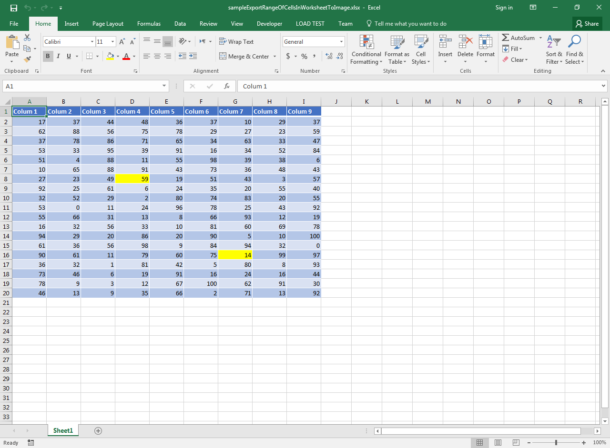

## **Possible Usage Scenarios**  

You can make an image of a worksheet using Aspose.Cells for JavaScript via C++. However, sometimes you need to export only a range of cells in a worksheet to an image. This article explains how to achieve this.  

## **Export Range of Cells in a Worksheet to Image**  

To take an image of a range, set the print area to the desired range and then set all margins to 0. Also set [**ImageOrPrintOptions.onePagePerSheet**](https://reference.aspose.com/cells/javascript-cpp/imageorprintoptions/#onePagePerSheet--) to **true**. The following code takes an image of the range D8:G16. Below is a screenshot of the [sample Excel file](47153160.xlsx) used in the code. You can try the code with any Excel file.  

## **Screenshot of Sample Excel File and its Exported Image**  

****  

Executing the code creates an image of the range D8:G16 only.  

****  

## **Sample Code**  

```html
<!DOCTYPE html>
<html>
    <head>
        <title>Aspose.Cells Example - Export Range To Image</title>
    </head>
    <body>
        <h1>Export Range Of Cells In Worksheet To Image</h1>
        <input type="file" id="fileInput" accept=".xls,.xlsx,.csv" />
        <button id="runExample">Run Example</button>
        <a id="downloadLink" style="display: none;">Download Result</a>
        <div id="result"></div>
    </body>

    <script src="aspose.cells.js.min.js"></script>
    <script type="text/javascript">
        const { Workbook, ImageOrPrintOptions, ImageType, SheetRender } = AsposeCells;
        
        AsposeCells.onReady({
            license: "/lic/aspose.cells.enc",
            fontPath: "/fonts/",
            fontList: [
                "arial.ttf",
                "NotoSansSC-Regular.ttf"
            ]
        }).then(() => {
            console.log("Aspose.Cells initialized");
        });

        document.getElementById('runExample').addEventListener('click', async () => {
            const fileInput = document.getElementById('fileInput');
            if (!fileInput.files.length) {
                document.getElementById('result').innerHTML = '<p style="color: red;">Please select an Excel file.</p>';
                return;
            }

            const file = fileInput.files[0];
            const arrayBuffer = await file.arrayBuffer();

            // Create workbook from uploaded file.
            const workbook = new Workbook(new Uint8Array(arrayBuffer));

            // Access the first worksheet
            const worksheet = workbook.worksheets.get(0);

            // Set the print area with your desired range
            worksheet.pageSetup.printArea = "D8:G16";

            // Set all margins as 0
            worksheet.pageSetup.leftMargin = 0;
            worksheet.pageSetup.rightMargin = 0;
            worksheet.pageSetup.topMargin = 0;
            worksheet.pageSetup.bottomMargin = 0;

            // Set OnePagePerSheet option as true and image options
            const options = new ImageOrPrintOptions();
            options.onePagePerSheet = true;
            options.imageType = ImageType.Jpeg;
            options.horizontalResolution = 200;
            options.verticalResolution = 200;

            // Take the image of your worksheet
            const sr = new SheetRender(worksheet, options);
            const outputData = sr.toImage(0);

            const blob = new Blob([outputData], { type: 'image/jpeg' });
            const downloadLink = document.getElementById('downloadLink');
            downloadLink.href = URL.createObjectURL(blob);
            downloadLink.download = 'outputExportRangeOfCellsInWorksheetToImage.jpg';
            downloadLink.style.display = 'block';
            downloadLink.textContent = 'Download Image';

            document.getElementById('result').innerHTML = '<p style="color: green;">Image exported successfully! Click the download link to download the image.</p>';
        });
    </script>
</html>
```