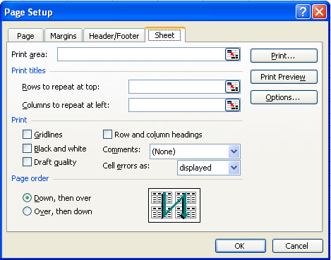

{}  
Sometimes, developers need to configure page setup and print settings to control the printing process. Page setup and print settings offer various options and are fully supported in Aspose.Cells.  

This article shows how to create a console application in JavaScript via C++, and apply page setup and printing options to a worksheet with a few simple lines of code using the Aspose.Cells API.  
{}  

## **Working with Page and Print Settings**  

For this example, we created a workbook in Microsoft Excel and used Aspose.Cells to set page setup and print options.  

### **Using Aspose.Cells to set Page Setup Options**  

First create a simple worksheet in Microsoft Excel. Then apply page setup options to it. Executing the code changes the Page Setup options as in the screenshot below.  

|**Output file.**|  
| :- |  
||  

1. Create a worksheet with some data in Microsoft Excel:  
   1. Open a new workbook in Microsoft Excel.  
   1. Add some data.  
2. Set page setup options:  
   Apply page setup options to the file. Below is a screenshot of the default options, before the new options are applied.  

|**Default page setup options.**|  
| :- |  
||  

1. Download and install Aspose.Cells:  
   1. [Download](https://downloads.aspose.com/cells/javascript-cpp) Aspose.Cells for JavaScript via C++.  
   1. Install it on your development computer.  
      All Aspose components, when installed, work in evaluation mode. The evaluation mode has no time limit and it only injects watermarks into produced documents.  
2. Create a project:  
   1. Start your JavaScript environment.  
   1. Create a new console application.  
      This example will show a JavaScript console application, but you can use C++ bindings too.  
3. Add references:  
   1. This example uses Aspose.Cells, so add a reference to that component to the project. For example:  
      …\Program Files\Aspose\Aspose.Cells\Bin\JavaScript-Cpp\Aspose.Cells.node  
4. Write the application that invokes the API:  

```html
<!DOCTYPE html>
<html>
    <head>
        <title>Aspose.Cells Example</title>
    </head>
    <body>
        <h1>Page Setup Example</h1>
        <input type="file" id="fileInput" accept=".xls,.xlsx,.csv" />
        <button id="runExample">Run Example</button>
        <a id="downloadLink" style="display: none;">Download Result</a>
        <div id="result"></div>
    </body>

    <script src="aspose.cells.js.min.js"></script>
    <script type="text/javascript">
        const { Workbook, SaveFormat, PageOrientationType, PaperSizeType } = AsposeCells;
        
        AsposeCells.onReady({
            license: "/lic/aspose.cells.enc",
            fontPath: "/fonts/",
            fontList: [
                "arial.ttf",
                "NotoSansSC-Regular.ttf"
            ]
        }).then(() => {
            console.log("Aspose.Cells initialized");
        });

        document.getElementById('runExample').addEventListener('click', async () => {
            const fileInput = document.getElementById('fileInput');
            if (!fileInput.files.length) {
                document.getElementById('result').innerHTML = '<p style="color: red;">Please select an Excel file.</p>';
                return;
            }

            const file = fileInput.files[0];
            const arrayBuffer = await file.arrayBuffer();

            // Instantiate workbook from uploaded file
            const workbook = new Workbook(new Uint8Array(arrayBuffer));

            // Accessing the first worksheet in the Excel file
            const worksheet = workbook.worksheets.get(0);

            // Access page setup as a property
            const pageSetup = worksheet.pageSetup;

            // Setting the orientation to Portrait
            pageSetup.orientation = PageOrientationType.Portrait;

            // Setting the number of pages to which the length of the worksheet will be spanned
            pageSetup.fitToPagesTall = 1;

            // Setting the number of pages to which the width of the worksheet will be spanned
            pageSetup.fitToPagesWide = 1;

            // Setting the paper size to A4
            pageSetup.paperSize = PaperSizeType.PaperA4;

            // Setting the print quality of the worksheet to 1200 dpi
            pageSetup.printQuality = 1200;

            // Setting the first page number of the worksheet pages
            pageSetup.firstPageNumber = 2;

            // Save the workbook and provide download link
            const outputData = workbook.save(SaveFormat.Xlsx);
            const blob = new Blob([outputData]);
            const downloadLink = document.getElementById('downloadLink');
            downloadLink.href = URL.createObjectURL(blob);
            downloadLink.download = 'PageSetup_out.xlsx';
            downloadLink.style.display = 'block';
            downloadLink.textContent = 'Download Modified Excel File';

            document.getElementById('result').innerHTML = '<p style="color: green;">Page setup modified successfully! Click the download link to get the modified file.</p>';
        });
    </script>
</html>
```  

### **Setting Print Options**  

Page setup settings also provide several print options (also called sheet options) that allow users to control how worksheet pages are printed. They allow users to:  

- Select a specific print area of a worksheet.  
- Print titles.  
- Print gridlines.  
- Print row/column headings.  
- Achieve draft quality.  
- Print comments.  
- Print cell errors.  
- Define page ordering.  

The example that follows applies print options to the file created in the example above (PageSetup.xls). The screenshot below shows the default print options before new options are applied.  

|**Input document**|  
| :- |  
||  
Executing the code changes the print options.  

|**Output file**|  
| :- |  
||  

```html
<!DOCTYPE html>
<html>
    <head>
        <title>Aspose.Cells Page Setup Example</title>
    </head>
    <body>
        <h1>Page Setup Example</h1>
        <input type="file" id="fileInput" accept=".xls,.xlsx,.csv" />
        <button id="runExample">Run Example</button>
        <a id="downloadLink" style="display: none;">Download Result</a>
        <div id="result"></div>
    </body>

    <script src="aspose.cells.js.min.js"></script>
    <script type="text/javascript">
        const { Workbook, SaveFormat, Utils } = AsposeCells;
        
        AsposeCells.onReady({
            license: "/lic/aspose.cells.enc",
            fontPath: "/fonts/",
            fontList: [
                "arial.ttf",
                "NotoSansSC-Regular.ttf"
            ]
        }).then(() => {
            console.log("Aspose.Cells initialized");
        });

        document.getElementById('runExample').addEventListener('click', async () => {
            const fileInput = document.getElementById('fileInput');
            if (!fileInput.files.length) {
                document.getElementById('result').innerHTML = '<p style="color: red;">Please select an Excel file.</p>';
                return;
            }

            const file = fileInput.files[0];
            const arrayBuffer = await file.arrayBuffer();
            
            // Open the workbook from the uploaded file
            const workbook = new Workbook(new Uint8Array(arrayBuffer));
            
            // Accessing the first worksheet in the Excel file
            const worksheet = workbook.worksheets.get(0);
            
            const pageSetup = worksheet.pageSetup;
            
            // Specifying the cells range (from A1 cell to E30 cell) of the print area
            pageSetup.printArea = "A1:E30";
            
            // Defining column numbers A & E as title columns
            pageSetup.printTitleColumns = "$A:$E";
            
            // Defining row numbers 1 as title rows
            pageSetup.printTitleRows = "$1:$2";
            
            // Allow printing gridlines
            pageSetup.printGridlines = true;
            
            // Allow printing row/column headings
            pageSetup.printHeadings = true;
            
            // Allow printing worksheet in black & white mode
            pageSetup.blackAndWhite = true;
            
            // Allow printing comments as displayed on worksheet
            pageSetup.printComments = AsposeCells.PrintCommentsType.PrintInPlace;
            
            // Allow printing worksheet with draft quality
            pageSetup.printDraft = true;
            
            // Allow printing cell errors as N/A
            pageSetup.printErrors = AsposeCells.PrintErrorsType.PrintErrorsNA;
            
            // Setting the printing order of the pages to over then down
            pageSetup.order = AsposeCells.PrintOrderType.OverThenDown;
            
            // Save the workbook and provide download link
            const outputData = workbook.save(SaveFormat.Xlsx);
            const blob = new Blob([outputData]);
            const downloadLink = document.getElementById('downloadLink');
            downloadLink.href = URL.createObjectURL(blob);
            downloadLink.download = 'PageSetup_Print_out.xlsx';
            downloadLink.style.display = 'block';
            downloadLink.textContent = 'Download Modified Excel File';
            
            document.getElementById('result').innerHTML = '<p style="color: green;">Page setup applied successfully! Click the download link to get the modified file.</p>';
        });
    </script>
</html>
```