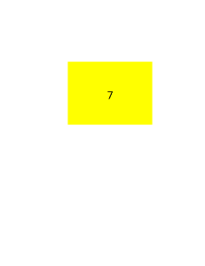

## **Possible Usage Scenarios**  

You can render a sequence of pages of your Excel file to images by using Aspose.Cells with [**ImageOrPrintOptions.pageIndex**](https://reference.aspose.com/cells/javascript-cpp/imageorprintoptions/#pageIndex--) and [**ImageOrPrintOptions.pageCount**](https://reference.aspose.com/cells/javascript-cpp/imageorprintoptions/#pageCount--) properties. These properties are useful when there are so many e.g. thousands of pages in your worksheet but you want to render some of them only. This will not only save the processing time but will also save the memory consumption of the rendering process.  

## **Render Sequence of Pages using PageIndex and PageCount Properties of ImageOrPrintOptions**  

The following sample code loads the [sample Excel file](55541781.xlsx) and renders only pages 4, 5, 6, and 7 using the [**ImageOrPrintOptions.pageIndex**](https://reference.aspose.com/cells/javascript-cpp/imageorprintoptions/#pageIndex--) and [**ImageOrPrintOptions.pageCount**](https://reference.aspose.com/cells/javascript-cpp/imageorprintoptions/#pageCount--) properties. Here are the rendered pages generated by the code.  

|||  
| :- | :- |  
|||  

## **Sample Code**  

```html
<!DOCTYPE html>
<html>
    <head>
        <title>Aspose.Cells Example - Export Pages as Images</title>
    </head>
    <body>
        <h1>Export Specified Pages as Images</h1>
        <input type="file" id="fileInput" accept=".xls,.xlsx,.csv" />
        <button id="runExample">Run Example</button>
        <a id="downloadLink" style="display: none;">Download Result</a>
        <div id="downloadLinks"></div>
        <div id="result"></div>
    </body>

    <script src="aspose.cells.js.min.js"></script>
    <script type="text/javascript">
        const { Workbook, ImageOrPrintOptions, SheetRender, ImageType, SaveFormat, Utils } = AsposeCells;
        
        AsposeCells.onReady({
            license: "/lic/aspose.cells.enc",
            fontPath: "/fonts/",
            fontList: [
                "arial.ttf",
                "NotoSansSC-Regular.ttf"
            ]
        }).then(() => {
            console.log("Aspose.Cells initialized");
        });

        document.getElementById('runExample').addEventListener('click', async () => {
            const fileInput = document.getElementById('fileInput');
            const resultDiv = document.getElementById('result');
            const downloadLinksDiv = document.getElementById('downloadLinks');
            const singleDownloadLink = document.getElementById('downloadLink');
            downloadLinksDiv.innerHTML = '';
            singleDownloadLink.style.display = 'none';
            resultDiv.innerHTML = '';

            if (!fileInput.files.length) {
                resultDiv.innerHTML = '<p style="color: red;">Please select an Excel file.</p>';
                return;
            }

            // Read the selected file
            const file = fileInput.files[0];
            const arrayBuffer = await file.arrayBuffer();

            // Instantiate Workbook from uploaded file
            const workbook = new Workbook(new Uint8Array(arrayBuffer));

            // Access the first worksheet
            const worksheet = workbook.worksheets.get(0);

            // Specify image or print options
            // We want to print pages 4, 5, 6, 7
            const opts = new ImageOrPrintOptions();
            opts.pageIndex = 3;
            opts.pageCount = 4;
            opts.imageType = ImageType.Png;

            // Create sheet render object
            const sheetRender = new SheetRender(worksheet, opts);

            // Generate images for the specified pages and create download links
            // Loop from pageIndex to pageIndex + pageCount - 1 to produce the intended pages
            for (let i = opts.pageIndex; i < opts.pageIndex + opts.pageCount; i++) {
                // toImage in browser returns image data (Uint8Array)
                const imageData = sheetRender.toImage(i);
                const blob = new Blob([imageData], { type: 'image/png' });
                const url = URL.createObjectURL(blob);
                const a = document.createElement('a');
                a.href = url;
                a.download = `outputImage-${i + 1}.png`;
                a.textContent = `Download outputImage-${i + 1}.png`;
                a.style.display = 'block';
                downloadLinksDiv.appendChild(a);
            }

            resultDiv.innerHTML = '<p style="color: green;">Images generated successfully! Click the links below to download.</p>';
        });
    </script>
</html>
```