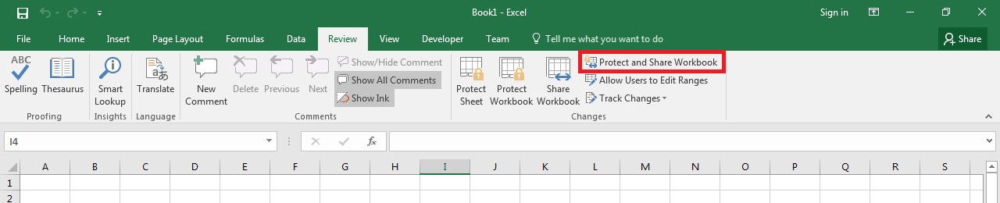
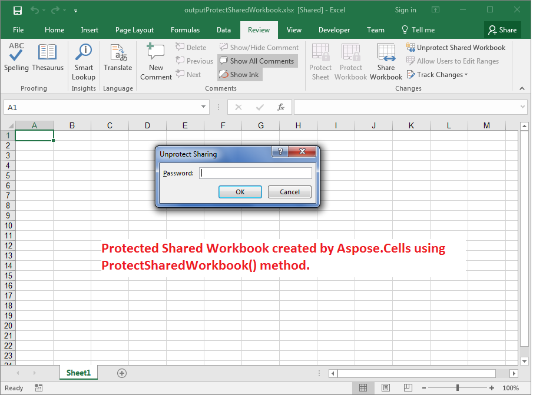

## **Possible Usage Scenarios**

You can protect or unprotect the shared workbook with Microsoft Excel as shown in the following screenshot. Aspose.Cells for JavaScript via C++ also supports this feature with the [**Workbook.protectSharedWorkbook(string)**](https://reference.aspose.com/cells/javascript-cpp/workbook/#protectSharedWorkbook-string-) and [**Workbook.unprotectSharedWorkbook(string)**](https://reference.aspose.com/cells/javascript-cpp/workbook/#unprotectSharedWorkbook-string-) methods.



## **Password Protect or Unprotect the Shared Workbook**

The following sample code creates a workbook, protects it while enabling sharing, and saves it as the [output Excel file](55541777.xlsx). The screenshot shows that when you try to unprotect it, Microsoft Excel prompts you to enter the password to unprotect it.



## **Sample Code**

```html
<!DOCTYPE html>
<html>
    <head>
        <title>Aspose.Cells Example</title>
    </head>
    <body>
        <h1>Protect Shared Workbook Example</h1>
        <input type="file" id="fileInput" accept=".xls,.xlsx,.csv" />
        <button id="runExample">Run Example</button>
        <a id="downloadLink" style="display: none;">Download Result</a>
        <div id="result"></div>
    </body>

    <script src="aspose.cells.js.min.js"></script>
    <script type="text/javascript">
        const { Workbook, SaveFormat } = AsposeCells;
        
        AsposeCells.onReady({
            license: "/lic/aspose.cells.enc",
            fontPath: "/fonts/",
            fontList: [
                "arial.ttf",
                "NotoSansSC-Regular.ttf"
            ]
        }).then(() => {
            console.log("Aspose.Cells initialized");
        });

        document.getElementById('runExample').addEventListener('click', async () => {
            // Creating an empty Workbook
            const workbook = new Workbook();
            
            // Protect the Shared Workbook with Password
            workbook.protectSharedWorkbook("1234");
            
            // Uncomment this line to Unprotect the Shared Workbook
            // workbook.unprotectSharedWorkbook("1234");
            
            // Saving the modified Excel file
            const outputData = workbook.save(SaveFormat.Xlsx);
            const blob = new Blob([outputData]);
            const downloadLink = document.getElementById('downloadLink');
            downloadLink.href = URL.createObjectURL(blob);
            downloadLink.download = 'outputProtectSharedWorkbook.xlsx';
            downloadLink.style.display = 'block';
            downloadLink.textContent = 'Download Excel File';
            
            document.getElementById('result').innerHTML = '<p style="color: green;">Workbook protected successfully! Click the download link to get the file.</p>';
        });
    </script>
</html>
```