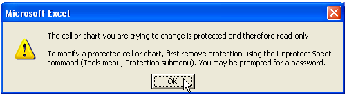

{}

When a worksheet is protected, the actions a user can take are restricted. For example, they cannot input data, insert, or delete rows or columns etc.

{}

## **Protect Worksheets**

### **Introduction**

The general protection options in Microsoft Excel are:

- Contents
- Objects
- Scenarios

Protected worksheets don't hide or protect sensitive data, so it's different from file encryption. Generally, worksheet protection is suitable for presentation purposes. It prevents the end user from modifying data, content, and formatting in the worksheet.

### **Protect a Worksheet**

Aspose.Cells provides a class, [**Workbook**](https://reference.aspose.com/cells/javascript-cpp/workbook) that represents a Microsoft Excel file. The [**Workbook**](https://reference.aspose.com/cells/javascript-cpp/workbook) class contains a [**worksheets**](https://reference.aspose.com/cells/javascript-cpp/workbook/#worksheets--) collection that allows access to each worksheet in an Excel file. A worksheet is represented by the [**Worksheet**](https://reference.aspose.com/cells/javascript-cpp/worksheet) class.

The [**Worksheet**](https://reference.aspose.com/cells/javascript-cpp/worksheet) class provides the [**protect(ProtectionType)**](https://reference.aspose.com/cells/javascript-cpp/worksheet/#protect-protectiontype-) method that is used to apply protection on the worksheet. The [**protect(ProtectionType)**](https://reference.aspose.com/cells/javascript-cpp/worksheet/#protect-protectiontype-) method accepts the following parameters:

- Protection Type, the type of protection to apply on the worksheet. Protection type is applied with the help of the [**ProtectionType**](https://reference.aspose.com/cells/javascript-cpp/protectiontype) enumeration.
- New Password, the new password used to protect the worksheet.
- Old Password, the old password, if the worksheet is already password protected. If the worksheet is not already protected then just pass null.

The [**ProtectionType**](https://reference.aspose.com/cells/javascript-cpp/protectiontype) enumeration contains the following pre-defined protection types:

|**Protection Types**|**Description**|
| :- | :- |
|All|The user cannot modify anything on this worksheet|
|Contents|The user cannot enter data in this worksheet|
|Objects|The user cannot modify drawing objects|
|Scenarios|The user cannot modify saved scenarios|
|Structure|The user cannot modify the structure|
|Windows|Protection is applied to windows|
|None|No protection is applied|

The example below shows how to protect a worksheet with a password.

```html
<!DOCTYPE html>
<html>
    <head>
        <title>Aspose.Cells Protect Worksheet Example</title>
    </head>
    <body>
        <h1>Protect Worksheet Example</h1>
        <input type="file" id="fileInput" accept=".xls,.xlsx,.csv" />
        <button id="runExample">Run Example</button>
        <a id="downloadLink" style="display: none;">Download Result</a>
        <div id="result"></div>
    </body>

    <script src="aspose.cells.js.min.js"></script>
    <script type="text/javascript">
        const { Workbook, SaveFormat, ProtectionType, Utils } = AsposeCells;
        
        AsposeCells.onReady({
            license: "/lic/aspose.cells.enc",
            fontPath: "/fonts/",
            fontList: [
                "arial.ttf",
                "NotoSansSC-Regular.ttf"
            ]
        }).then(() => {
            console.log("Aspose.Cells initialized");
        });

        document.getElementById('runExample').addEventListener('click', async () => {
            const fileInput = document.getElementById('fileInput');
            if (!fileInput.files.length) {
                document.getElementById('result').innerHTML = '<p style="color: red;">Please select an Excel file.</p>';
                return;
            }

            // Ensure Aspose.Cells is initialized before proceeding
            await AsposeCells.onReady();

            const file = fileInput.files[0];
            const arrayBuffer = await file.arrayBuffer();
            
            // Instantiating a Workbook object with file buffer
            const workbook = new Workbook(new Uint8Array(arrayBuffer));
            
            // Accessing the first worksheet in the Excel file
            const worksheet = workbook.worksheets.get(0);
            
            // Protecting the worksheet with a password
            worksheet.protect(ProtectionType.All, "aspose", null);
            
            // Saving the modified Excel file in Excel 97-2003 format
            const outputData = workbook.save(SaveFormat.Excel97To2003);
            const blob = new Blob([outputData]);
            const downloadLink = document.getElementById('downloadLink');
            downloadLink.href = URL.createObjectURL(blob);
            downloadLink.download = 'output.out.xls';
            downloadLink.style.display = 'block';
            downloadLink.textContent = 'Download Modified Excel File';
            
            document.getElementById('result').innerHTML = '<p style="color: green;">Worksheet protected successfully! Click the download link to get the modified file.</p>';
        });
    </script>
</html>
```

After the above code is used to protect the worksheet, you can check the protection on the worksheet by opening it. Once you open the file and try to add some data to the worksheet, you will see the following dialog:

|**A dialog warning that a user can't modify the worksheet**|
| :- |
||

To work on the worksheet, unprotect the worksheet by selecting the **Protection**, then **Unprotect Sheet** from the **Tools** menu item.

After you select Unprotect Sheet menu item, a dialog will open that would prompt you to enter the password so that you may work on the worksheet as shown below:

||

### **Protect a few Cells in the Worksheet Using Microsoft Excel**

There might be certain scenarios where you need to lock a few cells only in the worksheet. If you want to lock some specific cells in the worksheet, you have to unlock all the other cells in the worksheet. All the cells in a worksheet are already initialized for locking; you may check this by opening any Excel file in MS Excel and clicking the **Format | Cells...** to show the **Format Cells** dialog box and then click the **Protection** tab and see a checkbox labeled "Locked" is checked by default.

The following points describe how to lock a few cells using MS Excel. This method applies to Microsoft Office Excel 97, 2000, 2002, 2003, and greater versions.

1. Select the entire worksheet by clicking the **Select All** button (the gray rectangle directly above the row number for row 1 and to the left of column letter A).
2. Click **Cells** on the **Format** menu, click the **Protection** tab, and then clear the **Locked** checkbox.
   This unlocks all the cells on the worksheet.
   If the **Cells** command is not available, parts of the worksheet may already be locked. On the **Tools** menu, point to **Protection**, and then click **Unprotect Sheet**.
3. Select just the cells you want to lock and repeat step 2, but this time select the **Locked** checkbox.
4. On the **Tools** menu, point to **Protection**, click **Protect Sheet** and then click **OK**.
5. In the **Protect Sheet** dialog box, you have the option to specify a password and select the elements that you want users to be able to change.

### **Protect a few Cells in the Worksheet Using Aspose.Cells**

In this method, we use the Aspose.Cells API only to do the task.

Example: The following example exhibits how to protect a few cells in the worksheet. It unlocks all the cells in the worksheet first and then locks 3 cells (A1, B1, C1) in it. Finally, it protects the worksheet. The [**Style**](https://reference.aspose.com/cells/javascript-cpp/style) object contains a boolean property, [**isLocked()**](https://reference.aspose.com/cells/javascript-cpp/style/#isLocked--). You can set [**isLocked()**](https://reference.aspose.com/cells/javascript-cpp/style/#isLocked--) property to true or false and apply the *Column/Row.applyStyle()* method to lock or unlock the row/column with your desired attributes.

```html
<!DOCTYPE html>
<html>
    <head>
        <title>Aspose.Cells Example</title>
    </head>
    <body>
        <h1>Unlock Columns and Protect Specific Cells Example</h1>
        <input type="file" id="fileInput" accept=".xls,.xlsx,.csv" />
        <button id="runExample">Run Example</button>
        <a id="downloadLink" style="display: none;">Download Result</a>
        <div id="result"></div>
    </body>

    <script src="aspose.cells.js.min.js"></script>
    <script type="text/javascript">
        const { Workbook, SaveFormat, StyleFlag, ProtectionType } = AsposeCells;
        
        const readyPromise = AsposeCells.onReady({
            license: "/lic/aspose.cells.enc",
            fontPath: "/fonts/",
            fontList: [
                "arial.ttf",
                "NotoSansSC-Regular.ttf"
            ]
        }).then(() => {
            console.log("Aspose.Cells initialized");
        });

        document.getElementById('runExample').addEventListener('click', async () => {
            await readyPromise;

            // Create a new workbook.
            const wb = new Workbook();

            // Create a worksheet object and obtain the first sheet.
            const sheet = wb.worksheets.get(0);

            // Define the style object.
            let style;

            // Define the styleflag object
            const styleflag = new StyleFlag();

            // Loop through all the columns in the worksheet and unlock them.
            for (let i = 0; i <= 255; i++) {
                style = sheet.cells.columns.get(i).style;
                style.isLocked = false;
                styleflag.locked = true;
                sheet.cells.columns.get(i).applyStyle(style, styleflag);
            }

            // Lock the three cells...i.e. A1, B1, C1.
            style = sheet.cells.get("A1").style;
            style.isLocked = true;
            sheet.cells.get("A1").style = style;

            style = sheet.cells.get("B1").style;
            style.isLocked = true;
            sheet.cells.get("B1").style = style;

            style = sheet.cells.get("C1").style;
            style.isLocked = true;
            sheet.cells.get("C1").style = style;

            // Finally, Protect the sheet now.
            sheet.protect(ProtectionType.All);

            // Save the excel file and provide download link
            const outputData = wb.save(SaveFormat.Excel97To2003);
            const blob = new Blob([outputData]);
            const downloadLink = document.getElementById('downloadLink');
            downloadLink.href = URL.createObjectURL(blob);
            downloadLink.download = 'output.out.xls';
            downloadLink.style.display = 'block';
            downloadLink.textContent = 'Download Excel File';

            document.getElementById('result').innerHTML = '<p style="color: green;">Operation completed successfully! Click the download link to get the modified file.</p>';
        });
    </script>
</html>
```

### **Protect a Row in the Worksheet**

Aspose.Cells allows you to easily lock any row in the worksheet. Here, we can make use of the [**applyStyle(Style, StyleFlag)**](https://reference.aspose.com/cells/javascript-cpp/row/#applyStyle-style-styleflag-) method of [**Aspose.Cells.Row**](https://reference.aspose.com/cells/javascript-cpp/row) class to apply [**Style**](https://reference.aspose.com/cells/javascript-cpp/style) to a particular row in the worksheet. This method takes two arguments: a [**Style**](https://reference.aspose.com/cells/javascript-cpp/style) object and [**StyleFlag**](https://reference.aspose.com/cells/javascript-cpp/styleflag) object which has all the members related to applied formatting.

The following example shows how to protect a row in the worksheet. It unlocks all the cells in the worksheet first and then locks the first row in it. Finally, it protects the worksheet. The [**Style**](https://reference.aspose.com/cells/javascript-cpp/style) object contains a boolean property, [**isLocked()**](https://reference.aspose.com/cells/javascript-cpp/style/#isLocked--). You can set [**isLocked()**](https://reference.aspose.com/cells/javascript-cpp/style/#isLocked--) property to true or false to lock or unlock the row/column using the [**StyleFlag**](https://reference.aspose.com/cells/javascript-cpp/styleflag) object.

```html
<!DOCTYPE html>
<html>
    <head>
        <title>Aspose.Cells Example</title>
    </head>
    <body>
        <h1>Aspose.Cells Protect Worksheet Example</h1>
        <input type="file" id="fileInput" accept=".xls,.xlsx,.csv" />
        <button id="runExample">Run Example</button>
        <a id="downloadLink" style="display: none;">Download Result</a>
        <div id="result"></div>
    </body>

    <script src="aspose.cells.js.min.js"></script>
    <script type="text/javascript">
        const { Workbook, SaveFormat, StyleFlag, ProtectionType, Utils } = AsposeCells;
        
        AsposeCells.onReady({
            license: "/lic/aspose.cells.enc",
            fontPath: "/fonts/",
            fontList: [
                "arial.ttf",
                "NotoSansSC-Regular.ttf"
            ]
        }).then(() => {
            console.log("Aspose.Cells initialized");
        });

        document.getElementById('runExample').addEventListener('click', async () => {
            // Create a new workbook.
            const wb = new Workbook();

            // Create a worksheet object and obtain the first sheet.
            const sheet = wb.worksheets.get(0);

            // Define the style object.
            let style;

            // Define the styleflag object.
            const flag = new StyleFlag();

            // Loop through all the columns in the worksheet and unlock them.
            for (let i = 0; i <= 255; i++) {
                style = sheet.cells.columns.get(i).style;
                style.isLocked = false;
                flag.locked = true;
                sheet.cells.columns.get(i).applyStyle(style, flag);
            }

            // Get the first row style.
            style = sheet.cells.rows.get(0).style;

            // Lock it.
            style.isLocked = true;

            // Set the lock setting.
            flag.locked = true;

            // Apply the style to the first row.
            sheet.cells.applyRowStyle(0, style, flag);

            // Protect the sheet.
            sheet.protect(ProtectionType.All);

            // Save the excel file.
            const outputData = wb.save(SaveFormat.Excel97To2003);
            const blob = new Blob([outputData]);
            const downloadLink = document.getElementById('downloadLink');
            downloadLink.href = URL.createObjectURL(blob);
            downloadLink.download = 'output.out.xls';
            downloadLink.style.display = 'block';
            downloadLink.textContent = 'Download Excel File';

            document.getElementById('result').innerHTML = '<p style="color: green;">Workbook created and protected. Click the download link to get the file.</p>';
        });
    </script>
</html>
```

### **Protect a Column in the Worksheet**

Aspose.Cells allows you to easily lock any column in the worksheet. Here, we can make use of the [**applyStyle(Style, StyleFlag)**](https://reference.aspose.com/cells/javascript-cpp/column/#applyStyle-style-styleflag-) method of [**Aspose.Cells.Column**](https://reference.aspose.com/cells/javascript-cpp/column) class to apply [**Style**](https://reference.aspose.com/cells/javascript-cpp/style) to a particular column in the worksheet. This method takes two arguments: a [**Style**](https://reference.aspose.com/cells/javascript-cpp/style) object and [**StyleFlag**](https://reference.aspose.com/cells/javascript-cpp/styleflag) object which has all the members related to applied formatting.

The following example shows how to protect a column in the worksheet. It unlocks all the cells in the worksheet first and then locks the first column in it. Finally, it protects the worksheet. The [**Style**](https://reference.aspose.com/cells/javascript-cpp/style) object contains a boolean property, [**isLocked()**](https://reference.aspose.com/cells/javascript-cpp/style/#isLocked--). You can set [**isLocked()**](https://reference.aspose.com/cells/javascript-cpp/style/#isLocked--) property to true or false to lock or unlock the row/column using the [**StyleFlag**](https://reference.aspose.com/cells/javascript-cpp/styleflag) object.

```html
<!DOCTYPE html>
<html>
    <head>
        <title>Aspose.Cells Example</title>
    </head>
    <body>
        <h1>Aspose.Cells Example - Unlock Columns and Protect Sheet</h1>
        <input type="file" id="fileInput" accept=".xls,.xlsx,.csv" />
        <button id="runExample">Run Example</button>
        <a id="downloadLink" style="display: none;">Download Result</a>
        <div id="result"></div>
    </body>

    <script src="aspose.cells.js.min.js"></script>
    <script type="text/javascript">
        const { Workbook, SaveFormat, StyleFlag, ProtectionType } = AsposeCells;
        
        const readyPromise = AsposeCells.onReady({
            license: "/lic/aspose.cells.enc",
            fontPath: "/fonts/",
            fontList: [
                "arial.ttf",
                "NotoSansSC-Regular.ttf"
            ]
        }).then(() => {
            console.log("Aspose.Cells initialized");
        });

        document.getElementById('runExample').addEventListener('click', async () => {
            const fileInput = document.getElementById('fileInput');
            if (!fileInput.files.length) {
                // If no file provided, a new workbook will be created
                document.getElementById('result').innerHTML = '<p style="color: orange;">No file selected. A new workbook will be created and processed.</p>';
            } else {
                document.getElementById('result').innerHTML = '<p>Processing selected file...</p>';
            }

            await readyPromise;

            // Load workbook from file if provided, otherwise create new workbook
            let workbook;
            if (fileInput.files.length) {
                const file = fileInput.files[0];
                const arrayBuffer = await file.arrayBuffer();
                workbook = new Workbook(new Uint8Array(arrayBuffer));
            } else {
                workbook = new Workbook();
            }

            // Create a worksheet object and obtain the first sheet.
            const sheet = workbook.worksheets.get(0);

            // Define the style object.
            let style;

            // Define the styleflag object.
            const flag = new StyleFlag();

            // Loop through all the columns in the worksheet and unlock them.
            for (let i = 0; i <= 255; i++) {
                style = sheet.cells.columns.get(i).style;
                style.isLocked = false;
                flag.locked = true;
                sheet.cells.columns.get(i).applyStyle(style, flag);
            }

            // Get the first column style.
            style = sheet.cells.columns.get(0).style;

            // Lock it.
            style.isLocked = true;

            // Apply the style to the first column.
            sheet.cells.columns.get(0).applyStyle(style, flag);

            // Protect the sheet.
            sheet.protect(ProtectionType.All);

            // Save the excel file.
            const outputData = workbook.save(SaveFormat.Excel97To2003);
            const blob = new Blob([outputData]);
            const downloadLink = document.getElementById('downloadLink');
            downloadLink.href = URL.createObjectURL(blob);
            downloadLink.download = 'output.out.xls';
            downloadLink.style.display = 'block';
            downloadLink.textContent = 'Download Modified Excel File';

            document.getElementById('result').innerHTML = '<p style="color: green;">Operation completed successfully! Click the download link to get the modified file.</p>';
        });
    </script>
</html>
```

### **Allow Users to Edit Ranges**

The following example shows how to allow users to edit a range in a protected worksheet.

```html
<!DOCTYPE html>
<html>
    <head>
        <title>Aspose.Cells Example - Protect Range</title>
    </head>
    <body>
        <h1>Protect Range Example</h1>
        <input type="file" id="fileInput" accept=".xls,.xlsx,.csv" />
        <button id="runExample">Run Example</button>
        <a id="downloadLink" style="display: none;">Download Result</a>
        <div id="result"></div>
    </body>

    <script src="aspose.cells.js.min.js"></script>
    <script type="text/javascript">
        const { Workbook, SaveFormat, ProtectionType, Utils } = AsposeCells;
        
        AsposeCells.onReady({
            license: "/lic/aspose.cells.enc",
            fontPath: "/fonts/",
            fontList: [
                "arial.ttf",
                "NotoSansSC-Regular.ttf"
            ]
        }).then(() => {
            console.log("Aspose.Cells initialized");
        });

        document.getElementById('runExample').addEventListener('click', async () => {
            const fileInput = document.getElementById('fileInput');

            // Instantiate a new or loaded Workbook
            let book;
            if (fileInput.files && fileInput.files.length) {
                const file = fileInput.files[0];
                const arrayBuffer = await file.arrayBuffer();
                book = new Workbook(new Uint8Array(arrayBuffer));
            } else {
                book = new Workbook();
            }

            // Get the first (default) worksheet
            const sheet = book.worksheets.get(0);

            // Get the Allow Edit Ranges
            const allowRanges = sheet.allowEditRanges;

            // Define ProtectedRange
            let protected_range;

            // Create the range
            const idx = allowRanges.add("r2", 1, 1, 3, 3);
            protected_range = allowRanges.get(idx);

            // Specify the password
            protected_range.password = "123";

            // Protect the sheet
            sheet.protect(ProtectionType.All);

            // Save the Excel file
            const outputData = book.save(SaveFormat.Excel97To2003);
            const blob = new Blob([outputData]);
            const downloadLink = document.getElementById('downloadLink');
            downloadLink.href = URL.createObjectURL(blob);
            downloadLink.download = 'protectedrange.out.xls';
            downloadLink.style.display = 'block';
            downloadLink.textContent = 'Download Protected Range Excel File';

            document.getElementById('result').innerHTML = '<p style="color: green;">Protected range added and sheet protected successfully! Click the download link to get the modified file.</p>';
        });
    </script>
</html>
```