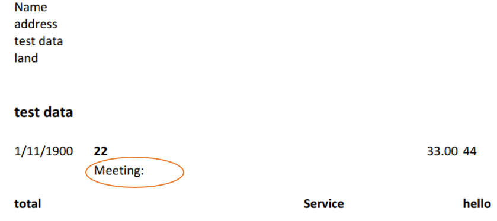
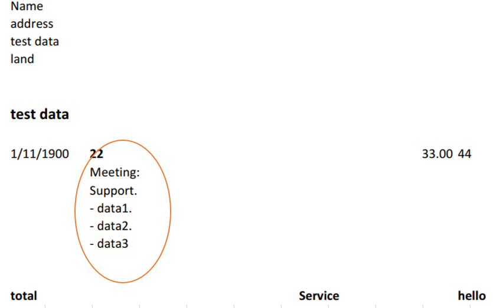

## **Possible Usage Scenarios**
The height of the row automatically matches the font of the content, but when the height of the cached row does not match the height of the content in the file, MS Excel will automatically adjust the row height when loading the file, while Aspose.Cells for JavaScript via C++ will not automatically adjust it to improve performance. If you need to use the Aspose.Cells program to automatically match line heights when loading files, you can achieve this through the parameter [autoFitterOptions(AutoFitterOptions) ](https://reference.aspose.com/cells/javascript-cpp/loadoptions/#autoFitterOptions-autofitteroptions-) in your code.

Please refer to the following image data. We can observe that the cached row height in line 11 is 15, but Excel automatically adjusted the row height when loading the file.
<br>


## **Adjust Row Height using Aspose.Cells for JavaScript via C++**
If you directly load the file and save it to PDF, the data will not be fully displayed in PDF because its cached line height is only 15.
<br>

<br>
If you set the parameter [autoFitterOptions(AutoFitterOptions) ](https://reference.aspose.com/cells/javascript-cpp/loadoptions/#autoFitterOptions-autofitteroptions-) to true when loading the file, then Aspose.Cells will automatically adjust the row height. The adjusted line height can effectively meet the text display requirements.
<br>


## **JavaScript Sample Code**

```html
<!DOCTYPE html>
<html>
    <head>
        <title>Aspose.Cells Example</title>
    </head>
    <body>
        <h1>Aspose.Cells LoadOptions & AutoFitter Example</h1>
        <input type="file" id="fileInput" accept=".xls,.xlsx,.csv" />
        <button id="runExample">Run Example</button>
        <div>
            <a id="downloadLink1" style="display: none;">Download out.pdf</a>
        </div>
        <div>
            <a id="downloadLink2" style="display: none;">Download out2.pdf</a>
        </div>
        <div id="result"></div>
    </body>

    <script src="aspose.cells.js.min.js"></script>
    <script type="text/javascript">
        const { Workbook, SaveFormat, LoadOptions, AutoFitterOptions } = AsposeCells;
        
        AsposeCells.onReady({
            license: "/lic/aspose.cells.enc",
            fontPath: "/fonts/",
            fontList: [
                "arial.ttf",
                "NotoSansSC-Regular.ttf"
            ]
        }).then(() => {
            console.log("Aspose.Cells initialized");
        });

        document.getElementById('runExample').addEventListener('click', async () => {
            const fileInput = document.getElementById('fileInput');
            const resultDiv = document.getElementById('result');
            const downloadLink1 = document.getElementById('downloadLink1');
            const downloadLink2 = document.getElementById('downloadLink2');

            if (!fileInput.files.length) {
                resultDiv.innerHTML = '<p style="color: red;">Please select an Excel file.</p>';
                return;
            }

            const file = fileInput.files[0];
            const arrayBuffer = await file.arrayBuffer();
            const data = new Uint8Array(arrayBuffer);

            // Load workbook and save as out.pdf
            const workbook = new Workbook(data);
            const outputData = workbook.save(SaveFormat.Pdf);
            const blob = new Blob([outputData], { type: 'application/pdf' });
            downloadLink1.href = URL.createObjectURL(blob);
            downloadLink1.download = 'out.pdf';
            downloadLink1.style.display = 'inline';
            downloadLink1.textContent = 'Download out.pdf';

            // Prepare LoadOptions with AutoFitterOptions and onlyAuto = true
            const loadOptions = new LoadOptions();
            loadOptions.autoFitterOptions = new AutoFitterOptions();
            loadOptions.autoFitterOptions.onlyAuto = true;

            // Load workbook with loadOptions and save as out2.pdf
            const book = new Workbook(data, loadOptions);
            const outputData2 = book.save(SaveFormat.Pdf);
            const blob2 = new Blob([outputData2], { type: 'application/pdf' });
            downloadLink2.href = URL.createObjectURL(blob2);
            downloadLink2.download = 'out2.pdf';
            downloadLink2.style.display = 'inline';
            downloadLink2.textContent = 'Download out2.pdf';

            resultDiv.innerHTML = '<p style="color: green;">Operation completed successfully! Click the download links to get the generated PDF files.</p>';
        });
    </script>
</html>
```