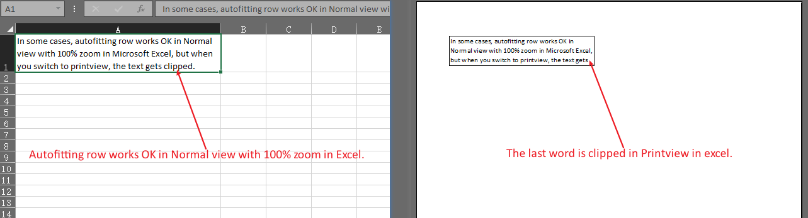
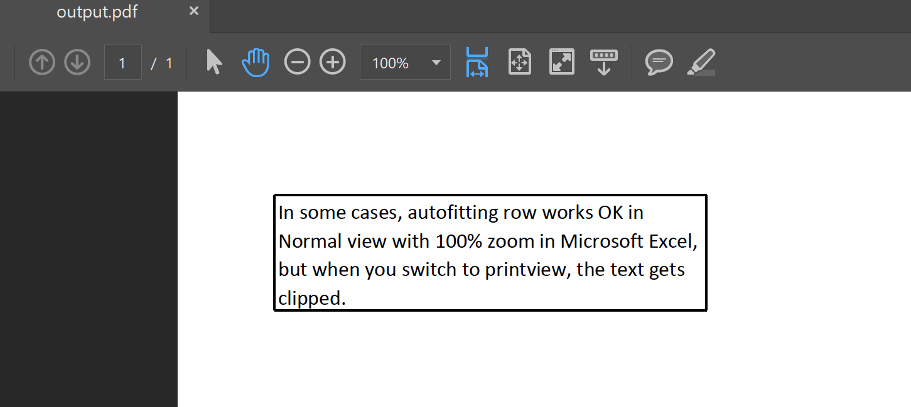

Generally, when you want to display all the text in a cell, you can auto-fit the row in Normal view with 100% zoom in Microsoft Excel. This allows the text to be fully visible in Normal view, and even when you print or save the file as a PDF, the text will be displayed correctly.

However, in some cases, auto-fitting the row works fine in Normal view, but when you switch to print view or save the file as a PDF, the text gets clipped. Please check the source file [Book1.xlsx](Book1.xlsx) and screenshots.



If you want to prevent text from being clipped in the saved PDF file, you can auto-fit the row with the [AutoFitterOptions.forRendering](https://reference.aspose.com/cells/javascript-cpp/autofitteroptions/#forRendering--) option.

```html
<!DOCTYPE html>
<html>
    <head>
        <title>Aspose.Cells Example</title>
    </head>
    <body>
        <h1>Autofit Rows and Save as PDF Example</h1>
        <input type="file" id="fileInput" accept=".xls,.xlsx,.csv" />
        <button id="runExample">Run Example</button>
        <a id="downloadLink" style="display: none;">Download Result</a>
        <div id="result"></div>
    </body>

    <script src="aspose.cells.js.min.js"></script>
    <script type="text/javascript">
        const { Workbook, AutoFitterOptions, SaveFormat, Utils } = AsposeCells;
        
        AsposeCells.onReady({
            license: "/lic/aspose.cells.enc",
            fontPath: "/fonts/",
            fontList: [
                "arial.ttf",
                "NotoSansSC-Regular.ttf"
            ]
        }).then(() => {
            console.log("Aspose.Cells initialized");
        });

        document.getElementById('runExample').addEventListener('click', async () => {
            const fileInput = document.getElementById('fileInput');
            if (!fileInput.files.length) {
                document.getElementById('result').innerHTML = '<p style="color: red;">Please select an Excel file.</p>';
                return;
            }

            const file = fileInput.files[0];
            const arrayBuffer = await file.arrayBuffer();

            // Init workbook instance from uploaded file.
            const workbook = new Workbook(new Uint8Array(arrayBuffer));

            // Set autofit options for rendering.
            const autoFitterOptions = new AutoFitterOptions();
            autoFitterOptions.forRendering = true;

            // Autofit rows with options on first worksheet.
            const worksheet = workbook.worksheets.get(0);
            worksheet.autoFitRows(autoFitterOptions);

            // Save to pdf.
            const outputData = workbook.save(SaveFormat.Pdf);
            const blob = new Blob([outputData], { type: 'application/pdf' });
            const downloadLink = document.getElementById('downloadLink');
            downloadLink.href = URL.createObjectURL(blob);
            downloadLink.download = 'output.pdf';
            downloadLink.style.display = 'block';
            downloadLink.textContent = 'Download PDF File';

            document.getElementById('result').innerHTML = '<p style="color: green;">Operation completed successfully! Click the download link to get the PDF file.</p>';
        });
    </script>
</html>
```

Now, the text is not clipped in the output PDF file.

