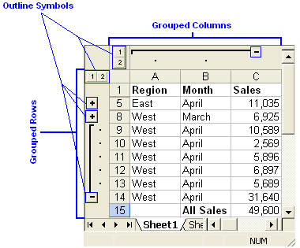

## **Introduction**

In a Microsoft Excel file, you can create an outline for the data to let you show and hide levels of detail with a single mouse click.

Click the **Outline Symbols**, 1, 2, 3, + and – to quickly display only the rows or columns that provide summaries or headings for sections in a worksheet, or you can use the symbols to see details under an individual summary or heading as shown below in the figure:

|**Grouping Rows and Columns.**|
| :- |
||

## **Group Management of Rows and Columns**

Aspose.Cells provides a class, [**Workbook**](https://reference.aspose.com/cells/javascript-cpp/workbook) that represents a Microsoft Excel file. The [**Workbook**](https://reference.aspose.com/cells/javascript-cpp/workbook) class contains a [**WorksheetCollection**](https://reference.aspose.com/cells/javascript-cpp/worksheetcollection) that allows access to each worksheet in the Excel file. A worksheet is represented by the [**Worksheet**](https://reference.aspose.com/cells/javascript-cpp/worksheet) class. The [**Worksheet**](https://reference.aspose.com/cells/javascript-cpp/worksheet) class provides a [**Cells**](https://reference.aspose.com/cells/javascript-cpp/cells) collection that represents all cells in the worksheet.

The [**Cells**](https://reference.aspose.com/cells/javascript-cpp/cells) collection provides several methods to manage rows or columns in a worksheet; a few of these are discussed below in more detail.

### **Grouping Rows and Columns**

It is possible to group rows or columns by calling the [**groupRows(number, number, boolean)**](https://reference.aspose.com/cells/javascript-cpp/cells/#groupRows-number-number-boolean-) and [**groupColumns(number, number)**](https://reference.aspose.com/cells/javascript-cpp/cells/#groupColumns-number-number-) methods of the [**Cells**](https://reference.aspose.com/cells/javascript-cpp/cells) collection. Both methods take the following parameters:

- First row/column index, the first row or column in the group.
- Last row/column index, the last row or column in the group.
- Is hidden, a Boolean parameter that specifies whether to hide rows/columns after grouping or not.

```html
<!DOCTYPE html>
<html>
    <head>
        <title>Group Rows and Columns Example</title>
    </head>
    <body>
        <h1>Group Rows and Columns Example</h1>
        <input type="file" id="fileInput" accept=".xls,.xlsx,.csv" />
        <button id="runExample">Run Example</button>
        <a id="downloadLink" style="display: none;">Download Result</a>
        <div id="result"></div>
    </body>

    <script src="aspose.cells.js.min.js"></script>
    <script type="text/javascript">
        const { Workbook, SaveFormat, Utils } = AsposeCells;
        
        AsposeCells.onReady({
            license: "/lic/aspose.cells.enc",
            fontPath: "/fonts/",
            fontList: [
                "arial.ttf",
                "NotoSansSC-Regular.ttf"
            ]
        }).then(() => {
            console.log("Aspose.Cells initialized");
        });

        document.getElementById('runExample').addEventListener('click', async () => {
            const fileInput = document.getElementById('fileInput');
            if (!fileInput.files.length) {
                document.getElementById('result').innerHTML = '<p style="color: red;">Please select an Excel file.</p>';
                return;
            }

            const file = fileInput.files[0];
            const arrayBuffer = await file.arrayBuffer();
            const workbook = new Workbook(new Uint8Array(arrayBuffer));
            const worksheet = workbook.worksheets.get(0);

            worksheet.cells.groupRows(0, 5, true);
            worksheet.cells.groupColumns(0, 2, true);

            const outputData = workbook.save(SaveFormat.Excel97To2003);
            const blob = new Blob([outputData]);
            const downloadLink = document.getElementById('downloadLink');
            downloadLink.href = URL.createObjectURL(blob);
            downloadLink.download = 'output.xls';
            downloadLink.style.display = 'block';
            downloadLink.textContent = 'Download Modified Excel File';

            document.getElementById('result').innerHTML = '<p style="color: green;">Rows and columns grouped successfully! Click the download link to get the modified file.</p>';
        });
    </script>
</html>
```

#### **Group Settings**

Microsoft Excel allows you to configure group settings for displaying:

- Summary rows below detail.
- Summary columns to the right of detail.

Developers can configure these group settings using the [**outline**](https://reference.aspose.com/cells/javascript-cpp/worksheet/#outline--) property of the [**Worksheet**](https://reference.aspose.com/cells/javascript-cpp/worksheet) class.

### **Summary Rows Below Detail**

It is possible to control whether summary rows are displayed below detail by setting the [**Outline**](https://reference.aspose.com/cells/javascript-cpp/outline) class' [**summaryRowBelow**](https://reference.aspose.com/cells/javascript-cpp/outline/#summaryRowBelow--) property to **true** or **false**.

```html
<!DOCTYPE html>
<html>
    <head>
        <title>Aspose.Cells Example</title>
        <meta charset="utf-8" />
    </head>
    <body>
        <h1>Aspose.Cells Example - Group Rows/Columns and Set Outline</h1>
        <input type="file" id="fileInput" accept=".xls,.xlsx,.csv" />
        <button id="runExample">Run Example</button>
        <a id="downloadLink" style="display: none;">Download Result</a>
        <div id="result"></div>
    </body>

    <script src="aspose.cells.js.min.js"></script>
    <script type="text/javascript">
        const { Workbook, SaveFormat } = AsposeCells;
        
        AsposeCells.onReady({
            license: "/lic/aspose.cells.enc",
            fontPath: "/fonts/",
            fontList: [
                "arial.ttf",
                "NotoSansSC-Regular.ttf"
            ]
        }).then(() => {
            console.log("Aspose.Cells initialized");
        });

        document.getElementById('runExample').addEventListener('click', async () => {
            const fileInput = document.getElementById('fileInput');
            const resultDiv = document.getElementById('result');

            if (!fileInput.files.length) {
                resultDiv.innerHTML = '<p style="color: red;">Please select an Excel file.</p>';
                return;
            }

            const file = fileInput.files[0];
            const arrayBuffer = await file.arrayBuffer();

            // Instantiating a Workbook object from the uploaded file
            const workbook = new Workbook(new Uint8Array(arrayBuffer));

            // Accessing the first worksheet in the Excel file
            const worksheet = workbook.worksheets.get(0);

            // Grouping first six rows and first three columns
            worksheet.cells.groupRows(0, 5, true);
            worksheet.cells.groupColumns(0, 2, true);

            // Setting SummaryRowBelow property to false
            worksheet.outline.summaryRowBelow = false;

            // Saving the modified Excel file (Excel97To2003 -> .xls)
            const outputData = workbook.save(SaveFormat.Excel97To2003);
            const blob = new Blob([outputData]);
            const downloadLink = document.getElementById('downloadLink');
            downloadLink.href = URL.createObjectURL(blob);
            downloadLink.download = 'output.xls';
            downloadLink.style.display = 'block';
            downloadLink.textContent = 'Download Modified Excel File';

            resultDiv.innerHTML = '<p style="color: green;">Operation completed successfully! Click the download link to get the modified file.</p>';
        });
    </script>
</html>
```

### **Summary Columns to Right of Detail**

Developers can also control displaying summary columns to the right of detail by setting the [**summaryColumnRight**](https://reference.aspose.com/cells/javascript-cpp/outline/#summaryColumnRight--) property of [**Outline**](https://reference.aspose.com/cells/javascript-cpp/outline) class to **true** or **false**.

```html
<!DOCTYPE html>
<html>
    <head>
        <title>Aspose.Cells Example</title>
    </head>
    <body>
        <h1>Group Rows and Columns Example</h1>
        <input type="file" id="fileInput" accept=".xls,.xlsx,.csv" />
        <button id="runExample">Run Example</button>
        <a id="downloadLink" style="display: none;">Download Result</a>
        <div id="result"></div>
    </body>

    <script src="aspose.cells.js.min.js"></script>
    <script type="text/javascript">
        const { Workbook, SaveFormat, Utils } = AsposeCells;
        
        AsposeCells.onReady({
            license: "/lic/aspose.cells.enc",
            fontPath: "/fonts/",
            fontList: [
                "arial.ttf",
                "NotoSansSC-Regular.ttf"
            ]
        }).then(() => {
            console.log("Aspose.Cells initialized");
        });

        document.getElementById('runExample').addEventListener('click', async () => {
            const fileInput = document.getElementById('fileInput');
            if (!fileInput.files.length) {
                document.getElementById('result').innerHTML = '<p style="color: red;">Please select an Excel file.</p>';
                return;
            }

            const file = fileInput.files[0];
            const arrayBuffer = await file.arrayBuffer();

            // Instantiating a Workbook object from uploaded file
            const workbook = new Workbook(new Uint8Array(arrayBuffer));

            // Accessing the first worksheet in the Excel file
            const worksheet = workbook.worksheets.get(0);

            // Grouping first six rows and first three columns
            worksheet.cells.groupRows(0, 5, true);
            worksheet.cells.groupColumns(0, 2, true);

            // Set summary column to right
            worksheet.outline.summaryColumnRight = true;

            // Saving the modified Excel file (Excel 97-2003 format)
            const outputData = workbook.save(SaveFormat.Excel97To2003);
            const blob = new Blob([outputData]);
            const downloadLink = document.getElementById('downloadLink');
            downloadLink.href = URL.createObjectURL(blob);
            downloadLink.download = 'output.xls';
            downloadLink.style.display = 'block';
            downloadLink.textContent = 'Download Modified Excel File';

            document.getElementById('result').innerHTML = '<p style="color: green;">Operation completed successfully! Click the download link to get the modified file.</p>';
        });
    </script>
</html>
```

## **Ungrouping Rows and Columns**

To ungroup any grouped rows or columns, call the [**Cells**](https://reference.aspose.com/cells/javascript-cpp/cells) collection's [**ungroupRows(number, number, boolean)**](https://reference.aspose.com/cells/javascript-cpp/cells/#ungroupRows-number-number-boolean-) and [**ungroupColumns(number, number)**](https://reference.aspose.com/cells/javascript-cpp/cells/#ungroupColumns-number-number-) methods. Both methods take two parameters:

- First row or column index, the first row/column to be ungrouped.
- Last row or column index, the last row/column to be ungrouped.

[**ungroupRows(number, number, boolean)**](https://reference.aspose.com/cells/javascript-cpp/cells/#ungroupRows-number-number-boolean-) has an overload that takes a Boolean third parameter. Setting it to **true** removes all grouped information. Otherwise, only the outer group information is removed.

```html
<!DOCTYPE html>
<html>
    <head>
        <title>Aspose.Cells Example</title>
    </head>
    <body>
        <h1>Ungroup Rows and Columns Example</h1>
        <input type="file" id="fileInput" accept=".xls,.xlsx,.csv" />
        <button id="runExample">Run Example</button>
        <a id="downloadLink" style="display: none;">Download Result</a>
        <div id="result"></div>
    </body>

    <script src="aspose.cells.js.min.js"></script>
    <script type="text/javascript">
        const { Workbook, SaveFormat } = AsposeCells;
        
        AsposeCells.onReady({
            license: "/lic/aspose.cells.enc",
            fontPath: "/fonts/",
            fontList: [
                "arial.ttf",
                "NotoSansSC-Regular.ttf"
            ]
        }).then(() => {
            console.log("Aspose.Cells initialized");
        });

        document.getElementById('runExample').addEventListener('click', async () => {
            const fileInput = document.getElementById('fileInput');
            if (!fileInput.files.length) {
                document.getElementById('result').innerHTML = '<p style="color: red;">Please select an Excel file.</p>';
                return;
            }

            const file = fileInput.files[0];
            const arrayBuffer = await file.arrayBuffer();

            // Instantiating a Workbook object with file content
            const workbook = new Workbook(new Uint8Array(arrayBuffer));

            // Accessing the first worksheet in the Excel file
            const worksheet = workbook.worksheets.get(0);

            // Ungrouping first six rows (from 0 to 5)
            worksheet.cells.ungroupRows(0, 5);

            // Ungrouping first three columns (from 0 to 2)
            worksheet.cells.ungroupColumns(0, 2);

            // Saving the modified Excel file
            const outputData = workbook.save(SaveFormat.Excel97To2003);
            const blob = new Blob([outputData]);
            const downloadLink = document.getElementById('downloadLink');
            downloadLink.href = URL.createObjectURL(blob);
            downloadLink.download = 'output.xls';
            downloadLink.style.display = 'block';
            downloadLink.textContent = 'Download Modified Excel File';

            document.getElementById('result').innerHTML = '<p style="color: green;">Operation completed successfully! Click the download link to get the modified file.</p>';
        });
    </script>
</html>
```