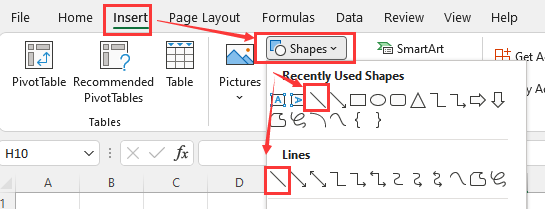
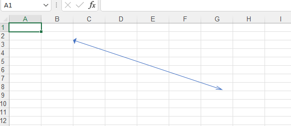
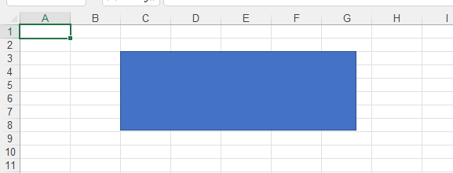
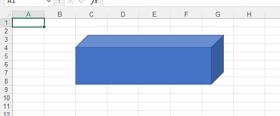
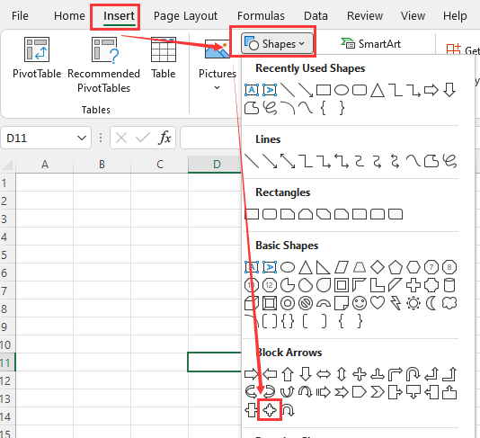
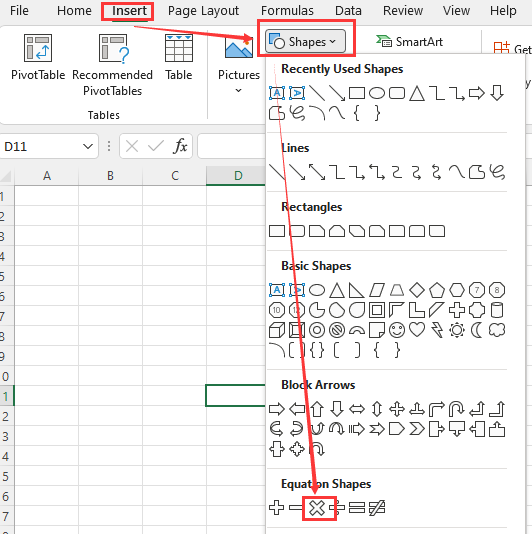

---
title: Insert Pictures and Shapes of Excel files with JavaScript via C++  
linktitle: Shapes  
type: docs  
weight: 140  
url: /javascript-cpp/insert-shapes/  
description: Manage pictures, OLE objects, and shapes in Excel files using Aspose.Cells for JavaScript via C++.  
---  

{}  
Sometimes you need to insert some necessary shapes into the worksheet. You may need to insert the same shape in different positions of the worksheet. Or you need to batch insert shapes in the worksheet.  
Do not worry! [Aspose.Cells](https://products.aspose.com/cells/) supports all these operations.  
{}  

The shapes in Excel are mainly divided into the following types:  
- **Pictures**  
- **OleObjects**  
- **Lines**  
- **Rectangles**  
- **Basic Shapes**  
- **Block Arrows**  
- **Equation Shapes**  
- **FlowCharts**  
- **Stars and Banners**  
- **Callouts**  

This guide document will select one or two shapes from each type to make samples. Through these examples, you will learn how to use [Aspose.Cells](https://products.aspose.com/cells/) to insert the specified shape into the worksheet.  

## **Adding Pictures in Excel Worksheet using JavaScript**  

Adding pictures to a spreadsheet is very easy. It only takes a few lines of code:  
Simply call the [**PictureCollection.add(number, number, number, number, Uint8Array)**](https://reference.aspose.com/cells/javascript-cpp/picturecollection/#add-number-number-number-number-uint8array-) method of the [**Pictures**](https://reference.aspose.com/cells/javascript-cpp/picturecollection) collection (encapsulated in the [**Worksheet**](https://reference.aspose.com/cells/javascript-cpp/worksheet) object). The [**PictureCollection.add(number, number, number, number, Uint8Array)**](https://reference.aspose.com/cells/javascript-cpp/picturecollection/#add-number-number-number-number-uint8array-) method takes the following parameters:  

- **Upper left row index**, the index of the upper left row.  
- **Upper left column index**, the index of the upper left column.  
- **Image file name**, the name of the image file, complete with path.  

```html
<!DOCTYPE html>
<html>
    <head>
        <title>Aspose.Cells Example</title>
    </head>
    <body>
        <h1>Add Picture to Workbook Example</h1>
        <p>
            Optional: select an existing Excel file to modify, or leave empty to create a new workbook.
        </p>
        <input type="file" id="fileInput" accept=".xls,.xlsx,.csv" />
        <p>
            Select an image to insert into the worksheet (required):
        </p>
        <input type="file" id="imageInput" accept="image/*" />
        <br/><br/>
        <button id="runExample">Run Example</button>
        <a id="downloadLink" style="display: none;"></a>
        <div id="result"></div>
    </body>

    <script src="aspose.cells.js.min.js"></script>
    <script type="text/javascript">
        const { Workbook, SaveFormat } = AsposeCells;
        
        AsposeCells.onReady({
            license: "/lic/aspose.cells.enc",
            fontPath: "/fonts/",
            fontList: [
                "arial.ttf",
                "NotoSansSC-Regular.ttf"
            ]
        }).then(() => {
            console.log("Aspose.Cells initialized");
        });

        document.getElementById('runExample').addEventListener('click', async () => {
            const fileInput = document.getElementById('fileInput');
            const imageInput = document.getElementById('imageInput');
            const resultDiv = document.getElementById('result');

            if (!imageInput.files.length) {
                resultDiv.innerHTML = '<p style="color: red;">Please select an image file to insert.</p>';
                return;
            }

            // If an Excel file is provided, open it; otherwise create a new workbook
            let workbook;
            if (fileInput.files.length) {
                const excelFile = fileInput.files[0];
                const arrayBuffer = await excelFile.arrayBuffer();
                workbook = new Workbook(new Uint8Array(arrayBuffer));
            } else {
                workbook = new Workbook();
            }

            // Add a new worksheet to the Workbook object
            const sheetIndex = workbook.worksheets.add();

            // Obtain the reference of the newly added worksheet by passing its sheet index
            const worksheet = workbook.worksheets.get(sheetIndex);

            // Read the selected image file as Uint8Array
            const imageFile = imageInput.files[0];
            const imageArrayBuffer = await imageFile.arrayBuffer();
            const imageBytes = new Uint8Array(imageArrayBuffer);

            // Adding a picture at the location of a cell whose row and column indices are 5 (F6)
            worksheet.pictures.add(5, 5, imageBytes);

            // Saving the Excel file
            const outputData = workbook.save(SaveFormat.Excel97To2003);
            const blob = new Blob([outputData]);
            const downloadLink = document.getElementById('downloadLink');
            downloadLink.href = URL.createObjectURL(blob);
            downloadLink.download = 'output.xls';
            downloadLink.style.display = 'block';
            downloadLink.textContent = 'Download Resulting Excel File';

            resultDiv.innerHTML = '<p style="color: green;">Picture inserted successfully! Click the download link to get the modified file.</p>';
        });
    </script>
</html>
```  

## **Inserting OLE Objects into Excel Worksheet using JavaScript**  

Aspose.Cells supports adding, extracting, and manipulating OLE objects in worksheets. For this reason, Aspose.Cells has the [**OleObjectCollection**](https://reference.aspose.com/cells/javascript-cpp/oleobjectcollection) class, used to add a new OLE Object to the collection list. Another class, [**OleObject**](https://reference.aspose.com/cells/javascript-cpp/oleobject), represents an OLE Object. It has some important members:  

- The [**OleObject.imageData**](https://reference.aspose.com/cells/javascript-cpp/oleobject/#imageData--) property specifies the image (icon) data of byte array type. The image will be displayed to show the OLE Object in the worksheet.  
- The [**OleObject.objectData**](https://reference.aspose.com/cells/javascript-cpp/oleobject/#objectData--) property specifies the object data in the form of a byte array. This data will be shown in its related program when you double-click on the OLE Object icon.  

The following example shows how to add an OLE Object(s) into a worksheet.  

```html
<!DOCTYPE html>
<html>
    <head>
        <title>Aspose.Cells Example</title>
    </head>
    <body>
        <h1>Insert OLE Object Example</h1>
        <p>
            Select an image to display as the OLE object's icon and an Excel file to embed as the OLE object.
        </p>
        <input type="file" id="imageInput" accept="image/*" />
        <input type="file" id="excelInput" accept=".xls,.xlsx" />
        <button id="runExample">Run Example</button>
        <a id="downloadLink" style="display: none;">Download Result</a>
        <div id="result"></div>
    </body>

    <script src="aspose.cells.js.min.js"></script>
    <script type="text/javascript">
        const { Workbook, SaveFormat } = AsposeCells;
        
        AsposeCells.onReady({
            license: "/lic/aspose.cells.enc",
            fontPath: "/fonts/",
            fontList: [
                "arial.ttf",
                "NotoSansSC-Regular.ttf"
            ]
        }).then(() => {
            console.log("Aspose.Cells initialized");
        });

        document.getElementById('runExample').addEventListener('click', async () => {
            const imageInput = document.getElementById('imageInput');
            const excelInput = document.getElementById('excelInput');
            const resultDiv = document.getElementById('result');

            if (!imageInput.files.length) {
                resultDiv.innerHTML = '<p style="color: red;">Please select an image file for the OLE icon.</p>';
                return;
            }
            if (!excelInput.files.length) {
                resultDiv.innerHTML = '<p style="color: red;">Please select an Excel file to embed.</p>';
                return;
            }

            const imageFile = imageInput.files[0];
            const excelFile = excelInput.files[0];

            // Read files as ArrayBuffers
            const imageArrayBuffer = await imageFile.arrayBuffer();
            const excelArrayBuffer = await excelFile.arrayBuffer();

            // Convert to Uint8Array for Aspose.Cells
            const imageData = new Uint8Array(imageArrayBuffer);
            const objectData = new Uint8Array(excelArrayBuffer);

            // Instantiate a new Workbook.
            const workbook = new Workbook();

            // Get the first worksheet.
            const sheet = workbook.worksheets.get(0);

            // Add an Ole object into the worksheet with the image shown in MS Excel.
            sheet.oleObjects.add(14, 3, 200, 220, imageData);

            // Set embedded ole object data.
            sheet.oleObjects.get(0).objectData = objectData;

            // Save the excel file
            const outputData = workbook.save(SaveFormat.Excel97To2003);
            const blob = new Blob([outputData], { type: 'application/vnd.ms-excel' });
            const downloadLink = document.getElementById('downloadLink');
            downloadLink.href = URL.createObjectURL(blob);
            downloadLink.download = 'output.out.xls';
            downloadLink.style.display = 'block';
            downloadLink.textContent = 'Download Modified Excel File';

            resultDiv.innerHTML = '<p style="color: green;">OLE object embedded successfully! Click the download link to get the modified file.</p>';
        });
    </script>
</html>
```  

## **Inserting a Line to Excel Worksheet using JavaScript**  

The shape of the line belongs to the **lines** category.  

*  

- Select the cell where you want to insert the line  
- Click the Insert menu and click Shapes.  
- Then, select the line from 'Recently Used Shapes' or 'Lines'  

  

***Using Aspose.Cells***  

You can use the following method to insert a line in the worksheet.  

{}  
[**ShapeCollection.addLine(number, number, number, number, number, number)**](https://reference.aspose.com/cells/javascript-cpp/shapecollection/#addLine-number-number-number-number-number-number-)  
The method returns a [LineShape](https://reference.aspose.com/cells/javascript-cpp/lineshape) object.  
{}  

The following example shows how to insert a line to a worksheet.  

```html
<!DOCTYPE html>
<html>
    <head>
        <title>Aspose.Cells Example</title>
    </head>
    <body>
        <h1>Aspose.Cells Add Line Example</h1>
        <input type="file" id="fileInput" accept=".xls,.xlsx,.csv" />
        <button id="runExample">Run Example</button>
        <a id="downloadLink" style="display: none;">Download Result</a>
        <div id="result"></div>
    </body>

    <script src="aspose.cells.js.min.js"></script>
    <script type="text/javascript">
        const { Workbook, SaveFormat, Worksheet, Cell } = AsposeCells;
        
        AsposeCells.onReady({
            license: "/lic/aspose.cells.enc",
            fontPath: "/fonts/",
            fontList: [
                "arial.ttf",
                "NotoSansSC-Regular.ttf"
            ]
        }).then(() => {
            console.log("Aspose.Cells initialized");
            document.getElementById('runExample').addEventListener('click', async () => {
                const fileInput = document.getElementById('fileInput');
                if (!fileInput.files.length) {
                    document.getElementById('result').innerHTML = '<p style="color: red;">Please select an Excel file.</p>';
                    return;
                }

                const file = fileInput.files[0];
                const arrayBuffer = await file.arrayBuffer();

                // Create workbook from uploaded file
                const workbook = new Workbook(new Uint8Array(arrayBuffer));

                // Access first worksheet from the collection
                const sheet = workbook.worksheets.get(0);

                // Add the line to the worksheet
                sheet.shapes.addLine(2, 0, 2, 0, 100, 300);

                // Save workbook to XLSX format and create download link
                const outputData = workbook.save(SaveFormat.Xlsx);
                const blob = new Blob([outputData]);
                const downloadLink = document.getElementById('downloadLink');
                downloadLink.href = URL.createObjectURL(blob);
                downloadLink.download = 'sample.xlsx';
                downloadLink.style.display = 'block';
                downloadLink.textContent = 'Download Excel File';

                document.getElementById('result').innerHTML = '<p style="color: green;">Line added successfully! Click the download link to get the modified file.</p>';
            });
        });
    </script>
</html>
```  

Execute the above code, you will get the following results:  

  

## **Inserting a line arrow to Excel Worksheet using JavaScript**  

The shape of the line arrow belongs to the **Lines** category. It is a special case of line.  

*  

- Select the cell where you want to insert the line arrow  
- Click the Insert menu and click Shapes.  
- Then, select the line arrow from 'Recently Used Shapes' or 'Lines'  

  

***Using Aspose.Cells***  

You can use the following method to insert a line arrow in the worksheet.  

{}  
[**ShapeCollection.addLine(number, number, number, number, number, number)**](https://reference.aspose.com/cells/javascript-cpp/shapecollection/#addLine-number-number-number-number-number-number-)  
The method returns a [LineShape](https://reference.aspose.com/cells/javascript-cpp/lineshape) object.  
{}  

The following example shows how to insert a line arrow to a worksheet.  

```html
<!DOCTYPE html>
<html>
    <head>
        <title>Aspose.Cells Example</title>
    </head>
    <body>
        <h1>Add Line Arrow Example</h1>
        <input type="file" id="fileInput" accept=".xls,.xlsx,.csv" />
        <button id="runExample">Run Example</button>
        <a id="downloadLink" style="display: none;">Download Result</a>
        <div id="result"></div>
    </body>

    <script src="aspose.cells.js.min.js"></script>
    <script type="text/javascript">
        const { Workbook, SaveFormat } = AsposeCells;
        
        AsposeCells.onReady({
            license: "/lic/aspose.cells.enc",
            fontPath: "/fonts/",
            fontList: [
                "arial.ttf",
                "NotoSansSC-Regular.ttf"
            ]
        }).then(() => {
            console.log("Aspose.Cells initialized");
        });

        document.getElementById('runExample').addEventListener('click', async () => {
            const fileInput = document.getElementById('fileInput');
            if (!fileInput.files.length) {
                document.getElementById('result').innerHTML = '<p style="color: red;">Please select an Excel file.</p>';
                return;
            }

            const file = fileInput.files[0];
            const arrayBuffer = await file.arrayBuffer();

            // Loads the workbook which contains shapes
            const workbook = new Workbook(new Uint8Array(arrayBuffer));

            // Access first worksheet from the collection
            const sheet = workbook.worksheets.get(0);

            // Add the line arrow to the worksheet
            let s = sheet.shapes.addLine(2, 0, 2, 0, 100, 300); // method 1
            // let s = sheet.shapes.addAutoShape(AsposeCells.AutoShapeType.Line, 2, 0, 2, 0, 100, 300); // method 2
            // let s = sheet.shapes.addShape(AsposeCells.MsoDrawingType.Line, 2, 0, 2, 0, 100, 300); // method 3

            // add a arrow at the line begin
            s.line.beginArrowheadStyle = AsposeCells.MsoArrowheadStyle.Arrow; // arrow type
            s.line.beginArrowheadWidth = AsposeCells.MsoArrowheadWidth.Wide; // arrow width
            s.line.beginArrowheadLength = AsposeCells.MsoArrowheadLength.Short; // arrow length

            // add a arrow at the line end
            s.line.endArrowheadStyle = AsposeCells.MsoArrowheadStyle.ArrowOpen; // arrow type
            s.line.endArrowheadWidth = AsposeCells.MsoArrowheadWidth.Narrow; // arrow width
            s.line.endArrowheadLength = AsposeCells.MsoArrowheadLength.Long; // arrow length

            // Save and provide download link
            const outputData = workbook.save(SaveFormat.Xlsx);
            const blob = new Blob([outputData]);
            const downloadLink = document.getElementById('downloadLink');
            downloadLink.href = URL.createObjectURL(blob);
            downloadLink.download = 'sample.with_arrow.xlsx';
            downloadLink.style.display = 'block';
            downloadLink.textContent = 'Download Excel File with Arrow';

            document.getElementById('result').innerHTML = '<p style="color: green;">Arrow added successfully! Click the download link to get the modified file.</p>';
        });
    </script>
</html>
```  

Execute the above code, you will get the following results:  

  

## **Inserting a Rectangle to Excel Worksheet using JavaScript**  

The shape of the rectangle belongs to the **Rectangles** category.  

*  

- Select the cell where you want to insert the rectangle  
- Click the Insert menu and click Shapes.  
- Then, select the rectangle from 'Recently Used Shapes' or 'Rectangles'  

  

***Using Aspose.Cells***  

You can use the following method to insert a rectangle in the worksheet.  

{}  
[**ShapeCollection.addRectangle(number, number, number, number, number, number)**](https://reference.aspose.com/cells/javascript-cpp/shapecollection/#addRectangle-number-number-number-number-number-number-)  
The method returns a [RectangleShape](https://reference.aspose.com/cells/javascript-cpp/rectangleshape) object.  
{}  

The following example shows how to insert a rectangle to a worksheet.  

```html
<!DOCTYPE html>
<html>
    <head>
        <title>Aspose.Cells Example - Add Rectangle</title>
    </head>
    <body>
        <h1>Add Rectangle to Worksheet</h1>
        <input type="file" id="fileInput" accept=".xls,.xlsx,.csv" />
        <button id="runExample">Run Example</button>
        <a id="downloadLink" style="display: none;">Download Result</a>
        <div id="result"></div>
    </body>

    <script src="aspose.cells.js.min.js"></script>
    <script type="text/javascript">
        const { Workbook, SaveFormat } = AsposeCells;
        
        AsposeCells.onReady({
            license: "/lic/aspose.cells.enc",
            fontPath: "/fonts/",
            fontList: [
                "arial.ttf",
                "NotoSansSC-Regular.ttf"
            ]
        }).then(() => {
            console.log("Aspose.Cells initialized");
        });

        document.getElementById('runExample').addEventListener('click', async () => {
            const fileInput = document.getElementById('fileInput');
            const resultDiv = document.getElementById('result');
            if (!fileInput.files.length) {
                resultDiv.innerHTML = '<p style="color: red;">Please select an Excel file.</p>';
                return;
            }

            const file = fileInput.files[0];
            const arrayBuffer = await file.arrayBuffer();

            // Create workbook from uploaded file
            const workbook = new Workbook(new Uint8Array(arrayBuffer));

            // Access first worksheet from the collection
            const sheet = workbook.worksheets.get(0);

            // Add the rectangle to the worksheet
            sheet.shapes.addRectangle(2, 0, 2, 0, 100, 300);

            // Save and provide download link
            const outputData = workbook.save(SaveFormat.Xlsx);
            const blob = new Blob([outputData]);
            const downloadLink = document.getElementById('downloadLink');
            downloadLink.href = URL.createObjectURL(blob);
            downloadLink.download = 'sample.xlsx';
            downloadLink.style.display = 'block';
            downloadLink.textContent = 'Download Modified Excel File';

            resultDiv.innerHTML = '<p style="color: green;">Rectangle added successfully! Click the download link to get the modified file.</p>';
        });
    </script>
</html>
```  

Execute the above code, you will get the following results:  

  

## **Inserting a Cube to Excel Worksheet using JavaScript**  

The shape of the cube belongs to the **Basic Shapes** category.  

*  

- Select the cell where you want to insert the cube  
- Click the Insert menu and click Shapes.  
- Then, select the Cube from **Basic Shapes**  

  

***Using Aspose.Cells***  

You can use the following method to insert a cube in the worksheet.  

{}  
[**ShapeCollection.addAutoShape(AutoShapeType, number, number, number, number, number, number)**](https://reference.aspose.com/cells/javascript-cpp/shapecollection/#addAutoShape-autoshapetype-number-number-number-number-number-number-)  
The method returns a [Shape](https://reference.aspose.com/cells/javascript-cpp/shape) object.  
{}  

The following example shows how to insert a cube to a worksheet.  

```html
<!DOCTYPE html>
<html>
    <head>
        <title>Aspose.Cells Example - Add Cube</title>
    </head>
    <body>
        <h1>Add Cube to Worksheet</h1>
        <input type="file" id="fileInput" accept=".xls,.xlsx,.csv" />
        <button id="runExample">Run Example</button>
        <a id="downloadLink" style="display: none;">Download Result</a>
        <div id="result"></div>
    </body>

    <script src="aspose.cells.js.min.js"></script>
    <script type="text/javascript">
        const { Workbook, SaveFormat } = AsposeCells;
        
        AsposeCells.onReady({
            license: "/lic/aspose.cells.enc",
            fontPath: "/fonts/",
            fontList: [
                "arial.ttf",
                "NotoSansSC-Regular.ttf"
            ]
        }).then(() => {
            console.log("Aspose.Cells initialized");
        });

        document.getElementById('runExample').addEventListener('click', async () => {
            const fileInput = document.getElementById('fileInput');
            const result = document.getElementById('result');
            if (!fileInput.files.length) {
                result.innerHTML = '<p style="color: red;">Please select an Excel file.</p>';
                return;
            }

            const file = fileInput.files[0];
            const arrayBuffer = await file.arrayBuffer();

            // Instantiating a Workbook object from the uploaded file
            const workbook = new Workbook(new Uint8Array(arrayBuffer));

            // Access first worksheet from the collection
            const sheet = workbook.worksheets.get(0);

            // Add the cube to the worksheet
            sheet.shapes.addAutoShape(AsposeCells.AutoShapeType.Cube, 2, 0, 2, 0, 100, 300);

            // Save and provide download link
            const outputData = workbook.save(SaveFormat.Xlsx);
            const blob = new Blob([outputData]);
            const downloadLink = document.getElementById('downloadLink');
            downloadLink.href = URL.createObjectURL(blob);
            downloadLink.download = 'sample.xlsx';
            downloadLink.style.display = 'block';
            downloadLink.textContent = 'Download Excel File';

            result.innerHTML = '<p style="color: green;">Cube added successfully! Click the download link to get the modified file.</p>';
        });
    </script>
</html>
```  

Execute the above code, you will get the following results:  

  

## **Inserting a callout quad arrow to Excel Worksheet using JavaScript**  

The shape of the callout quad arrow belongs to the **Block Arrows** category.  

*  

- Select the cell where you want to insert the callout quad arrow  
- Click the Insert menu and click Shapes.  
- Then, select the callout quad arrow from **Block Arrows**  

  

***Using Aspose.Cells***  

You can use the following method to insert a callout quad arrow in the worksheet.  

{}  
[**ShapeCollection.addAutoShape(AutoShapeType, number, number, number, number, number, number)**](https://reference.aspose.com/cells/javascript-cpp/shapecollection/#addAutoShape-autoshapetype-number-number-number-number-number-number-)  
The method returns a [Shape](https://reference.aspose.com/cells/javascript-cpp/shape) object.  
{}  

The following example shows how to insert a callout quad arrow to a worksheet.  

```html
<!DOCTYPE html>
<html>
    <head>
        <title>Aspose.Cells Example - Add Callout Quad Arrow</title>
    </head>
    <body>
        <h1>Add Callout Quad Arrow Shape</h1>
        <input type="file" id="fileInput" accept=".xls,.xlsx,.csv" />
        <button id="runExample">Run Example</button>
        <a id="downloadLink" style="display: none;">Download Result</a>
        <div id="result"></div>
    </body>

    <script src="aspose.cells.js.min.js"></script>
    <script type="text/javascript">
        const { Workbook, SaveFormat, AutoShapeType } = AsposeCells;
        
        AsposeCells.onReady({
            license: "/lic/aspose.cells.enc",
            fontPath: "/fonts/",
            fontList: [
                "arial.ttf",
                "NotoSansSC-Regular.ttf"
            ]
        }).then(() => {
            console.log("Aspose.Cells initialized");
        });

        document.getElementById('runExample').addEventListener('click', async () => {
            const fileInput = document.getElementById('fileInput');
            if (!fileInput.files.length) {
                document.getElementById('result').innerHTML = '<p style="color: red;">Please select an Excel file.</p>';
                return;
            }

            const file = fileInput.files[0];
            const arrayBuffer = await file.arrayBuffer();

            const workbook = new Workbook(new Uint8Array(arrayBuffer));

            const sheet = workbook.worksheets.get(0);

            sheet.shapes.addAutoShape(AutoShapeType.QuadArrowCallout, 2, 0, 2, 0, 100, 100);

            const outputData = workbook.save(SaveFormat.Xlsx);
            const blob = new Blob([outputData]);
            const downloadLink = document.getElementById('downloadLink');
            downloadLink.href = URL.createObjectURL(blob);
            downloadLink.download = 'sample.xlsx';
            downloadLink.style.display = 'block';
            downloadLink.textContent = 'Download Excel File';

            document.getElementById('result').innerHTML = '<p style="color: green;">Shape added successfully! Click the download link to get the modified file.</p>';
        });
    </script>
</html>
```  

Execute the above code, you will get the following results:  

  

## **Inserting a multiplication sign to Excel Worksheet using JavaScript**  

The shape of the multiplication sign belongs to the **Equation Shapes** category.  

*  

- Select the cell where you want to insert the multiplication sign  
- Click the Insert menu and click Shapes.  
- Then, select the multiplication sign from **Equation Shapes**  

  

***Using Aspose.Cells***  

You can use the following method to insert a multiplication sign in the worksheet.  

{}  
[**ShapeCollection.addAutoShape(AutoShapeType, number, number, number, number, number, number)**](https://reference.aspose.com/cells/javascript-cpp/shapecollection/#addAutoShape-autoshapetype-number-number-number-number-number-number-)  
The method returns a [Shape](https://reference.aspose.com/cells/javascript-cpp/shape) object.  
{}  

The following example shows how to insert a multiplication sign to a worksheet.  

```html
<!DOCTYPE html>
<html>
    <head>
        <title>Aspose.Cells Example - Add Multiply Sign</title>
    </head>
    <body>
        <h1>Add Multiplication Sign to Worksheet</h1>
        <input type="file" id="fileInput" accept=".xls,.xlsx,.csv" />
        <button id="runExample">Run Example</button>
        <a id="downloadLink" style="display: none;">Download Result</a>
        <div id="result"></div>
    </body>

    <script src="aspose.cells.js.min.js"></script>
    <script type="text/javascript">
        const { Workbook, SaveFormat, AutoShapeType } = AsposeCells;
        
        AsposeCells.onReady({
            license: "/lic/aspose.cells.enc",
            fontPath: "/fonts/",
            fontList: [
                "arial.ttf",
                "NotoSansSC-Regular.ttf"
            ]
        }).then(() => {
            console.log("Aspose.Cells initialized");
        });

        document.getElementById('runExample').addEventListener('click', async () => {
            const fileInput = document.getElementById('fileInput');
            if (!fileInput.files.length) {
                document.getElementById('result').innerHTML = '<p style="color: red;">Please select an Excel file.</p>';
                return;
            }

            const file = fileInput.files[0];
            const arrayBuffer = await file.arrayBuffer();

            // Instantiating a Workbook object by opening the Excel file through the file stream
            const workbook = new Workbook(new Uint8Array(arrayBuffer));

            // Access first worksheet from the collection
            const sheet = workbook.worksheets.get(0);

            // Add the multiplication sign to the worksheet
            sheet.shapes.addAutoShape(AsposeCells.AutoShapeType.MathMultiply, 2, 0, 2, 0, 100, 100);

            // Save and provide download link
            const outputData = workbook.save(SaveFormat.Xlsx);
            const blob = new Blob([outputData]);
            const downloadLink = document.getElementById('downloadLink');
            downloadLink.href = URL.createObjectURL(blob);
            downloadLink.download = 'sample.xlsx';
            downloadLink.style.display = 'block';
            downloadLink.textContent = 'Download Modified Excel File';

            document.getElementById('result').innerHTML = '<p style="color: green;">Multiplication sign added successfully! Click the download link to get the modified file.</p>';
        });
    </script>
</html>
```  

Execute the above code, you will get the following results:  

  

## **Inserting a multidocument to Excel Worksheet using JavaScript**  

The shape of the multidocument belongs to the **FlowCharts** category.  

*  

- Select the cell where you want to insert the multidocument  
- Click the Insert menu and click Shapes.  
- Then, select the multidocument from **FlowCharts**  

  

***Using Aspose.Cells***  

You can use the following method to insert a multidocument in the worksheet.  

{}  
[**ShapeCollection.addAutoShape(AutoShapeType, number, number, number, number, number, number)**](https://reference.aspose.com/cells/javascript-cpp/shapecollection/#addAutoShape-autoshapetype-number-number-number-number-number-number-)  
The method returns a [Shape](https://reference.aspose.com/cells/javascript-cpp/shape) object.  
{}  

The following example shows how to insert a multidocument to a worksheet.  

```html
<!DOCTYPE html>
<html>
    <head>
        <title>Aspose.Cells Example</title>
    </head>
    <body>
        <h1>Aspose.Cells Example</h1>
        <input type="file" id="fileInput" accept=".xls,.xlsx,.csv" />
        <button id="runExample">Run Example</button>
        <a id="downloadLink" style="display: none;">Download Result</a>
        <div id="result"></div>
    </body>

    <script src="aspose.cells.js.min.js"></script>
    <script type="text/javascript">
        const { Workbook, SaveFormat, AutoShapeType } = AsposeCells;
        
        AsposeCells.onReady({
            license: "/lic/aspose.cells.enc",
            fontPath: "/fonts/",
            fontList: [
                "arial.ttf",
                "NotoSansSC-Regular.ttf"
            ]
        }).then(() => {
            console.log("Aspose.Cells initialized");
        });

        document.getElementById('runExample').addEventListener('click', async () => {
            const fileInput = document.getElementById('fileInput');
            if (!fileInput.files.length) {
                document.getElementById('result').innerHTML = '<p style="color: red;">Please select an Excel file.</p>';
                return;
            }

            const file = fileInput.files[0];
            const arrayBuffer = await file.arrayBuffer();

            // Create workbook from uploaded file
            const workbook = new Workbook(new Uint8Array(arrayBuffer));

            // Access first worksheet from the collection
            const sheet = workbook.worksheets.get(0);

            // Add the multidocument to the worksheet
            sheet.shapes.addAutoShape(AutoShapeType.FlowChartMultidocument, 2, 0, 2, 0, 100, 100);

            // Save and provide download link
            const outputData = workbook.save(SaveFormat.Xlsx);
            const blob = new Blob([outputData], { type: 'application/vnd.openxmlformats-officedocument.spreadsheetml.sheet' });
            const downloadLink = document.getElementById('downloadLink');
            downloadLink.href = URL.createObjectURL(blob);
            downloadLink.download = 'sample.xlsx';
            downloadLink.style.display = 'block';
            downloadLink.textContent = 'Download Excel File';

            document.getElementById('result').innerHTML = '<p style="color: green;">Operation completed successfully! Click the download link to get the modified file.</p>';
        });
    </script>
</html>
```  

Execute the above code, you will get the following results:  

  

## **Inserting a Five-pointed star to Excel Worksheet using JavaScript**  

The shape of the Five-pointed star belongs to the **Stars and Banners** category.  

*  

- Select the cell where you want to insert the Five-pointed star  
- Click the Insert menu and click Shapes.  
- Then, select the Five-pointed star from **Stars and Banners**  

  

***Using Aspose.Cells***  

You can use the following method to insert a Five-pointed star in the worksheet.  

{}  
[**ShapeCollection.addAutoShape(AutoShapeType, number, number, number, number, number, number)**](https://reference.aspose.com/cells/javascript-cpp/shapecollection/#addAutoShape-autoshapetype-number-number-number-number-number-number-)  
The method returns a [Shape](https://reference.aspose.com/cells/javascript-cpp/shape) object.  
{}  

The following example shows how to insert a Five-pointed star to a worksheet.  

```html
<!DOCTYPE html>
<html>
    <head>
        <title>Aspose.Cells Example - Add Star Shape</title>
    </head>
    <body>
        <h1>Add Five-Pointed Star to Worksheet</h1>
        <input type="file" id="fileInput" accept=".xls,.xlsx,.csv" />
        <button id="runExample">Run Example</button>
        <a id="downloadLink" style="display: none;">Download Result</a>
        <div id="result"></div>
    </body>

    <script src="aspose.cells.js.min.js"></script>
    <script type="text/javascript">
        const { Workbook, SaveFormat, AutoShapeType } = AsposeCells;
        
        AsposeCells.onReady({
            license: "/lic/aspose.cells.enc",
            fontPath: "/fonts/",
            fontList: [
                "arial.ttf",
                "NotoSansSC-Regular.ttf"
            ]
        }).then(() => {
            console.log("Aspose.Cells initialized");
        });

        document.getElementById('runExample').addEventListener('click', async () => {
            const fileInput = document.getElementById('fileInput');
            if (!fileInput.files.length) {
                document.getElementById('result').innerHTML = '<p style="color: red;">Please select an Excel file.</p>';
                return;
            }

            const file = fileInput.files[0];
            const arrayBuffer = await file.arrayBuffer();
            
            // Instantiate workbook from uploaded file
            const workbook = new Workbook(new Uint8Array(arrayBuffer));
            
            // Access first worksheet
            const sheet = workbook.worksheets.get(0);
            
            // Add the Five-pointed star to the worksheet
            sheet.shapes.addAutoShape(AutoShapeType.Star5, 2, 0, 2, 0, 100, 100);
            
            // Save and provide download link
            const outputData = workbook.save(SaveFormat.Xlsx);
            const blob = new Blob([outputData]);
            const downloadLink = document.getElementById('downloadLink');
            downloadLink.href = URL.createObjectURL(blob);
            downloadLink.download = 'sample.xlsx';
            downloadLink.style.display = 'block';
            downloadLink.textContent = 'Download Modified Excel File';
            
            document.getElementById('result').innerHTML = '<p style="color: green;">Star shape added successfully! Click the download link to get the modified file.</p>';
        });
    </script>
</html>
```  

Execute the above code, you will get the following results:  

  

## **Inserting a thought bubble cloud to Excel Worksheet using JavaScript**  

The shape of the thought bubble cloud belongs to the **Callouts** category.  

*  

- Select the cell where you want to insert the thought bubble cloud  
- Click the Insert menu and click Shapes.  
- Then, select the thought bubble cloud from **Callouts**  

  

***Using Aspose.Cells***  

You can use the following method to insert a thought bubble cloud in the worksheet.  

{}  
[**ShapeCollection.addAutoShape(AutoShapeType, number, number, number, number, number, number)**](https://reference.aspose.com/cells/javascript-cpp/shapecollection/#addAutoShape-autoshapetype-number-number-number-number-number-number-)  
The method returns a [Shape](https://reference.aspose.com/cells/javascript-cpp/shape) object.  
{}  

The following example shows how to insert a thought bubble cloud to a worksheet.  

```html
<!DOCTYPE html>
<html>
    <head>
        <title>Aspose.Cells Example</title>
    </head>
    <body>
        <h1>Add Cloud Callout Example</h1>
        <input type="file" id="fileInput" accept=".xls,.xlsx,.csv" />
        <button id="runExample">Run Example</button>
        <a id="downloadLink" style="display: none;">Download Result</a>
        <div id="result"></div>
    </body>

    <script src="aspose.cells.js.min.js"></script>
    <script type="text/javascript">
        const { Workbook, SaveFormat, AutoShapeType } = AsposeCells;
        
        AsposeCells.onReady({
            license: "/lic/aspose.cells.enc",
            fontPath: "/fonts/",
            fontList: [
                "arial.ttf",
                "NotoSansSC-Regular.ttf"
            ]
        }).then(() => {
            console.log("Aspose.Cells initialized");
        });

        document.getElementById('runExample').addEventListener('click', async () => {
            const fileInput = document.getElementById('fileInput');
            if (!fileInput.files.length) {
                document.getElementById('result').innerHTML = '<p style="color: red;">Please select an Excel file.</p>';
                return;
            }

            const file = fileInput.files[0];
            const arrayBuffer = await file.arrayBuffer();
            
            // Instantiating a Workbook object from the uploaded file
            const workbook = new Workbook(new Uint8Array(arrayBuffer));
            
            // Access first worksheet from the collection
            const sheet = workbook.worksheets.get(0);
            
            // Add the thought bubble cloud to the worksheet
            sheet.shapes.addAutoShape(AutoShapeType.CloudCallout, 2, 0, 2, 0, 100, 100);
            
            // Save and provide download link
            const outputData = workbook.save(SaveFormat.Xlsx);
            const blob = new Blob([outputData]);
            const downloadLink = document.getElementById('downloadLink');
            downloadLink.href = URL.createObjectURL(blob);
            downloadLink.download = 'sample.xlsx';
            downloadLink.style.display = 'block';
            downloadLink.textContent = 'Download Modified Excel File';
            
            document.getElementById('result').innerHTML = '<p style="color: green;">Cloud callout added successfully! Click the download link to get the modified file.</p>';
        });
    </script>
</html>
```  

Execute the above code, you will get the following results:  

  

## **Advance topics**  
- [Change Adjustment Values of the Shape](/cells/javascript-cpp/change-adjustment-values-of-the-shape/)  
- [Copy Shapes between Worksheets](/cells/javascript-cpp/copy-shapes-between-worksheets/)  
- [Data in Non-Primitive Shape](/cells/javascript-cpp/data-in-non-primitive-shape/)  
- [Finding Absolute Position of Shape inside the Worksheet](/cells/javascript-cpp/finding-absolute-position-of-shape-inside-the-worksheet/)  
- [Get Connection points from shape](/cells/javascript-cpp/get-connection-points-from-shape/)  
- [Managing Controls](/cells/javascript-cpp/managing-controls/)  
- [Add Icons to Worksheet](/cells/javascript-cpp/insert-svg-to-excel/)  
- [Managing OLE Objects](/cells/javascript-cpp/managing-ole-objects/)  
- [Managing Pictures](/cells/javascript-cpp/managing-pictures/)  
- [Manage Smart Art](/cells/javascript-cpp/managing-smartart/)  
- [Managing TextBox](/cells/javascript-cpp/managing-textbox-of-excel/)  
- [Add WordArt Watermark to Worksheet](/cells/javascript-cpp/add-wordart-watermark-to-worksheet/)  
- [Refresh Values of Linked Shapes](/cells/javascript-cpp/refresh-values-of-linked-shapes/)  
- [Send Shape Front or Back inside the Worksheet](/cells/javascript-cpp/send-shape-front-or-back-inside-the-worksheet/)  
- [Manage Shape Options](/cells/javascript-cpp/managing-shape-options/)  
- [Manage Shape Text Options](/cells/javascript-cpp/managing-shape-text-options/)  
- [Web Extensions - Office Add-ins](/cells/javascript-cpp/web-extensions-office-add-ins/)