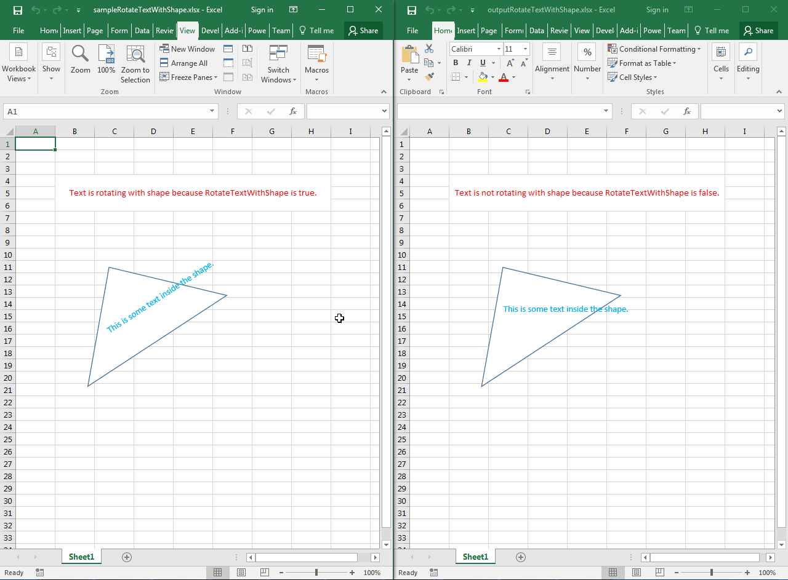

## **Possible Usage Scenarios**

You can add text inside any shape using Microsoft Excel. If you add a shape using the very old Microsoft Excel 2003, then the text will not rotate with the shape. But if you add a shape using newer versions of Microsoft Excel, e.g., 2007, 2010, 2013, or 2016, then the text will rotate with the shape. You can control whether the text should rotate with the shape or not using the [**ShapeTextAlignment.rotateTextWithShape**](https://reference.aspose.com/cells/javascript-cpp/shapetextalignment/#rotateTextWithShape--) property. The default value is **true**, which means text will rotate with the shape, but if you set it to **false**, the text will not rotate with the shape.

## **Rotate Text with Shape inside the Worksheet**

The following sample code loads the [sample Excel file](64716896.xlsx) that has a triangle shape and its text rotates with the shape. If you open the sample Excel file in Microsoft Excel and rotate the triangle shape, the text will also rotate with it. The code then sets the [**ShapeTextAlignment.rotateTextWithShape**](https://reference.aspose.com/cells/javascript-cpp/shapetextalignment/#rotateTextWithShape--) property to **false** and saves it as the [output Excel file](64716897.xlsx). If you now open the output Excel file in Microsoft Excel and rotate the triangle shape, the text will not rotate with it. Please see the following screenshot showing the effect of the code on the sample Excel file for reference.



## **Sample Code**

```html
<!DOCTYPE html>
<html>
    <head>
        <title>Aspose.Cells Example - Rotate Text With Shape</title>
    </head>
    <body>
        <h1>Rotate Text With Shape Example</h1>
        <input type="file" id="fileInput" accept=".xls,.xlsx,.csv" />
        <button id="runExample">Run Example</button>
        <a id="downloadLink" style="display: none;">Download Result</a>
        <div id="result"></div>
    </body>

    <script src="aspose.cells.js.min.js"></script>
    <script type="text/javascript">
        const { Workbook, SaveFormat } = AsposeCells;
        
        AsposeCells.onReady({
            license: "/lic/aspose.cells.enc",
            fontPath: "/fonts/",
            fontList: [
                "arial.ttf",
                "NotoSansSC-Regular.ttf"
            ]
        }).then(() => {
            console.log("Aspose.Cells initialized");
        });

        document.getElementById('runExample').addEventListener('click', async () => {
            const fileInput = document.getElementById('fileInput');
            if (!fileInput.files.length) {
                document.getElementById('result').innerHTML = '<p style="color: red;">Please select an Excel file.</p>';
                return;
            }

            const file = fileInput.files[0];
            const arrayBuffer = await file.arrayBuffer();

            // Instantiating a Workbook object by loading the uploaded file
            const workbook = new Workbook(new Uint8Array(arrayBuffer));

            // Access first worksheet.
            const worksheet = workbook.worksheets.get(0);

            // Access cell B4 and add message inside it.
            const cellB4 = worksheet.cells.get("B4");
            cellB4.value = "Text is not rotating with shape because RotateTextWithShape is false.";

            // Access first shape.
            const shape = worksheet.shapes.get(0);

            // Access shape text alignment.
            const shapeTextAlignment = shape.textBody.textAlignment;

            // Do not rotate text with shape by setting RotateTextWithShape to false.
            shapeTextAlignment.rotateTextWithShape = false;

            // Saving the modified Excel file and providing download link
            const outputData = workbook.save(SaveFormat.Xlsx);
            const blob = new Blob([outputData]);
            const downloadLink = document.getElementById('downloadLink');
            downloadLink.href = URL.createObjectURL(blob);
            downloadLink.download = 'outputRotateTextWithShapeInsideWorksheet.xlsx';
            downloadLink.style.display = 'block';
            downloadLink.textContent = 'Download Modified Excel File';

            document.getElementById('result').innerHTML = '<p style="color: green;">Operation completed successfully! Click the download link to get the modified file.</p>';
        });
    </script>
</html>
```