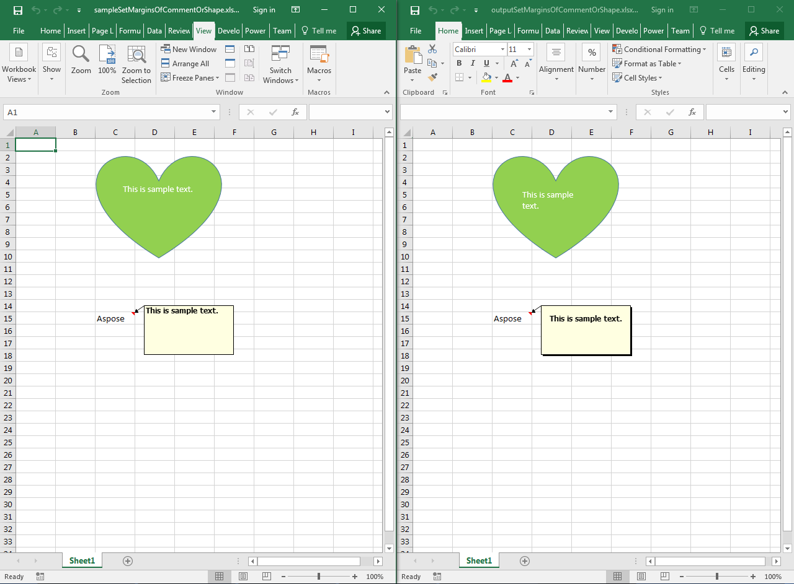

## **Possible Usage Scenarios**  

Aspose.Cells allows you to set the margins of any shape or comment using the [**Shape.textBody.textAlignment**](https://reference.aspose.com/cells/javascript-cpp/shapetextalignment/) property. This property returns the object of [**Aspose.Cells.Drawing.Texts.ShapeTextAlignment**](https://reference.aspose.com/cells/javascript-cpp/shapetextalignment) class which has different properties e.g. [**ShapeTextAlignment.topMarginPt**](https://reference.aspose.com/cells/javascript-cpp/shapetextalignment/#topMarginPt--), [**ShapeTextAlignment.leftMarginPt**](https://reference.aspose.com/cells/javascript-cpp/shapetextalignment/#leftMarginPt--), [**ShapeTextAlignment.bottomMarginPt**](https://reference.aspose.com/cells/javascript-cpp/shapetextalignment/#bottomMarginPt--), [**ShapeTextAlignment.rightMarginPt**](https://reference.aspose.com/cells/javascript-cpp/shapetextalignment/#rightMarginPt--), etc. that can be used to set the top, left, bottom and right margins.  

## **Set Margins of Comment or Shape inside the Worksheet**  

Please see the following sample code. It loads the [sample Excel file](61767851.xlsx) that contains two shapes. The code accesses the shapes one by one and sets their top, left, bottom and right margins. Please see the [output Excel file](61767852.xlsx) generated by the code and screenshot showing the effect of the code on the output Excel file.  

  

## **Sample Code**  

```html
<!DOCTYPE html>
<html>
    <head>
        <title>Set Margins of Comment or Shape Example</title>
    </head>
    <body>
        <h1>Set Margins of Comment or Shape Inside The Worksheet</h1>
        <input type="file" id="fileInput" accept=".xls,.xlsx,.csv" />
        <button id="runExample">Run Example</button>
        <a id="downloadLink" style="display: none;">Download Result</a>
        <div id="result"></div>
    </body>

    <script src="aspose.cells.js.min.js"></script>
    <script type="text/javascript">
        const { Workbook, SaveFormat, Worksheet, Cell, Utils } = AsposeCells;
        
        AsposeCells.onReady({
            license: "/lic/aspose.cells.enc",
            fontPath: "/fonts/",
            fontList: [
                "arial.ttf",
                "NotoSansSC-Regular.ttf"
            ]
        }).then(() => {
            console.log("Aspose.Cells initialized");
        });

        document.getElementById('runExample').addEventListener('click', async () => {
            const fileInput = document.getElementById('fileInput');
            if (!fileInput.files.length) {
                document.getElementById('result').innerHTML = '<p style="color: red;">Please select an Excel file.</p>';
                return;
            }

            const file = fileInput.files[0];
            const arrayBuffer = await file.arrayBuffer();

            // Instantiating a Workbook object from the uploaded file
            const workbook = new Workbook(new Uint8Array(arrayBuffer));

            // Access first worksheet
            const ws = workbook.worksheets.get(0);

            const shapes = ws.shapes;
            for (let i = 0; i < shapes.count; i++) {
                const sh = shapes.get(i);
                // Access the text alignment
                const txtAlign = sh.textBody.textAlignment;

                // Set auto margin false
                txtAlign.isAutoMargin = false;

                // Set the top, left, bottom and right margins
                txtAlign.topMarginPt = 10;
                txtAlign.leftMarginPt = 10;
                txtAlign.bottomMarginPt = 10;
                txtAlign.rightMarginPt = 10;
            }

            // Saving the modified Excel file
            const outputData = workbook.save(SaveFormat.Xlsx);
            const blob = new Blob([outputData]);
            const downloadLink = document.getElementById('downloadLink');
            downloadLink.href = URL.createObjectURL(blob);
            downloadLink.download = 'outputSetMarginsOfCommentOrShapeInsideTheWorksheet.xlsx';
            downloadLink.style.display = 'block';
            downloadLink.textContent = 'Download Excel File';

            document.getElementById('result').innerHTML = '<p style="color: green;">Margins updated successfully! Click the download link to get the modified file.</p>';
        });
    </script>
</html>
```