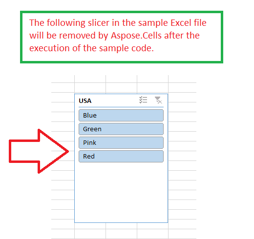

## **Possible Usage Scenarios**

If you want to remove a slicer in Excel, just select it and press the *Delete* button. Similarly, if you want to remove it using the Aspose.Cells API programmatically, please use the [**SlicerCollection.remove(Slicer)**](https://reference.aspose.com/cells/javascript-cpp/slicercollection/#remove-slicer-) method. It will remove the slicer from the worksheet.

## **Removing Slicer**

The following sample code loads the [sample Excel file](67338478.xlsx) that contains an existing slicer. It accesses the slicer collection and then removes it. Finally, it saves the workbook as [output Excel file](67338477.xlsx). The following screenshot shows the slicer that will be removed after executing the sample code.



## **Sample Code**

```html
<!DOCTYPE html>
<html>
    <head>
        <title>Removing Slicer Example</title>
    </head>
    <body>
        <h1>Removing Slicer Example</h1>
        <input type="file" id="fileInput" accept=".xls,.xlsx,.csv" />
        <button id="runExample">Run Example</button>
        <a id="downloadLink" style="display: none;">Download Result</a>
        <div id="result"></div>
    </body>

    <script src="aspose.cells.js.min.js"></script>
    <script type="text/javascript">
        const { Workbook, SaveFormat, Worksheet, Cell, Utils } = AsposeCells;
        
        const asposeReady = AsposeCells.onReady({
            license: "/lic/aspose.cells.enc",
            fontPath: "/fonts/",
            fontList: [
                "arial.ttf",
                "NotoSansSC-Regular.ttf"
            ]
        }).then(() => {
            console.log("Aspose.Cells initialized");
        });

        document.getElementById('runExample').addEventListener('click', async () => {
            const fileInput = document.getElementById('fileInput');
            if (!fileInput.files.length) {
                document.getElementById('result').innerHTML = '<p style="color: red;">Please select an Excel file.</p>';
                return;
            }

            await asposeReady;

            const file = fileInput.files[0];
            const arrayBuffer = await file.arrayBuffer();
            
            // Instantiating a Workbook object from the uploaded file
            const workbook = new Workbook(new Uint8Array(arrayBuffer));
            
            // Access the first worksheet.
            const worksheet = workbook.worksheets.get(0);
            
            // Access the first slicer inside the slicer collection.
            const slicer = worksheet.slicers.get(0);
            
            // Remove the slicer.
            worksheet.slicers.remove(slicer);
            
            // Save the workbook in output XLSX format.
            const outputData = workbook.save(SaveFormat.Xlsx);
            const blob = new Blob([outputData]);
            const downloadLink = document.getElementById('downloadLink');
            downloadLink.href = URL.createObjectURL(blob);
            downloadLink.download = 'outputRemovingSlicer.xlsx';
            downloadLink.style.display = 'block';
            downloadLink.textContent = 'Download Modified Excel File';
            
            document.getElementById('result').innerHTML = '<p style="color: green;">Slicer removed successfully! Click the download link to get the modified file.</p>';
        });
    </script>
</html>
```