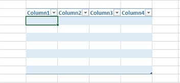

---  
title: Accessing Table from Cell and Adding Values inside it using Row and Column Offsets with JavaScript via C++  
linktitle: Accessing Table from Cell and Adding Values inside it using Row and Column Offsets  
type: docs  
weight: 230  
url: /javascript-cpp/accessing-table-from-cell-and-adding-values-inside-it-using-row-and-column-offsets/  
---  

{}  

Normally, you add values inside the Table or List Object using the [**Cell.putValue(boolean)**](https://reference.aspose.com/cells/javascript-cpp/cell/#putValue-boolean-) method. However, sometimes you might need to add values inside the Table or List Object using row and column offsets.  

To access a Table or List Object from a cell, use the [**Cell.table**](https://reference.aspose.com/cells/javascript-cpp/cell/#table--) property. To add values inside it using row and column offsets, use the [**ListObject.putCellValue(number, number, object)**](https://reference.aspose.com/cells/javascript-cpp/listobject/#putCellValue-number-number-object-) method.  

{}  

The following screenshot shows the source Excel file used in the code. It contains an empty table and highlights cell **D5**, which lies within the table. We will access this table from cell **D5** using the [**Cell.table**](https://reference.aspose.com/cells/javascript-cpp/cell/#table--) property and then add values inside it using both the [**Cell.putValue(boolean)**](https://reference.aspose.com/cells/javascript-cpp/cell/#putValue-boolean-) and [**ListObject.putCellValue(number, number, object)**](https://reference.aspose.com/cells/javascript-cpp/listobject/#putCellValue-number-number-object-) methods.  

## Example  

### Screenshots comparing the source and output files  

|  |  
| :- |  

The following screenshot shows the output Excel file generated by the code. As you can see, cell **D5** has a value, and cell **F6**, which is at the offset (2,2) of the table, also has a value.  

|  |  
| :- |  

### JavaScript code to access a table from a cell and add values inside it using row and column offsets  

The following sample code loads the source Excel file as shown in the above screenshot, adds values inside the table, and generates the output Excel file as shown above.  

```html
<!DOCTYPE html>
<html>
    <head>
        <title>Aspose.Cells Example</title>
    </head>
    <body>
        <h1>Aspose.Cells - Accessing Table Example</h1>
        <input type="file" id="fileInput" accept=".xls,.xlsx,.csv" />
        <button id="runExample">Run Example</button>
        <a id="downloadLink" style="display: none;">Download Result</a>
        <div id="result"></div>
    </body>

    <script src="aspose.cells.js.min.js"></script>
    <script type="text/javascript">
        const { Workbook, SaveFormat, Utils } = AsposeCells;
        
        AsposeCells.onReady({
            license: "/lic/aspose.cells.enc",
            fontPath: "/fonts/",
            fontList: [
                "arial.ttf",
                "NotoSansSC-Regular.ttf"
            ]
        }).then(() => {
            console.log("Aspose.Cells initialized");
        });

        document.getElementById('runExample').addEventListener('click', async () => {
            const fileInput = document.getElementById('fileInput');
            if (!fileInput.files.length) {
                document.getElementById('result').innerHTML = '<p style="color: red;">Please select an Excel file.</p>';
                return;
            }

            const file = fileInput.files[0];
            const arrayBuffer = await file.arrayBuffer();

            // Create workbook from uploaded Excel file
            const workbook = new Workbook(new Uint8Array(arrayBuffer));

            // Access first worksheet
            const worksheet = workbook.worksheets.get(0);

            // Access cell D5 which lies inside the table
            const cell = worksheet.cells.get("D5");

            // Put a value inside cell D5
            cell.value = "D5 Data";

            // Access the Table from this cell
            const table = cell.table;

            // Add a value using row and column offsets
            table.putCellValue(2, 2, "Offset [2,2]");

            // Save the workbook
            const outputData = workbook.save(SaveFormat.Xlsx);
            const blob = new Blob([outputData]);
            const downloadLink = document.getElementById('downloadLink');
            downloadLink.href = URL.createObjectURL(blob);
            downloadLink.download = 'output_out.xlsx';
            downloadLink.style.display = 'block';
            downloadLink.textContent = 'Download Modified Excel File';

            document.getElementById('result').innerHTML = '<p style="color: green;">Operation completed successfully! Click the download link to get the modified file.</p>';
        });
    </script>
</html>
```