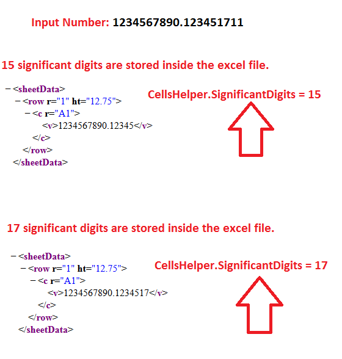

## **Possible Usage Scenarios**  

By default, Aspose.Cells for JavaScript via C++ stores 17 significant digits of double values inside the Excel file, unlike MS‑Excel which stores only 15 significant digits. You can change the default behavior of Aspose.Cells from 17 significant digits to 15 significant digits using the [**CellsHelper.significantDigits**](https://reference.aspose.com/cells/javascript-cpp/cellshelper/#significantDigits--) property.  

## **Specifying Significant Digits to be Stored in Excel File**  

The following sample code enforces Aspose.Cells to use 15 significant digits while storing double values inside the Excel file. Please check the [output Excel file](22774105.xlsx). Change its extension to `.zip`, unzip it, and you will see that only 15 significant digits are stored inside the Excel file. The following screenshot explains the effect of the [**CellsHelper.significantDigits**](https://reference.aspose.com/cells/javascript-cpp/cellshelper/#significantDigits--) property on the output Excel file.  

  

## **Sample Code**  

```html
<!DOCTYPE html>
<html>
    <head>
        <meta charset="utf-8" />
        <title>Aspose.Cells Example - Significant Digits</title>
    </head>
    <body>
        <h1>Significant Digits Example</h1>
        <p>This example sets CellsHelper.significantDigits to 15 and writes a double to cell A1.</p>
        <input type="file" id="fileInput" accept=".xls,.xlsx,.csv" />
        <button id="runExample">Run Example</button>
        <a id="downloadLink" style="display: none;">Download Result</a>
        <div id="result"></div>
    </body>

    <script src="aspose.cells.js.min.js"></script>
    <script type="text/javascript">
        const { Workbook, SaveFormat, CellsHelper } = AsposeCells;
        
        AsposeCells.onReady({
            license: "/lic/aspose.cells.enc",
            fontPath: "/fonts/",
            fontList: [
                "arial.ttf",
                "NotoSansSC-Regular.ttf"
            ]
        }).then(() => {
            console.log("Aspose.Cells initialized");
        });

        document.getElementById('runExample').addEventListener('click', async () => {
            const fileInput = document.getElementById('fileInput');

            // If a file is provided, open it; otherwise create a new workbook (matches original Node behavior)
            let workbook;
            if (fileInput.files.length) {
                const file = fileInput.files[0];
                const arrayBuffer = await file.arrayBuffer();
                workbook = new Workbook(new Uint8Array(arrayBuffer));
            } else {
                workbook = new Workbook();
            }

            // By default, Aspose.Cells stores 17 significant digits, unlike MS‑Excel which stores only 15 significant digits
            CellsHelper.significantDigits = 15;

            // Access first worksheet
            const worksheet = workbook.worksheets.get(0);

            // Access cell A1
            const c = worksheet.cells.get("A1");

            // Put a double value; only 15 significant digits, as specified by CellsHelper.significantDigits above, will be stored
            c.value = 1234567890.123451711;

            // Saving the workbook
            const outputData = workbook.save(SaveFormat.Xlsx);
            const blob = new Blob([outputData]);
            const downloadLink = document.getElementById('downloadLink');
            downloadLink.href = URL.createObjectURL(blob);
            downloadLink.download = 'out_SignificantDigits.xlsx';
            downloadLink.style.display = 'block';
            downloadLink.textContent = 'Download Modified Excel File';

            document.getElementById('result').innerHTML = '<p style="color: green;">Workbook created/modified successfully! Click the download link to get the file.</p>';
        });
    </script>
</html>
```