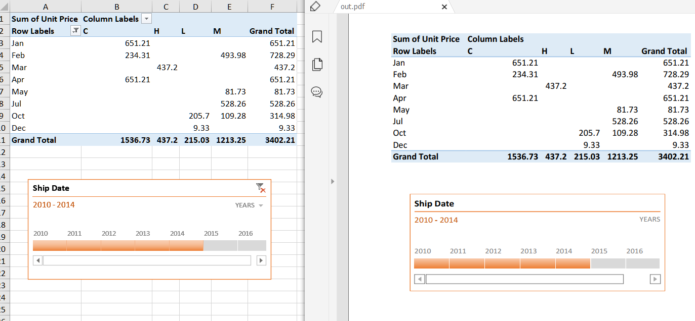

## **Draw Timeline while rendering Excel to PDF**
If you have an Excel file which has a timeline applied to it and you want to export the Excel to PDF with the timeline settings, Aspose.Cells for JavaScript via C++ now supports this by default. You simply export the Excel file with a timeline to PDF, and the generated PDF will show the timeline applied.

The following sample code loads the [sample Excel file](input.xlsx) that contains an existing timeline. It then saves the workbook as [output PDF file](out.pdf). The following screenshot compares the source Excel file and the generated PDF file.



## **Sample Code**
```html
<!DOCTYPE html>
<html>
    <head>
        <title>Aspose.Cells Example</title>
    </head>
    <body>
        <h1>Aspose.Cells Example</h1>
        <input type="file" id="fileInput" accept=".xls,.xlsx,.csv" />
        <button id="runExample">Run Example</button>
        <a id="downloadLink" style="display: none;">Download Result</a>
        <div id="result"></div>
    </body>

    <script src="aspose.cells.js.min.js"></script>
    <script type="text/javascript">
        const { Workbook, SaveFormat, Utils } = AsposeCells;
        
        AsposeCells.onReady({
            license: "/lic/aspose.cells.enc",
            fontPath: "/fonts/",
            fontList: [
                "arial.ttf",
                "NotoSansSC-Regular.ttf"
            ]
        }).then(() => {
            console.log("Aspose.Cells initialized");
        });

        document.getElementById('runExample').addEventListener('click', async () => {
            const fileInput = document.getElementById('fileInput');
            const resultDiv = document.getElementById('result');
            if (!fileInput.files.length) {
                resultDiv.innerHTML = '<p style="color: red;">Please select an Excel file.</p>';
                return;
            }

            const file = fileInput.files[0];
            const arrayBuffer = await file.arrayBuffer();

            // Instantiating a Workbook object from the uploaded file
            const workbook = new Workbook(new Uint8Array(arrayBuffer));

            // Saving the workbook to PDF format (browser)
            const outputData = workbook.save(SaveFormat.Pdf);
            const blob = new Blob([outputData], { type: 'application/pdf' });
            const downloadLink = document.getElementById('downloadLink');
            downloadLink.href = URL.createObjectURL(blob);
            downloadLink.download = 'out.pdf';
            downloadLink.style.display = 'block';
            downloadLink.textContent = 'Download PDF File';

            resultDiv.innerHTML = '<p style="color: green;">PDF generated successfully! Click the download link to get the PDF file.</p>';
        });
    </script>
</html>
```