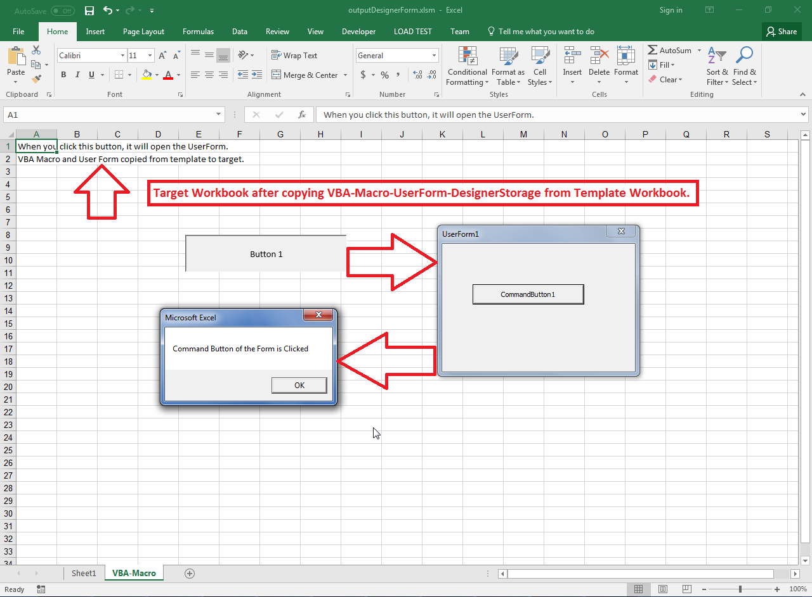

## **Possible Usage Scenarios**  

Aspose.Cells allows you to copy a VBA project from one Excel file into another Excel file. A VBA project consists of various types of modules i.e. Document, Procedural, Designer, etc. All modules can be copied with simple code, but for the Designer module, there is some extra data called Designer Storage that needs to be accessed or copied. The following two methods deal with Designer Storage.  

- [**VbaModuleCollection.designerStorage(string)**](https://reference.aspose.com/cells/javascript-cpp/vbamodulecollection/#designerStorage-string-)  
- [**VbaModuleCollection.addDesignerStorage(string, number[])**](https://reference.aspose.com/cells/javascript-cpp/vbamodulecollection/#addDesignerStorage-string-numberarray-)  

## **Copy VBA Macro UserForm DesignerStorage from Template to Target Workbook**  

Please see the following sample code. It copies the VBA project from the [template Excel file](50528345.xlsm) into an empty workbook and saves it as the [output Excel file](50528346.xlsm). If you open the VBA project inside the template Excel file, you will see a User Form as shown below. The User Form consists of Designer Storage, so it will be copied using [**VbaModuleCollection.designerStorage(string)**](https://reference.aspose.com/cells/javascript-cpp/vbamodulecollection/#designerStorage-string-) and [**VbaModuleCollection.addDesignerStorage(string, number[])**](https://reference.aspose.com/cells/javascript-cpp/vbamodulecollection/#addDesignerStorage-string-numberarray-) methods.  

****  

The following screenshot shows the output Excel file and its contents which were copied from the template Excel file. When you click on the Button 1, it opens up the VBA User Form which itself has a command button that shows a message box on clicking.  

****  

## **Sample Code**  

```html
<!DOCTYPE html>
<html>
    <head>
        <title>Aspose.Cells Example</title>
    </head>
    <body>
        <h1>Copy VBA Designer UserForm Example</h1>
        <input type="file" id="fileInput" accept=".xls,.xlsx,.xlsm" />
        <button id="runExample">Run Example</button>
        <a id="downloadLink" style="display: none;">Download Result</a>
        <div id="result"></div>
    </body>

    <script src="aspose.cells.js.min.js"></script>
    <script type="text/javascript">
        const { Workbook, SaveFormat, Utils, SheetType, VbaModuleType } = AsposeCells;
        
        AsposeCells.onReady({
            license: "/lic/aspose.cells.enc",
            fontPath: "/fonts/",
            fontList: [
                "arial.ttf",
                "NotoSansSC-Regular.ttf"
            ]
        }).then(() => {
            console.log("Aspose.Cells initialized");
        });

        document.getElementById('runExample').addEventListener('click', async () => {
            const fileInput = document.getElementById('fileInput');
            const resultDiv = document.getElementById('result');
            if (!fileInput.files.length) {
                resultDiv.innerHTML = '<p style="color: red;">Please select an Excel macro-enabled (.xlsm) file.</p>';
                return;
            }

            const file = fileInput.files[0];
            const arrayBuffer = await file.arrayBuffer();

            // Create empty target workbook
            const target = new Workbook();

            // Load the Excel file containing VBA-Macro Designer User Form
            const templateFile = new Workbook(new Uint8Array(arrayBuffer));

            // Copy all template worksheets to target workbook
            const sheets = templateFile.worksheets;
            const sheetCount = sheets.count;
            for (let i = 0; i < sheetCount; i++) {
                const ws = sheets.get(i);
                if (ws.type === SheetType.Worksheet) {
                    const s = target.worksheets.add(ws.name);
                    s.copy(ws);

                    // Put message in cell A2 of the target worksheet
                    s.cells.get("A2").putValue("VBA Macro and User Form copied from template to target.");
                }
            }

            // Copy the VBA-Macro Designer UserForm from Template to Target 
            const modules = templateFile.vbaProject.modules;
            const moduleCount = modules.count;
            for (let i = 0; i < moduleCount; i++) {
                const vbaItem = modules.get(i);
                if (vbaItem.name === "ThisWorkbook") {
                    // Copy ThisWorkbook module code
                    target.vbaProject.modules.get("ThisWorkbook").codes = vbaItem.codes;
                } else {
                    console.log(vbaItem.name);

                    let vbaMod = 0;
                    const sheet = target.worksheets.sheetByCodeName(vbaItem.name);
                    if (sheet.isNull()) {
                        vbaMod = target.vbaProject.modules.add(vbaItem.type, vbaItem.name);
                    } else {
                        vbaMod = target.vbaProject.modules.add(sheet);
                    }

                    target.vbaProject.modules.get(vbaMod).codes = vbaItem.codes;

                    if (vbaItem.type === AsposeCells.VbaModuleType.Designer) {
                        // Get the data of the user form i.e. designer storage
                        const designerStorage = modules.getDesignerStorage(vbaItem.name);
                        
                        // Add the designer storage to target Vba Project
                        target.vbaProject.modules.addDesignerStorage(vbaItem.name, designerStorage);
                    }
                }
            }

            // Saving the modified Excel file
            const outputData = target.save(SaveFormat.Xlsm);
            const blob = new Blob([outputData]);
            const downloadLink = document.getElementById('downloadLink');
            downloadLink.href = URL.createObjectURL(blob);
            downloadLink.download = 'outputDesignerForm.xlsm';
            downloadLink.style.display = 'block';
            downloadLink.textContent = 'Download Modified Excel File';

            resultDiv.innerHTML = '<p style="color: green;">VBA Designer UserForm copied successfully! Click the download link to get the modified file.</p>';
        });
    </script>
</html>
```