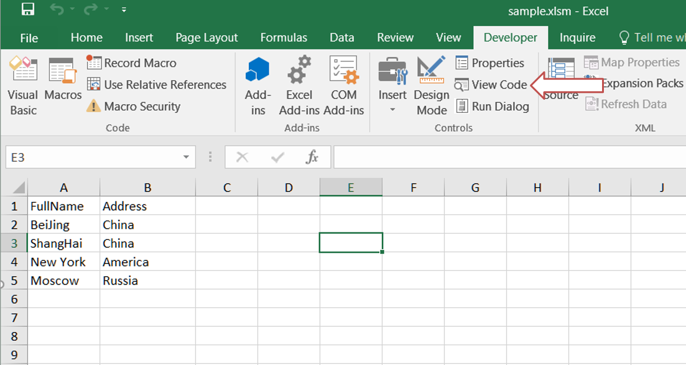
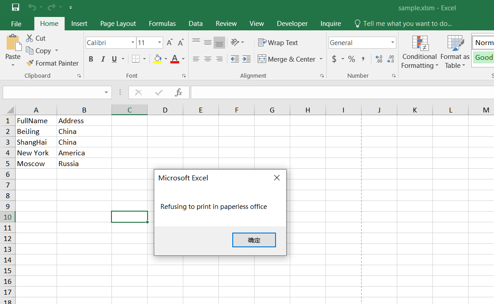

## **Possible Usage Scenarios**  
In our daily work, there may be some important information in the Excel file; in order to protect the internal data from spreading, the company will not allow us to print it. This document will tell you how to prevent others from printing Excel files.  

## **How to Prevent Users from Printing File in MS-Excel**  
You can apply the following VBA code to protect your specific file from being printed.  
1. Open the workbook that you don’t want others to print.  
2. Select the **Developer** tab in the Excel ribbon and click the **View Code** button in the **Controls** section. Alternatively, you can press **ALT + F11** to open the Microsoft Visual Basic for Applications window.  
<br>  
  
3. In the left Project Explorer, double‑click **ThisWorkbook** to open the module and add some VBA code.  
<br>  
  
4. Then save and close the code, return to the workbook. When you attempt to print the workbook, it will be prevented, and you will see the following warning box:  
<br>  
  

## **How to Prevent Users from Printing Excel File using Aspose.Cells for JavaScript via C++**  

The following sample code illustrates how to prevent users from printing an Excel file:  

1. Load the [sample file](sample.xlsx).  
2. Get the **VbaModuleCollection** object from the **VbaProject** property of **Workbook**.  
3. Get the **VbaModule** object by the name **"ThisWorkbook"**.  
4. Set the **codes** property of the **VbaModule**.  
5. Save the workbook in **XLSM** format.  

```html
<!DOCTYPE html>
<html>
    <head>
        <title>Aspose.Cells Example</title>
    </head>
    <body>
        <h1>Update VBA Module Example</h1>
        <input type="file" id="fileInput" accept=".xls,.xlsx,.xlsm" />
        <button id="runExample">Run Example</button>
        <a id="downloadLink" style="display: none;">Download Result</a>
        <div id="result"></div>
    </body>

    <script src="aspose.cells.js.min.js"></script>
    <script type="text/javascript">
        const { Workbook, SaveFormat } = AsposeCells;
        
        AsposeCells.onReady({
            license: "/lic/aspose.cells.enc",
            fontPath: "/fonts/",
            fontList: [
                "arial.ttf",
                "NotoSansSC-Regular.ttf"
            ]
        }).then(() => {
            console.log("Aspose.Cells initialized");
        });

        document.getElementById('runExample').addEventListener('click', async () => {
            const fileInput = document.getElementById('fileInput');
            if (!fileInput.files.length) {
                document.getElementById('result').innerHTML = '<p style="color: red;">Please select an Excel file.</p>';
                return;
            }

            const file = fileInput.files[0];
            const arrayBuffer = await file.arrayBuffer();

            // Instantiating a Workbook object from the uploaded file
            const workbook = new Workbook(new Uint8Array(arrayBuffer));

            // Accessing VBA project and its modules
            const modules = workbook.vbaProject.modules;
            const module = modules.get("ThisWorkbook");

            // Setting module codes
            module.codes = "Private Sub Workbook_BeforePrint(Cancel As Boolean)\r\n  Cancel = True\r\n  MsgBox \"Refusing to print in paperless office\"\r\nEnd Sub\r\n";

            // Saving the modified workbook as a macro‑enabled workbook
            const outputData = workbook.save(SaveFormat.Xlsm);
            const blob = new Blob([outputData]);
            const downloadLink = document.getElementById('downloadLink');
            downloadLink.href = URL.createObjectURL(blob);
            downloadLink.download = 'out.xlsm';
            downloadLink.style.display = 'block';
            downloadLink.textContent = 'Download Modified Excel File';

            document.getElementById('result').innerHTML = '<p style="color: green;">VBA module updated successfully! Click the download link to get the modified file.</p>';
        });
    </script>
</html>
```