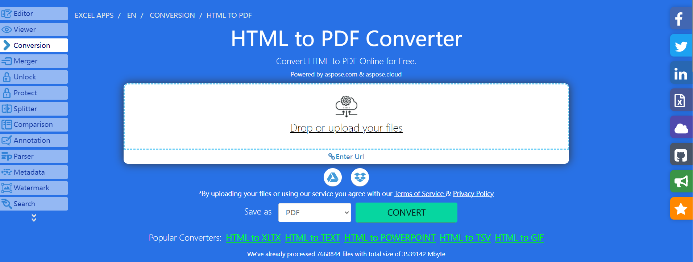

## **Overview**
<b>Aspose.Cells</b> is a professional solution that allows you to generate PDF files from web pages and raw HTML code in your applications. 

This article explains how to <b>convert HTML to PDF</b>. It covers the following topics.

<ul>
<li><a href="#js-convert-html-to-pdf">JavaScript HTML to PDF</a></li>
<li><a href="#js-convert-html-to-pdf">JavaScript Convert HTML to PDF</a></li>
<li><a href="#js-convert-html-to-pdf">JavaScript How to convert HTML to PDF</a></li>
</ul>

## **HTML to PDF Conversion in JavaScript**
How to convert HTML to PDF? With [Aspose.Cells for JavaScript via C++](https://releases.aspose.com/cells/javascript-cpp/) library, you can easily convert HTML to PDF programmatically with a few lines of code. Aspose.Cells for JavaScript via C++ is capable of building cross‑platform applications with the ability to generate, modify, convert, render and print all Excel files.

## **JavaScript Convert HTML to PDF**
The following JavaScript code sample shows how to convert an HTML document to a PDF using [Aspose.Cells for JavaScript via C++](https://releases.aspose.com/cells/javascript-cpp/).

1. Create an instance of the [HtmlLoadOptions](https://reference.aspose.com/cells/javascript-cpp/htmlloadoptions/) class.  
2. Initialize a [Workbook](https://reference.aspose.com/cells/javascript-cpp/workbook/) object.  
3. Save the output PDF document by calling the `Workbook.save()` method.

```html
<!DOCTYPE html>
<html>
    <head>
        <title>Aspose.Cells HTML to PDF Example</title>
    </head>
    <body>
        <h1>Convert HTML to PDF using Aspose.Cells</h1>
        <input type="file" id="fileInput" accept=".html,.htm" />
        <button id="runExample">Run Example</button>
        <a id="downloadLink" style="display: none;">Download Result</a>
        <div id="result"></div>
    </body>

    <script src="aspose.cells.js.min.js"></script>
    <script type="text/javascript">
        const { Workbook, SaveFormat, Utils } = AsposeCells;
        
        AsposeCells.onReady({
            license: "/lic/aspose.cells.enc",
            fontPath: "/fonts/",
            fontList: [
                "arial.ttf",
                "NotoSansSC-Regular.ttf"
            ]
        }).then(() => {
            console.log("Aspose.Cells initialized");
        });

        document.getElementById('runExample').addEventListener('click', async () => {
            const fileInput = document.getElementById('fileInput');
            if (!fileInput.files.length) {
                document.getElementById('result').innerHTML = '<p style="color: red;">Please select an HTML file.</p>';
                return;
            }

            const file = fileInput.files[0];
            const arrayBuffer = await file.arrayBuffer();

            // Loads the workbook which contains hidden external links
            const options = new AsposeCells.HtmlLoadOptions(AsposeCells.LoadFormat.Html);
            const workbook = new Workbook(new Uint8Array(arrayBuffer), options);

            // Save as PDF
            const outputData = workbook.save(SaveFormat.Pdf);
            const blob = new Blob([outputData], { type: 'application/pdf' });
            const downloadLink = document.getElementById('downloadLink');
            downloadLink.href = URL.createObjectURL(blob);
            downloadLink.download = 'out.pdf';
            downloadLink.style.display = 'block';
            downloadLink.textContent = 'Download PDF File';

            document.getElementById('result').innerHTML = '<p style="color: green;">PDF generated successfully! Click the download link to get the file.</p>';
        });
    </script>
</html>
```

## **Try converting HTML to PDF online**

[Aspose.Cells for JavaScript via C++](https://releases.aspose.com/cells/javascript-cpp/) provides a free online application <a href="https://products.aspose.app/cells/en/conversion/html-to-pdf">“HTML to PDF”</a>, where you can try the functionality and evaluate the quality of the results.  
<br>
<a href="https://products.aspose.app/cells/en/conversion/html-to-pdf"></a>