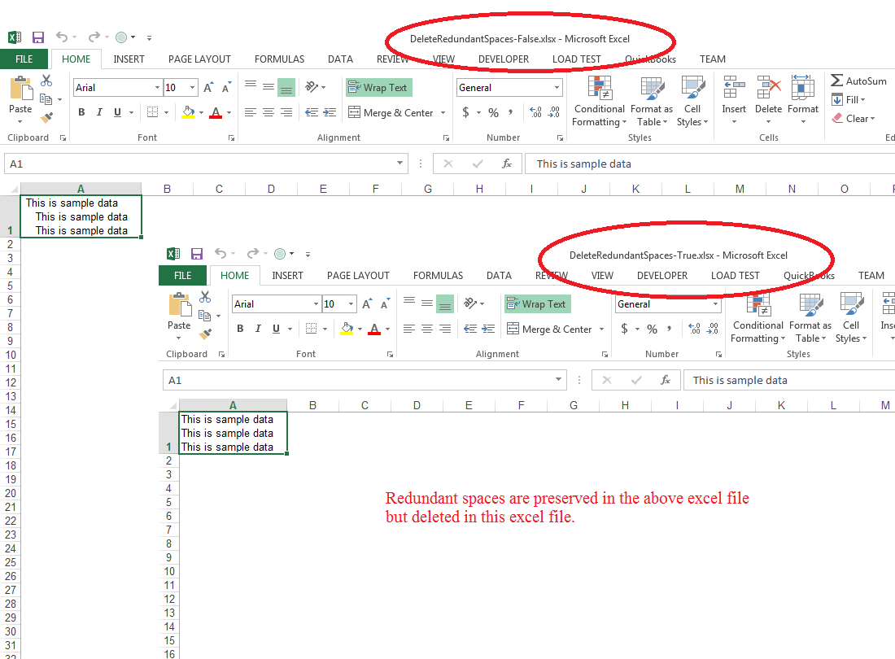

{}

Please use [**HtmlLoadOptions.deleteRedundantSpaces**](https://reference.aspose.com/cells/javascript-cpp/htmlloadoptions/#deleteRedundantSpaces--) property and set it **true** to delete all the redundant spaces coming after the line break tag. By default, this property is **false** and redundant spaces are preserved in the output Excel files.

{}

## Effect of setting the HTMLLoadOptions.deleteRedundantSpaces property to false and true

The following screenshot shows the effect of setting this property to **false** and **true**.



## Delete redundant spaces after line break while importing HTML

### Programming Sample

The following sample code shows the usage of the [**HtmlLoadOptions.deleteRedundantSpaces**](https://reference.aspose.com/cells/javascript-cpp/htmlloadoptions/#deleteRedundantSpaces--) property. Please set it **true** or **false** to get the output as shown in the above screenshot.

```html
<!DOCTYPE html>
<html>
    <head>
        <title>Aspose.Cells Example - Delete Redundant Spaces While Importing From HTML</title>
    </head>
    <body>
        <h1>Delete Redundant Spaces While Importing From HTML</h1>
        <input type="file" id="fileInput" accept=".xls,.xlsx,.csv" />
        <button id="runExample">Run Example</button>
        <a id="downloadLink" style="display: none;">Download Result</a>
        <div id="result"></div>
    </body>

    <script src="aspose.cells.js.min.js"></script>
    <script type="text/javascript">
        const { Workbook, SaveFormat, HtmlLoadOptions, LoadFormat } = AsposeCells;
        
        AsposeCells.onReady({
            license: "/lic/aspose.cells.enc",
            fontPath: "/fonts/",
            fontList: [
                "arial.ttf",
                "NotoSansSC-Regular.ttf"
            ]
        }).then(() => {
            console.log("Aspose.Cells initialized");
        });

        document.getElementById('runExample').addEventListener('click', async () => {
            // Sample Html containing redundant spaces after <br> tag
            const html = "<html> <body> <table> <tr> <td> <br>    This is sample data <br>    This is sample data<br>    This is sample data</td> </tr> </table> </body> </html>";

            // Convert Html to byte array
            const encoder = new TextEncoder();
            const byteArray = encoder.encode(html);

            // Set Html load options and keep precision true
            const loadOptions = new HtmlLoadOptions(LoadFormat.Html);
            loadOptions.deleteRedundantSpaces = true;

            // Create workbook from stream with Html load options
            const stream = byteArray;
            const workbook = new Workbook(stream, loadOptions);

            // Access first worksheet
            const sheet = workbook.worksheets.get(0);

            // Auto fit the sheet columns
            sheet.autoFitColumns();

            // Saving the workbook and provide download link
            const outputData = workbook.save(SaveFormat.Xlsx);
            const blob = new Blob([outputData], { type: "application/vnd.openxmlformats-officedocument.spreadsheetml.sheet" });
            const downloadLink = document.getElementById('downloadLink');
            downloadLink.href = URL.createObjectURL(blob);
            downloadLink.download = 'outputDeleteRedundantSpacesWhileImportingFromHtml.xlsx';
            downloadLink.style.display = 'block';
            downloadLink.textContent = 'Download Excel File';

            document.getElementById('result').innerHTML = '<p style="color: green;">Operation completed successfully! Click the download link to get the modified file.</p>';
        });
    </script>
</html>
```