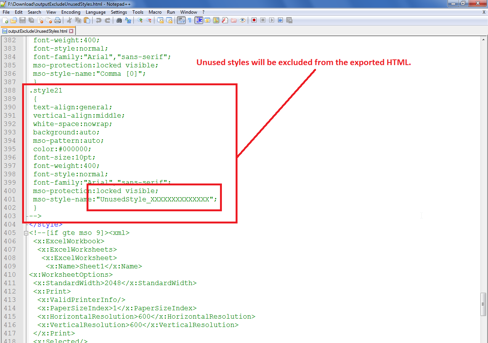

## **Possible Usage Scenarios**  

Microsoft Excel files may contain many unused styles. When you export the Excel file to HTML format, these unused styles are also exported. This can increase the size of the HTML. You can exclude the unused styles during the conversion of Excel files to HTML using the [**HtmlSaveOptions.excludeUnusedStyles**](https://reference.aspose.com/cells/javascript-cpp/htmlsaveoptions/#excludeUnusedStyles--) property. When you set it **true**, all unused styles are excluded from the output HTML. The following screenshot displays a sample unused style inside the output HTML.  

  

## **Exclude Unused Styles during Excel to HTML conversion**  

The following sample code creates a workbook and also creates an unused named style. Since the [**HtmlSaveOptions.excludeUnusedStyles**](https://reference.aspose.com/cells/javascript-cpp/htmlsaveoptions/#excludeUnusedStyles--) is set to **true**, this unused named style will not be exported to [output HTML](61767778.zip). But if you set it to **false**, then this unused style will be present inside the output HTML which you can then see in HTML markup as shown in the above screenshot.  

## **Sample Code**  

```html
<!DOCTYPE html>
<html>
    <head>
        <title>Aspose.Cells Example - Exclude Unused Styles</title>
    </head>
    <body>
        <h1>Exclude Unused Styles from Excel to HTML</h1>
        <input type="file" id="fileInput" accept=".xls,.xlsx,.csv" />
        <button id="runExample">Run Example</button>
        <a id="downloadLink" style="display: none;"></a>
        <div id="result"></div>
    </body>

    <script src="aspose.cells.js.min.js"></script>
    <script type="text/javascript">
        const { Workbook, SaveFormat, HtmlSaveOptions } = AsposeCells;
        
        AsposeCells.onReady({
            license: "/lic/aspose.cells.enc",
            fontPath: "/fonts/",
            fontList: [
                "arial.ttf",
                "NotoSansSC-Regular.ttf"
            ]
        }).then(() => {
            console.log("Aspose.Cells initialized");
        });

        document.getElementById('runExample').addEventListener('click', async () => {
            const fileInput = document.getElementById('fileInput');

            if (fileInput.files.length > 0 && fileInput.files[0].size === 0) {
                document.getElementById('result').innerHTML = '<p style="color: red;">Please select a valid Excel file.</p>';
                return;
            }

            // Instantiate workbook from selected file or create a new one
            let wb;
            if (fileInput.files.length) {
                const file = fileInput.files[0];
                const arrayBuffer = await file.arrayBuffer();
                wb = new Workbook(new Uint8Array(arrayBuffer));
            } else {
                wb = new Workbook();
            }

            // Create an unused named style
            const style = wb.createStyle();
            style.name = "UnusedStyle_XXXXXXXXXXXXXX";

            // Access first worksheet
            const ws = wb.worksheets.get(0);

            // Put some value in cell C7
            const cell = ws.cells.get("C7");
            cell.value = "This is sample text.";

            // Specify html save options, we want to exclude unused styles
            const opts = new HtmlSaveOptions();
            // Comment this line to include unused styles
            opts.excludeUnusedStyles = true;

            // Save the workbook in html format
            const outputData = wb.save(SaveFormat.Html, opts);
            const blob = new Blob([outputData], { type: "text/html" });
            const downloadLink = document.getElementById('downloadLink');
            downloadLink.href = URL.createObjectURL(blob);
            downloadLink.download = 'outputExcludeUnusedStylesInExcelToHTML.html';
            downloadLink.style.display = 'block';
            downloadLink.textContent = 'Download HTML File';

            document.getElementById('result').innerHTML = '<p style="color: green;">HTML generated successfully. Click the download link to get the result.</p>';
        });
    </script>
</html>
```