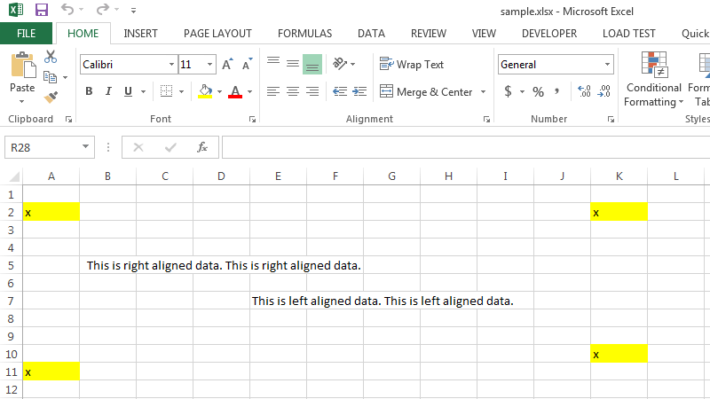
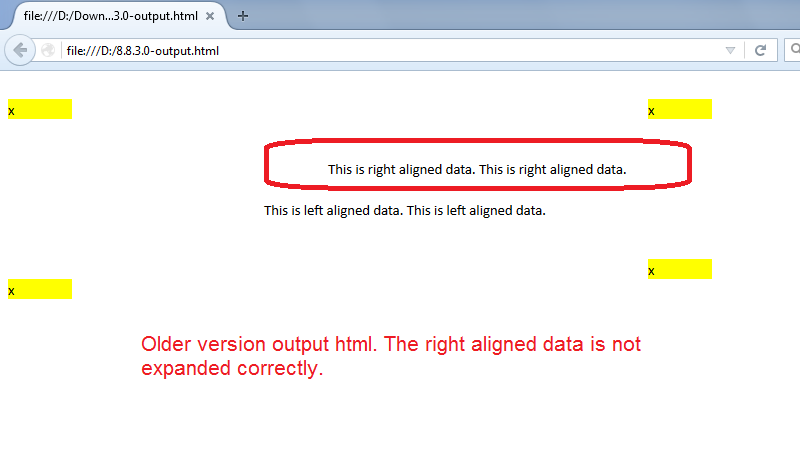

{}

Aspose.Cells now supports expanding text from right to left while exporting an Excel file to HTML. This feature has been implemented since v8.9.0.0. Now, if your source Excel file contains any text that expands from right to left, Aspose.Cells will export it to HTML correctly.

{}
## **Expanding Text from Right to Left while Exporting Excel File to HTML**

The following sample code converts the [sample Excel file](5115502.xlsx) into HTML. This screenshot shows how the sample Excel looks in Microsoft Excel 2013.



This screenshot shows the [output HTML generated with the older version](5115509).



This screenshot shows the [output HTML generated with the newer version](5115508).


As you can see in the screenshots, the newer version expands the right‑aligned text to the left correctly, just like Microsoft Excel.


```html
<!DOCTYPE html>
<html>
    <head>
        <title>Aspose.Cells Example</title>
    </head>
    <body>
        <h1>Expand Text From Right To Left Example</h1>
        <input type="file" id="fileInput" accept=".xls,.xlsx,.csv" />
        <button id="runExample">Run Example</button>
        <a id="downloadLink" style="display: none;">Download Result</a>
        <div id="result"></div>
    </body>

    <script src="aspose.cells.js.min.js"></script>
    <script type="text/javascript">
        const { Workbook, SaveFormat, CellsHelper } = AsposeCells;
        
        AsposeCells.onReady({
            license: "/lic/aspose.cells.enc",
            fontPath: "/fonts/",
            fontList: [
                "arial.ttf",
                "NotoSansSC-Regular.ttf"
            ]
        }).then(() => {
            console.log("Aspose.Cells initialized");
        });

        document.getElementById('runExample').addEventListener('click', async () => {
            const fileInput = document.getElementById('fileInput');
            const resultDiv = document.getElementById('result');

            if (!fileInput.files.length) {
                resultDiv.innerHTML = '<p style="color: red;">Please select an Excel file.</p>';
                return;
            }

            const file = fileInput.files[0];
            const arrayBuffer = await file.arrayBuffer();

            // Load source Excel file into the workbook object
            const wb = new Workbook(new Uint8Array(arrayBuffer));

            // Get CellsHelper version (converted from getVersion())
            const version = CellsHelper.version;

            // Save the workbook in HTML format
            const outputData = wb.save(SaveFormat.Html);
            const blob = new Blob([outputData], { type: 'text/html' });
            const downloadLink = document.getElementById('downloadLink');
            downloadLink.href = URL.createObjectURL(blob);
            downloadLink.download = `ExpandTextFromRightToLeft_out_${version}.html`;
            downloadLink.style.display = 'block';
            downloadLink.textContent = 'Download HTML File';

            resultDiv.innerHTML = '<p style="color: green;">Workbook converted to HTML successfully. Click the download link to get the result.</p>';
        });
    </script>
</html>
```