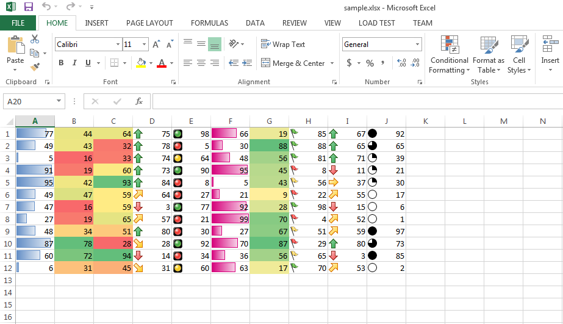

{} 

You can export DataBar, ColorScale and IconSet Conditional Formatting while converting your Excel file into HTML. This feature is partially supported by Microsoft Excel but Aspose.Cells for JavaScript via C++ supports it fully.

{}  

## **Export DataBar, ColorScale and IconSet Conditional Formatting while Excel to HTML Conversion**  
The following screenshot shows the [sample Excel file](5115558.xlsx) with DataBar, ColorScale and IconSet Conditional Formatting. You can download the [sample Excel file](5115558.xlsx) from the given link.  

  

The following screenshot shows the Aspose.Cells output HTML file showing DataBar, ColorScale and IconSet Conditional Formatting. As you can see, it looks exactly like the [sample Excel file](5115558.xlsx).  

  

### **Sample Code**  
The following sample code converts the sample Excel file into HTML, which is a normal [Excel to HTML conversion](/cells/javascript-cpp/convert-workbook-to-different-formats/#convertworkbooktodifferentformats-convertingexcelworkbooktohtml).  
```html
<!DOCTYPE html>
<html>
    <head>
        <title>Aspose.Cells Example</title>
    </head>
    <body>
        <h1>Converting Excel to HTML Example</h1>
        <input type="file" id="fileInput" accept=".xls,.xlsx,.csv" />
        <button id="runExample">Run Example</button>
        <a id="downloadLink" style="display: none;">Download Result</a>
        <div id="result"></div>
    </body>

    <script src="aspose.cells.js.min.js"></script>
    <script type="text/javascript">
        const { Workbook, SaveFormat, Utils } = AsposeCells;
        
        AsposeCells.onReady({
            license: "/lic/aspose.cells.enc",
            fontPath: "/fonts/",
            fontList: [
                "arial.ttf",
                "NotoSansSC-Regular.ttf"
            ]
        }).then(() => {
            console.log("Aspose.Cells initialized");
        });

        document.getElementById('runExample').addEventListener('click', async () => {
            const fileInput = document.getElementById('fileInput');
            if (!fileInput.files.length) {
                document.getElementById('result').innerHTML = '<p style="color: red;">Please select an Excel file.</p>';
                return;
            }

            const file = fileInput.files[0];
            const arrayBuffer = await file.arrayBuffer();

            // Load your sample Excel file in a workbook object
            const workbook = new Workbook(new Uint8Array(arrayBuffer));

            // Save it in HTML format
            const outputData = workbook.save(SaveFormat.Html);

            const blob = new Blob([outputData], { type: 'text/html' });
            const downloadLink = document.getElementById('downloadLink');
            downloadLink.href = URL.createObjectURL(blob);
            downloadLink.download = 'ConvertingToHTMLFiles_out.html';
            downloadLink.style.display = 'block';
            downloadLink.textContent = 'Download HTML File';

            document.getElementById('result').innerHTML = '<p style="color: green;">Conversion completed successfully! Click the download link to get the HTML file.</p>';
        });
    </script>
</html>
```