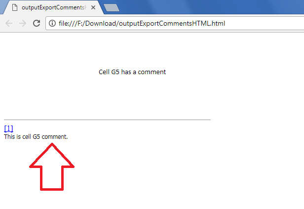

## **Possible Usage Scenarios**

When you save your Excel file into HTML, comments are not exported. However, Aspose.Cells for JavaScript via C++ provides this feature using the [**HtmlSaveOptions.isExportComments**](https://docs.aspose.com/cells/javascript-cpp/export-comments-while-saving-excel-file-to/) property. If you set it **to true**, then HTML will also display comments present in your Excel file.

## **Export Comments while Saving Excel file to HTML**

The following sample code explains the usage of the [**HtmlSaveOptions.isExportComments**](https://docs.aspose.com/cells/javascript-cpp/export-comments-while-saving-excel-file-to/) property. The screenshot shows the effect of the code on the HTML when it is set to **true**. Please download the [sample Excel file](50528260.xlsx) and the [generated HTML](5052826.txt) for a reference.



## **Sample Code**

```html
<!DOCTYPE html>
<html>
    <head>
        <title>Aspose.Cells Export Comments to HTML</title>
    </head>
    <body>
        <h1>Export Comments to HTML Example</h1>
        <input type="file" id="fileInput" accept=".xls,.xlsx,.csv" />
        <button id="runExample">Run Example</button>
        <a id="downloadLink" style="display: none;">Download Result</a>
        <div id="result"></div>
    </body>

    <script src="aspose.cells.js.min.js"></script>
    <script type="text/javascript">
        const { Workbook, SaveFormat, HtmlSaveOptions, Utils } = AsposeCells;
        
        AsposeCells.onReady({
            license: "/lic/aspose.cells.enc",
            fontPath: "/fonts/",
            fontList: [
                "arial.ttf",
                "NotoSansSC-Regular.ttf"
            ]
        }).then(() => {
            console.log("Aspose.Cells initialized");
        });

        document.getElementById('runExample').addEventListener('click', async () => {
            const fileInput = document.getElementById('fileInput');
            if (!fileInput.files.length) {
                document.getElementById('result').innerHTML = '<p style="color: red;">Please select an Excel file.</p>';
                return;
            }

            const file = fileInput.files[0];
            const arrayBuffer = await file.arrayBuffer();

            // Instantiating a Workbook object from the uploaded file
            const workbook = new Workbook(new Uint8Array(arrayBuffer));

            // Create HTML save options and set IsExportComments to true
            const opts = new HtmlSaveOptions();
            opts.isExportComments = true;

            // Save the workbook to HTML format with the specified options
            const outputData = workbook.save(SaveFormat.Html, opts);
            const blob = new Blob([outputData], { type: 'text/html' });
            const downloadLink = document.getElementById('downloadLink');
            downloadLink.href = URL.createObjectURL(blob);
            downloadLink.download = 'outputExportCommentsHTML.html';
            downloadLink.style.display = 'block';
            downloadLink.textContent = 'Download HTML File';

            document.getElementById('result').innerHTML = '<p style="color: green;">Export completed successfully! Click the download link to get the HTML file.</p>';
        });
    </script>
</html>
```