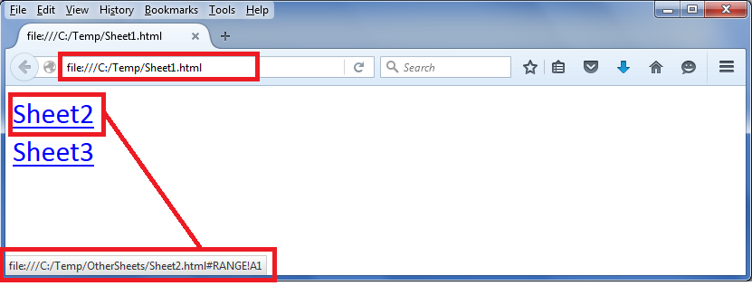

## **Possible Usage Scenarios**
Suppose you have an Excel file with multiple sheets and you want to export each sheet to an individual HTML file. If any of your sheets have links to other sheets, then those links will be broken in the exported HTML. To deal with this problem, Aspose.Cells for JavaScript via C++ provides the [IFilePathProvider](https://reference.aspose.com/cells/javascript-cpp/ifilepathprovider) interface, which you can implement to fix the broken links.

## **Provide exported worksheet HTML file path via IFilePathProvider interface**
Please download the [sample excel file](5115213.zip) used in the following code and its exported HTML files. All these files are inside the Temp directory. You should extract it on the C: drive. Then, it will become the C:\Temp directory. Then you will open the Sheet1.html file in the browser and click the two links inside it. These links refer to these two exported HTML worksheets which are inside the C:\Temp\OtherSheets directory.


 file:///C:/Temp/OtherSheets/Sheet2.html#RANGE!A1

file:///C:/Temp/OtherSheets/Sheet3.html#RANGE!A1


The following screenshot shows how the C:\Temp\Sheet1.html and its links look like



The following screenshot shows the HTML source. As you can see, the links are now referring to C:\Temp\OtherSheets directory. This was achieved using the [IFilePathProvider](https://reference.aspose.com/cells/javascript-cpp/ifilepathprovider) interface.


## **Sample Code**
Please note the C:\Temp directory is just for illustration purposes. You can use any directory of your choice and place the [sample excel file](5115211.xlsx) inside there and execute the provided sample code. It will then create an OtherSheets sub-directory inside your directory and export the second and third worksheets HTML inside it. Please change the dirPath variable inside the provided code and refer it to the directory of your choice before execution.

{} 

The sample code will only work when you set the Aspose.Cells license. If you try to run the code without setting the license, it will go into an infinite loop. Therefore, we have added a check to print a message and stop execution when the license is not set. You can either purchase a license or request a 30-day temporary license from the Aspose.Purchase team.

{} 

Please note that commenting out these lines inside the code will break the links in Sheet1.html, and Sheet2.html or Sheet3.html will not open up when their links are clicked inside Sheet1.html.

```html
<!DOCTYPE html>
<html>
    <head>
        <title>Aspose.Cells Example</title>
    </head>
    <body>
        <h1>Export Worksheet to HTML with FilePathProvider Example</h1>
        <input type="file" id="fileInput" accept=".xls,.xlsx,.csv" />
        <button id="runExample">Run Example</button>
        <a id="downloadLink" style="display: none;">Download Result</a>
        <div id="result"></div>
    </body>

    <script src="aspose.cells.js.min.js"></script>
    <script type="text/javascript">
        const { Workbook, SaveFormat, HtmlSaveOptions } = AsposeCells;
        
        AsposeCells.onReady({
            license: "/lic/aspose.cells.enc",
            fontPath: "/fonts/",
            fontList: [
                "arial.ttf",
                "NotoSansSC-Regular.ttf"
            ]
        }).then(() => {
            console.log("Aspose.Cells initialized");
        });

        // Implementation of IFilePathProvider for browser
        class FilePathProvider extends AsposeCells.IFilePathProvider {
            constructor() {
                super();
            }

            // Converted method name from getFullName -> fullName per universal getter/setter conversion rule
            fullName(sheetName) {
                if (sheetName === "Sheet2") {
                    return "file:///OtherSheets/Sheet2.html";
                } else if (sheetName === "Sheet3") {
                    return "file:///OtherSheets/Sheet3.html";
                }
                return "";
            }
        }

        document.getElementById('runExample').addEventListener('click', async () => {
            const fileInput = document.getElementById('fileInput');
            const resultDiv = document.getElementById('result');
            if (!fileInput.files.length) {
                resultDiv.innerHTML = '<p style="color: red;">Please select an Excel file.</p>';
                return;
            }

            const file = fileInput.files[0];
            const arrayBuffer = await file.arrayBuffer();

            // Instantiate Workbook from uploaded file
            const workbook = new Workbook(new Uint8Array(arrayBuffer));

            // Create HtmlSaveOptions and assign FilePathProvider (converted setter to property assignment)
            const options = new HtmlSaveOptions();
            options.filePathProvider = new FilePathProvider();

            // Save workbook to HTML using options
            const outputData = workbook.save(SaveFormat.Html, options);
            const blob = new Blob([outputData], { type: 'text/html' });
            const downloadLink = document.getElementById('downloadLink');
            downloadLink.href = URL.createObjectURL(blob);
            downloadLink.download = 'output.html';
            downloadLink.style.display = 'block';
            downloadLink.textContent = 'Download HTML File';

            resultDiv.innerHTML = '<p style="color: green;">HTML exported successfully! Click the download link to get the result.</p>';
        });
    </script>
</html>
```


```html
<!DOCTYPE html>
<html>
    <head>
        <title>Aspose.Cells Example - IFilePathProvider</title>
    </head>
    <body>
        <h1>Aspose.Cells IFilePathProvider Example (Browser)</h1>
        <p>Select the Sample_filepath.xlsx file to export worksheets to separate HTML files.</p>
        <input type="file" id="fileInput" accept=".xls,.xlsx,.csv" />
        <button id="runExample">Run Example</button>
        <a id="downloadLink" style="display: none;">Download Result</a>
        <div id="result"></div>
        <div id="links"></div>
    </body>

    <script src="aspose.cells.js.min.js"></script>
    <script type="text/javascript">
        const { Workbook, SaveFormat, HtmlSaveOptions, Utils } = AsposeCells;
        
        AsposeCells.onReady({
            license: "/lic/aspose.cells.enc",
            fontPath: "/fonts/",
            fontList: [
                "arial.ttf",
                "NotoSansSC-Regular.ttf"
            ]
        }).then(() => {
            console.log("Aspose.Cells initialized");
        });

        // Implementation of IFilePathProvider interface for browser
        class FilePathProvider extends AsposeCells.IFilePathProvider {
            constructor() {
                super();
            }

            // Gets the full path of the file by worksheet name when exporting worksheet to html separately.
            // So the references among the worksheets could be exported correctly.
            getFullName(sheetName) {
                if (sheetName === "Sheet2") {
                    return "file:///OtherSheets/Sheet2.html";
                } else if (sheetName === "Sheet3") {
                    return "file:///OtherSheets/Sheet3.html";
                }
                return "";
            }
        }

        document.getElementById('runExample').addEventListener('click', async () => {
            const fileInput = document.getElementById('fileInput');
            const resultDiv = document.getElementById('result');
            const linksDiv = document.getElementById('links');
            linksDiv.innerHTML = '';
            resultDiv.innerHTML = '';

            if (!fileInput.files.length) {
                resultDiv.innerHTML = '<p style="color: red;">Please select the Sample_filepath.xlsx file.</p>';
                return;
            }

            const file = fileInput.files[0];
            const arrayBuffer = await file.arrayBuffer();

            // Instantiate workbook from uploaded file
            const workbook = new Workbook(new Uint8Array(arrayBuffer));

            // Check license
            if (!workbook.isLicensed()) {
                resultDiv.innerHTML = '<p style="color: red;">You must set the license to execute this code successfully.</p>';
                return;
            }

            // Export each worksheet to separate HTML using HtmlSaveOptions and FilePathProvider
            const sheetCount = workbook.worksheets.count;

            for (let i = 0; i < sheetCount; i++) {
                // Set the active worksheet to current index
                workbook.worksheets.activeSheetIndex = i;

                // Create html save option
                const options = new HtmlSaveOptions();
                options.exportActiveWorksheetOnly = true;
                // Provide file path provider so hyperlinks among sheets are preserved correctly
                options.filePathProvider = new FilePathProvider();

                // Save the active worksheet to HTML (returns Uint8Array)
                const outputData = workbook.save(SaveFormat.Html, options);

                // Create downloadable blob for the HTML
                const blob = new Blob([outputData], { type: 'text/html' });

                // Determine filename similar to original logic
                const sheetIndex = i + 1;
                let filename = '';
                if (i === 0) {
                    filename = 'Sheet1.html';
                } else {
                    filename = `OtherSheets_Sheet${sheetIndex}_out.html`;
                }

                const link = document.createElement('a');
                link.href = URL.createObjectURL(blob);
                link.download = filename;
                link.textContent = 'Download ' + filename;
                link.style.display = 'block';
                linksDiv.appendChild(link);
            }

            resultDiv.innerHTML = '<p style="color: green;">Worksheets exported successfully! Use the links below to download each HTML file.</p>';
        });
    </script>
</html>
```