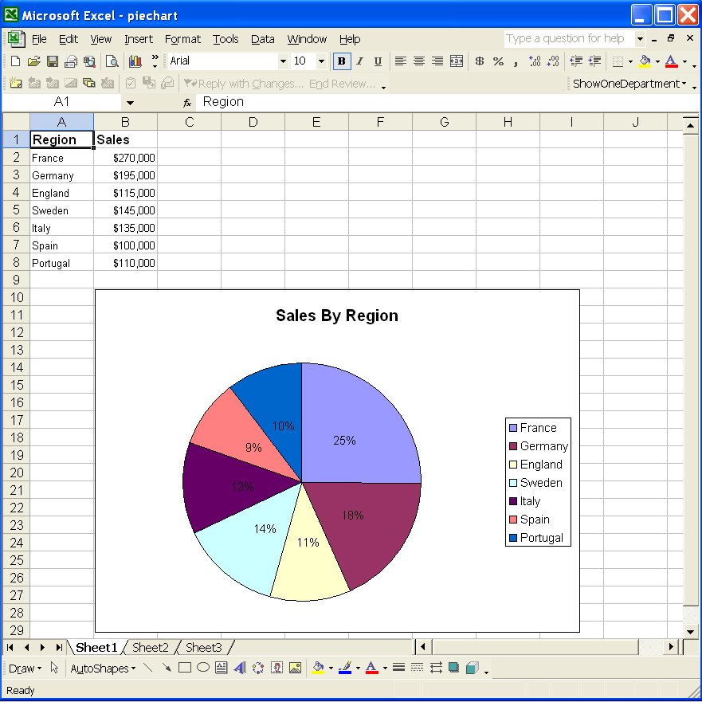
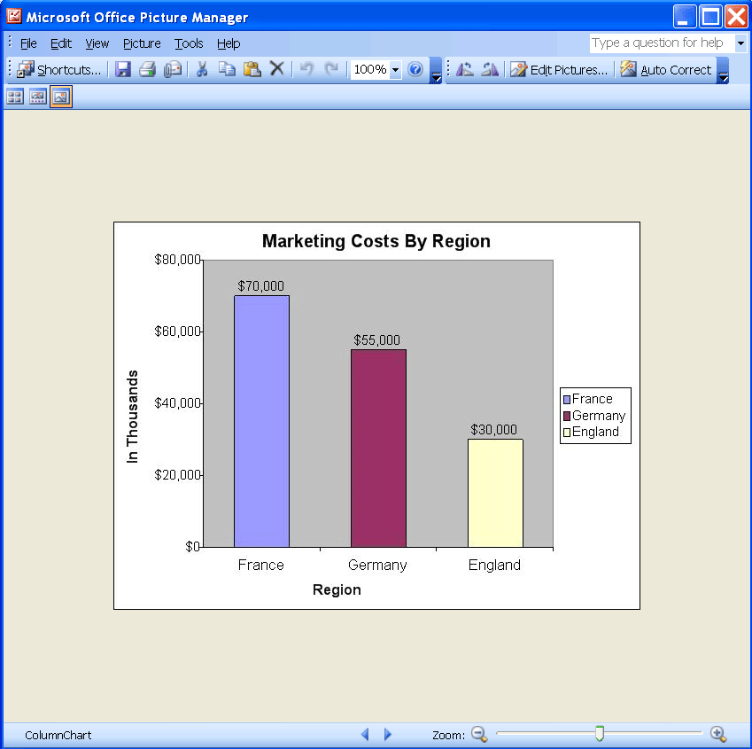
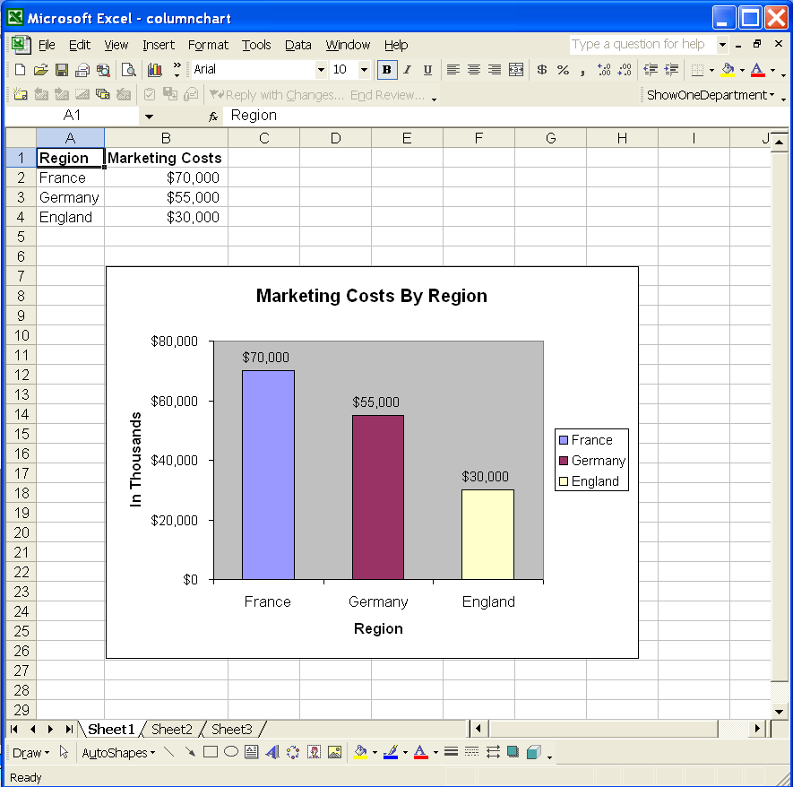

{}  

Charts are visually appealing and make it easy for users to see comparisons, patterns, and trends in data. For instance, rather than analyzing columns of worksheet numbers, a chart shows at a glance whether sales are falling or rising, or how actual sales compare to projected sales. People are frequently asked to present statistical and graphical information in an easy to understand and an easy to maintain manner. A picture helps.  

Sometimes, charts are needed in an application or web pages. Or it might be needed for a Word document, a PDF file, a PowerPoint presentation or some other application. In each case, you want to render the chart as an image so that you can use it elsewhere.  

{}  

## **Converting Charts to Images**  

In the examples here, a pie chart and a column chart are converted to images.  

### **Converting a Pie Chart to an Image File**  

First, create a pie chart in Microsoft Excel and then convert it to an image file with Aspose.Cells for JavaScript via C++. The code in this example creates an EMF image based on the pie chart in the template Microsoft Excel file.  

|**Output: pie chart image**|  
| :- |  
||  

1. Create a pie chart in Microsoft Excel:  
   1. Open a new workbook in Microsoft Excel.  
   1. Input some data into a worksheet.  
   1. Create a pie chart based on the data.  
   1. Save the file.  

|**The input file.**|  
| :- |  
||  

1. Download and install Aspose.Cells:  
   1. [Download Aspose.Cells for JavaScript via C++](https://downloads.aspose.com/cells/javascript-cpp).  
   1. Install it on your development computer.  

All [Aspose](http://www.aspose.com/) components work in evaluation mode when first installed. The evaluation mode has no time limit and it only injects watermarks into output documents.  

1. Create a project:  
   1. Start your preferred IDE.  
   1. Create a new console application. This example uses a JavaScript application, but you can create it using any JavaScript runtime environment.  
   1. Add a reference. This project uses Aspose.Cells so add a reference to Aspose.Cells for JavaScript via C++.  
   1. Write the code that finds and converts the chart. Below is the code used by the component to accomplish the task. Very few lines of code are used.  

```html
<!DOCTYPE html>
<html>
    <head>
        <title>Aspose.Cells Example</title>
    </head>
    <body>
        <h1>Convert Chart to Image Example</h1>
        <input type="file" id="fileInput" accept=".xls,.xlsx,.csv" />
        <button id="runExample">Run Example</button>
        <a id="downloadLink" style="display: none;">Download Result</a>
        <div id="result"></div>
    </body>

    <script src="aspose.cells.js.min.js"></script>
    <script type="text/javascript">
        const { Workbook, SaveFormat, Utils } = AsposeCells;
        
        AsposeCells.onReady({
            license: "/lic/aspose.cells.enc",
            fontPath: "/fonts/",
            fontList: [
                "arial.ttf",
                "NotoSansSC-Regular.ttf"
            ]
        }).then(() => {
            console.log("Aspose.Cells initialized");
        });

        document.getElementById('runExample').addEventListener('click', async () => {
            const fileInput = document.getElementById('fileInput');
            if (!fileInput.files.length) {
                document.getElementById('result').innerHTML = '<p style="color: red;">Please select an Excel file.</p>';
                return;
            }

            const file = fileInput.files[0];
            const arrayBuffer = await file.arrayBuffer();

            // Instantiating a Workbook object from the uploaded file
            const workbook = new Workbook(new Uint8Array(arrayBuffer));

            // Get the designer chart (first chart) in the first worksheet of the workbook.
            const chart = workbook.worksheets.get(0).charts.get(0);

            // Convert the chart to an image (EMF) and prepare download link
            const imageData = chart.toImage(AsposeCells.ImageType.Emf);
            const blob = new Blob([imageData]);
            const downloadLink = document.getElementById('downloadLink');
            downloadLink.href = URL.createObjectURL(blob);
            downloadLink.download = 'PieChart.out.emf';
            downloadLink.style.display = 'block';
            downloadLink.textContent = 'Download Chart Image';

            document.getElementById('result').innerHTML = '<p style="color: green;">Chart converted to EMF successfully! Click the download link to get the image.</p>';
        });
    </script>
</html>
```  

### **Converting a Column Chart to an Image File**  

First, create a column chart in Microsoft Excel and convert it to an image file, as above. After executing the sample code, a JPEG file is created based on the column chart in the template Excel file.  

|**Output file: a column chart image.**|  
| :- |  
||  

1. Create a column chart in Microsoft Excel:  
   1. Open a new workbook in Microsoft Excel.  
   1. Input some data into a worksheet.  
   1. Create a column chart based on the data.  
   1. Save the file.  

|**Input file.**|  
| :- |  
||  

1. Set up a project, with references, as described above.  
1. Convert the chart to an image dynamically. Following is the code used by the component to accomplish the task. The code is similar to the previous one:  

```html
<!DOCTYPE html>
<html>
    <head>
        <title>Aspose.Cells Example - Convert Chart to Image</title>
    </head>
    <body>
        <h1>Convert Chart to Image</h1>
        <input type="file" id="fileInput" accept=".xls,.xlsx,.csv" />
        <button id="runExample">Run Example</button>
        <a id="downloadLink" style="display: none;">Download Result</a>
        <div id="result"></div>
    </body>

    <script src="aspose.cells.js.min.js"></script>
    <script type="text/javascript">
        const { Workbook, SaveFormat, ImageType, Utils } = AsposeCells;
        
        AsposeCells.onReady({
            license: "/lic/aspose.cells.enc",
            fontPath: "/fonts/",
            fontList: [
                "arial.ttf",
                "NotoSansSC-Regular.ttf"
            ]
        }).then(() => {
            console.log("Aspose.Cells initialized");
        });

        document.getElementById('runExample').addEventListener('click', async () => {
            const fileInput = document.getElementById('fileInput');
            if (!fileInput.files.length) {
                document.getElementById('result').innerHTML = '<p style="color: red;">Please select an Excel file.</p>';
                return;
            }

            const file = fileInput.files[0];
            const arrayBuffer = await file.arrayBuffer();

            // Instantiate Workbook from uploaded file
            const workbook = new Workbook(new Uint8Array(arrayBuffer));

            // Get the designer chart (first chart) in the first worksheet of the workbook.
            const chart = workbook.worksheets.get(0).charts.get(0);

            // Convert the chart to an image (JPEG)
            const imageData = await chart.toImage(ImageType.Jpeg);

            // Create a Blob and provide a download link
            const blob = new Blob([imageData], { type: 'image/jpeg' });
            const downloadLink = document.getElementById('downloadLink');
            downloadLink.href = URL.createObjectURL(blob);
            downloadLink.download = 'ColumnChart.out.jpeg';
            downloadLink.style.display = 'block';
            downloadLink.textContent = 'Download Chart Image';

            document.getElementById('result').innerHTML = '<p style="color: green;">Chart converted to image successfully! Click the download link to get the image.</p>';
        });
    </script>
</html>
```