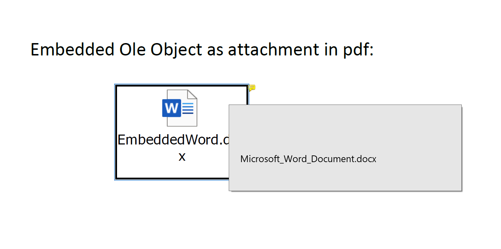

In Excel, you can insert an Ole Object with source data ([embedded-attachments-example.xlsx](embedded-attachments-example.xlsx)). Double-click the Ole Object, and the embedded file will be opened.

Generally, while converting to PDF, the Ole Object will be rendered as an icon or a thumbnail without the Ole Object source data. With option [PdfSaveOptions.embedAttachments()](https://reference.aspose.com/cells/javascript-cpp/pdfsaveoptions/#embedAttachments--) you can embed the Ole Object source data as an attachment in PDF. You can double-click the icon or the thumbnail in PDF to open the source file of the Ole Object.

```html
<!DOCTYPE html>
<html>
    <head>
        <title>Aspose.Cells Example - Embed Attachments to PDF</title>
    </head>
    <body>
        <h1>Embed Attachments to PDF Example</h1>
        <input type="file" id="fileInput" accept=".xls,.xlsx" />
        <button id="runExample">Run Example</button>
        <a id="downloadLink" style="display: none;">Download Result</a>
        <div id="result"></div>
    </body>

    <script src="aspose.cells.js.min.js"></script>
    <script type="text/javascript">
        const { Workbook, PdfSaveOptions, SaveFormat, Utils } = AsposeCells;
        
        AsposeCells.onReady({
            license: "/lic/aspose.cells.enc",
            fontPath: "/fonts/",
            fontList: [
                "arial.ttf",
                "NotoSansSC-Regular.ttf"
            ]
        }).then(() => {
            console.log("Aspose.Cells initialized");
        });

        document.getElementById('runExample').addEventListener('click', async () => {
            const fileInput = document.getElementById('fileInput');
            if (!fileInput.files.length) {
                document.getElementById('result').innerHTML = '<p style="color: red;">Please select an Excel file.</p>';
                return;
            }

            const file = fileInput.files[0];
            const arrayBuffer = await file.arrayBuffer();

            // Instantiating a Workbook object from the uploaded file
            const workbook = new Workbook(new Uint8Array(arrayBuffer));

            // Set to embed Ole Object attachment.
            const pdfSaveOptions = new PdfSaveOptions();
            pdfSaveOptions.embedAttachments = true;

            // Save the PDF file with PdfSaveOptions
            const outputData = workbook.save(SaveFormat.Pdf, pdfSaveOptions);
            const blob = new Blob([outputData], { type: 'application/pdf' });
            const downloadLink = document.getElementById('downloadLink');
            downloadLink.href = URL.createObjectURL(blob);
            downloadLink.download = 'output.pdf';
            downloadLink.style.display = 'block';
            downloadLink.textContent = 'Download PDF File';

            document.getElementById('result').innerHTML = '<p style="color: green;">PDF generated successfully! Click the download link to get the file.</p>';
        });
    </script>
</html>
```

