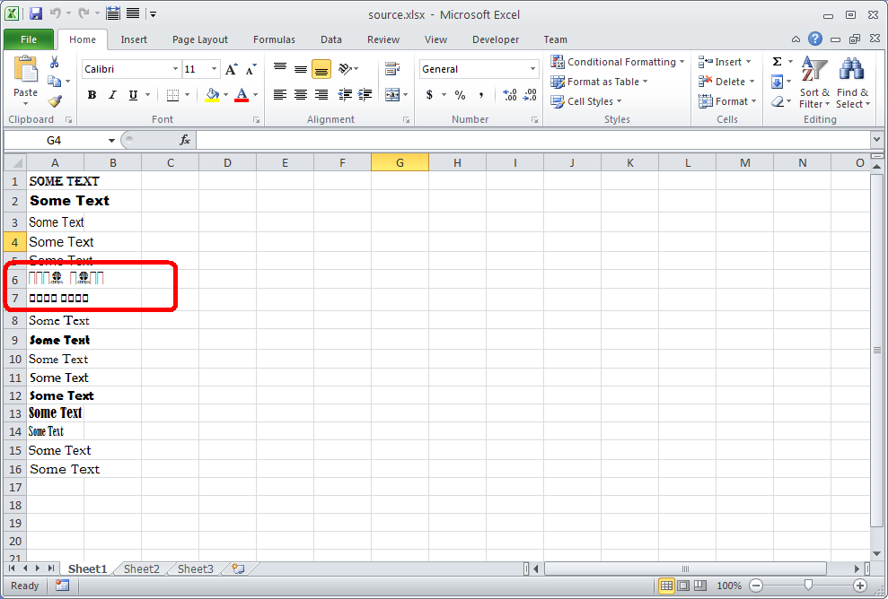

{}  

Sometimes, when rendering a Microsoft Excel file to PDF, Aspose.Cells substitutes fonts. Aspose.Cells provides a feature that lets developers know what particular font has been substituted by firing a warning. This is a useful feature that can help you identify why an Aspose.Cells rendered PDF looks different from the original Microsoft Excel file so you can take appropriate actions. For example, installing the missing fonts so that rendering results look the same.

{}  

To get warnings for font substitution when rendering Excel files to PDF, implement the IWarningCallback interface and set the PdfSaveOptions.warningCallback property with your implemented interface.

The screenshot below shows a source Excel file that we will use in the following code. It has some text in the cells A6 and A7 in fonts that are not rendered fine by Microsoft Excel.

|**Not all fonts are rendered correctly**|  
| :- |  
||  
Aspose.Cells will substitute the fonts in the cells A6 and A7 with suitable fonts as shown below.

|**Substituted fonts**|  
| :- |  
||  
## **Download Source File and Output PDF**  
You can download the source Excel file and the output PDF from the following links

- [source.xlsx](5112611.xlsx)  
- [output.pdf](5112616.pdf)  
## **Code**  
The following code implements the IWarningCallback and sets the PdfSaveOptions.warningCallback property with the implemented interface. Now, whenever any font will be substituted in any cell, Aspose.Cells will fire a warning inside the WarningCallback.Warning() method.

```html
<!DOCTYPE html>
<html>
    <head>
        <title>Aspose.Cells Example - GetWarningsForFontSubstitution</title>
    </head>
    <body>
        <h1>GetWarningsForFontSubstitution Example</h1>
        <input type="file" id="fileInput" accept=".xls,.xlsx,.csv" />
        <button id="runExample">Run Example</button>
        <a id="downloadLink" style="display: none;">Download Result</a>
        <div id="result"></div>
    </body>

    <script src="aspose.cells.js.min.js"></script>
    <script type="text/javascript">
        const { Workbook, SaveFormat, PdfSaveOptions } = AsposeCells;
        
        AsposeCells.onReady({
            license: "/lic/aspose.cells.enc",
            fontPath: "/fonts/",
            fontList: [
                "arial.ttf",
                "NotoSansSC-Regular.ttf"
            ]
        }).then(() => {
            console.log("Aspose.Cells initialized");
        });

        class GetWarningsForFontSubstitution {
            static warning(info) {
                if (info.type === AsposeCells.WarningType.FontSubstitution) {
                    console.log("WARNING INFO: " + info.description);
                }
            }
        }

        document.getElementById('runExample').addEventListener('click', async () => {
            const fileInput = document.getElementById('fileInput');
            const resultDiv = document.getElementById('result');
            if (!fileInput.files.length) {
                resultDiv.innerHTML = '<p style="color: red;">Please select an Excel file.</p>';
                return;
            }

            const file = fileInput.files[0];
            const arrayBuffer = await file.arrayBuffer();
            // Instantiate workbook from uploaded file
            const workbook = new Workbook(new Uint8Array(arrayBuffer));

            // Prepare PDF save options and assign warning callback
            const options = new PdfSaveOptions();
            options.warningCallback = GetWarningsForFontSubstitution;

            // Save workbook as PDF
            const outputData = workbook.save(SaveFormat.Pdf, options);
            const blob = new Blob([outputData], { type: 'application/pdf' });
            const downloadLink = document.getElementById('downloadLink');
            downloadLink.href = URL.createObjectURL(blob);
            downloadLink.download = 'output_out.pdf';
            downloadLink.style.display = 'block';
            downloadLink.textContent = 'Download PDF File';

            resultDiv.innerHTML = '<p style="color: green;">PDF generated successfully! Click the download link to get the file.</p>';
        });
    </script>
</html>
```  
## **Output**  
After converting the source Excel file to PDF, the warnings are output to the debug console like this:

  

 WARNING INFO: Font substitution: Font [ Athene Logos; Regular ] has been substituted in Cell [ A6 ] in Sheet [ Sheet1 ].  

WARNING INFO: Font substitution: Font [ B Traffic; Regular ] has been substituted in Cell [ A7 ] in Sheet [ Sheet1 ].  

  

{}  

If your spreadsheet contains formulas, it is best to call Workbook.calculateFormula method just before rendering the spreadsheet to PDF format. Doing so will ensure that the formula dependent values are recalculated, and the correct values are rendered in the PDF.

{}