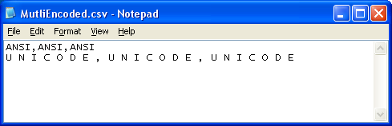

{}

Sometimes, your CSV file contains multiple Encodings (Unicode, ANSI, UTF8, UTF7, etc). Aspose.Cells allows you to load such CSV files and convert them into other formats, for example, PDF or XLSX.

{}

Aspose.Cells provides the [**TxtLoadOptions.isMultiEncoded()**](https://reference.aspose.com/cells/javascript-cpp/txtloadoptions/#isMultiEncoded--) property, which you need to set to **true** to load your CSV file with multiple encodings properly.

The following screenshot shows a sample CSV file that contains two lines. The first line is in **ANSI** encoding and the second line is in **Unicode** encoding

|**Input file**|
| :- |
||

The following screenshot shows the XLSX file converted from the above CSV file without setting the [**TxtLoadOptions.isMultiEncoded()**](https://reference.aspose.com/cells/javascript-cpp/txtloadoptions/#isMultiEncoded--) property to **true**. As you can see, the Unicode text was not converted properly.

|**Output file 1: no accommodation made for multiple encoding**|
| :- |
||

The following screenshot shows the XSLX file converted from the above CSV file after setting the [**TxtLoadOptions.isMultiEncoded()**](https://reference.aspose.com/cells/javascript-cpp/txtloadoptions/#isMultiEncoded--) property to **true**. As you can see, the Unicode text is now converted properly.

|**Output file 2: IsMultiEncoded is set to true**|
| :- |
||

Below is the sample code that converts the above CSV file into XLSX format properly.

```html
<!DOCTYPE html>
<html>
    <head>
        <title>Aspose.Cells Example</title>
    </head>
    <body>
        <h1>Aspose.Cells - Convert Multi-Encoded CSV to XLSX</h1>
        <input type="file" id="fileInput" accept=".csv" />
        <button id="runExample">Convert to XLSX</button>
        <a id="downloadLink" style="display: none;">Download Result</a>
        <div id="result"></div>
    </body>

    <script src="aspose.cells.js.min.js"></script>
    <script type="text/javascript">
        const { Workbook, SaveFormat, TxtLoadOptions, Utils } = AsposeCells;
        
        AsposeCells.onReady({
            license: "/lic/aspose.cells.enc",
            fontPath: "/fonts/",
            fontList: [
                "arial.ttf",
                "NotoSansSC-Regular.ttf"
            ]
        }).then(() => {
            console.log("Aspose.Cells initialized");
        });

        document.getElementById('runExample').addEventListener('click', async () => {
            const fileInput = document.getElementById('fileInput');
            if (!fileInput.files.length) {
                document.getElementById('result').innerHTML = '<p style="color: red;">Please select a CSV file.</p>';
                return;
            }

            const file = fileInput.files[0];
            const arrayBuffer = await file.arrayBuffer();

            // Create TxtLoadOptions and set isMultiEncoded property
            const options = new TxtLoadOptions();
            options.isMultiEncoded = true;

            // Load the CSV into a Workbook using the options
            const workbook = new Workbook(new Uint8Array(arrayBuffer), options);

            // Save the workbook to XLSX format and provide a download link
            const outputData = workbook.save(SaveFormat.Xlsx);
            const blob = new Blob([outputData]);
            const downloadLink = document.getElementById('downloadLink');
            const outName = file.name.replace(/(\.[^/.]+)$/, '$1.out.xlsx');
            downloadLink.href = URL.createObjectURL(blob);
            downloadLink.download = outName;
            downloadLink.style.display = 'block';
            downloadLink.textContent = 'Download Converted Excel File';

            document.getElementById('result').innerHTML = '<p style="color: green;">File converted successfully! Click the download link to save the XLSX file.</p>';
        });
    </script>
</html>
```

## Related Articles

- [Opening CSV Files](/cells/javascript-cpp/opening-files-with-different-formats/#opening-csv-files)