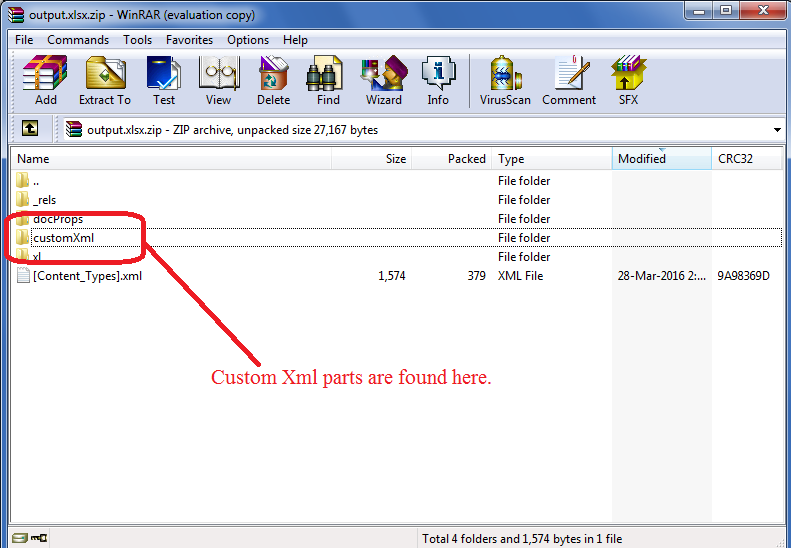

## Using Custom XML Parts in Aspose.Cells

Custom XML Parts are XML data stored by applications such as SharePoint inside the Excel file. This data is consumed by different applications that need it. Microsoft Excel does not make use of this data, so there is no GUI to add it. You can view this data by changing the extension of **.xlsx** to **.zip** and then opening it with **WinZip**. You can also open the ZIP file using any third‑party Windows zip utility such as WinRAR or WinZip, etc. The data is present inside the **customXml** folder.

You can add custom XML parts using Aspose.Cells for JavaScript via C++ through the [**ContentTypePropertyCollection**](https://reference.aspose.com/cells/javascript-cpp/contenttypepropertycollection/) method.

The following sample code makes use of the [**ContentTypePropertyCollection**](https://reference.aspose.com/cells/javascript-cpp/contenttypepropertycollection/) method and adds the **Book Catalog XML**, naming it **BookStore**. The following image shows the result of this code. As you can see, the Book Catalog XML is added inside the BookStore node, which is the name of this property.




## JavaScript code to use custom XML parts

```html
<!DOCTYPE html>
<html>
    <head>
        <title>Aspose.Cells Example</title>
    </head>
    <body>
        <h1>Add Custom XML to Workbook Example</h1>
        <input type="file" id="fileInput" accept=".xls,.xlsx,.csv" />
        <button id="runExample">Run Example</button>
        <a id="downloadLink" style="display: none;">Download Result</a>
        <div id="result"></div>
    </body>

    <script src="aspose.cells.js.min.js"></script>
    <script type="text/javascript">
        const { Workbook, SaveFormat, Utils } = AsposeCells;
        
        AsposeCells.onReady({
            license: "/lic/aspose.cells.enc",
            fontPath: "/fonts/",
            fontList: [
                "arial.ttf",
                "NotoSansSC-Regular.ttf"
            ]
        }).then(() => {
            console.log("Aspose.Cells initialized");
        });

        const booksXML = `<catalog>
<book>
<title>Complete C#</title>
<price>44</price>
</book>
<book>
<title>Complete Java</title>
<price>76</price>
</book>
<book>
<title>Complete SharePoint</title>
<price>55</price>
</book>
<book>
<title>Complete PHP</title>
<price>63</price>
</book>
<book>
<title>Complete VB.NET</title>
<price>72</price>
</book>
</catalog>`;

        document.getElementById('runExample').addEventListener('click', async () => {
            // Create an instance of Workbook class
            const workbook = new Workbook();

            // Add Custom XML Part to ContentTypePropertyCollection
            workbook.contentTypeProperties.add("BookStore", booksXML);

            // Save the resultant spreadsheet
            const outputData = workbook.save(SaveFormat.Xlsx);
            const blob = new Blob([outputData]);
            const downloadLink = document.getElementById('downloadLink');
            downloadLink.href = URL.createObjectURL(blob);
            downloadLink.download = 'output.xlsx';
            downloadLink.style.display = 'block';
            downloadLink.textContent = 'Download Excel File';

            document.getElementById('result').innerHTML = '<p style="color: green;">Custom XML added and file prepared. Click the download link to get the file.</p>';
        });
    </script>
</html>
```

## Related Article

- [Adding Custom Properties visible inside Document Information Panel](/cells/javascript-cpp/adding-custom-properties-visible-inside-document-information-panel/)