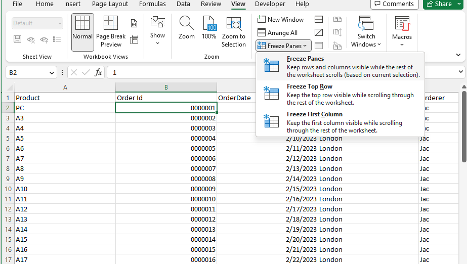

## **Introduction**  

In this article, we will learn how to freeze panes. When you have a huge amount of data under a common heading, you are unable to see the heading when scrolled down the worksheet. Each record contains many data points. You can freeze panes so that you can see that frozen portion even when the rest of the data is being scrolled. You can easily see headers in the top rows or first columns. Freezing and unfreezing panes only changes the view of the data without changing the data itself.  

## **In Excel**  

****  

1. If you want to freeze panes, freeze rows and columns, then first select a cell (such as B2).  
2. Click **View > Freeze Panes**.  
3. On the drop‑down menu, click **Freeze Panes**.  
4. If you scroll down or right, the first row and column are frozen.  

****  

As you can see, the first row and column A are frozen, the second row is 32, and the second visible column is D.  

Freeze panes let you view your large data without keeping track of row or column labels.  

## **Freeze Panes with Aspose.Cells for JavaScript via C++**  
It's simple to freeze panes with Aspose.Cells for JavaScript via C++. Please use the [**Worksheet.freezePanes(number, number, number, number)**](https://reference.aspose.com/cells/javascript-cpp/worksheet/#freezePanes-number-number-number-number-) method to freeze panes at the selected cell.  
1. Construct a Workbook to open the file or create an empty file.  
2. Freeze panes with the `Worksheet.freezePanes()` method.  
3. Save the file.  

```html
<!DOCTYPE html>
<html>
    <head>
        <title>Aspose.Cells Freeze Panes Example</title>
    </head>
    <body>
        <h1>Freeze Panes Example</h1>
        <p>Select an Excel file (Freeze.xlsx) and click "Run Example" to freeze panes at B2.</p>
        <input type="file" id="fileInput" accept=".xls,.xlsx,.csv" />
        <button id="runExample">Run Example</button>
        <a id="downloadLink" style="display: none;">Download Result</a>
        <div id="result"></div>

    <script src="aspose.cells.js.min.js"></script>
    <script type="text/javascript">
        const { Workbook, SaveFormat, Utils } = AsposeCells;
        
        AsposeCells.onReady({
            license: "/lic/aspose.cells.enc",
            fontPath: "/fonts/",
            fontList: [
                "arial.ttf",
                "NotoSansSC-Regular.ttf"
            ]
        }).then(() => {
            console.log("Aspose.Cells initialized");
        });

        document.getElementById('runExample').addEventListener('click', async () => {
            const fileInput = document.getElementById('fileInput');
            const resultDiv = document.getElementById('result');
            if (!fileInput.files.length) {
                resultDiv.innerHTML = '<p style="color: red;">Please select an Excel file.</p>';
                return;
            }

            const file = fileInput.files[0];
            const arrayBuffer = await file.arrayBuffer();

            // Instantiating a Workbook object from the uploaded file
            const workbook = new Workbook(new Uint8Array(arrayBuffer));

            // Accessing the first worksheet in the Excel file
            const worksheet = workbook.worksheets.get(0);

            // Freezing panes at the cell B2
            worksheet.freezePanes("B2", 1, 1);

            // Saving the modified Excel file
            const outputData = workbook.save(SaveFormat.Xlsx);
            const blob = new Blob([outputData]);
            const downloadLink = document.getElementById('downloadLink');
            downloadLink.href = URL.createObjectURL(blob);
            downloadLink.download = 'frozen.xlsx';
            downloadLink.style.display = 'block';
            downloadLink.textContent = 'Download Frozen Excel File';

            resultDiv.innerHTML = '<p style="color: green;">Panes frozen successfully! Click the download link to get the modified file.</p>';
        });
    </script>
    </body>
</html>
```  

Attached [sample source Excel file](Freeze.xlsx).