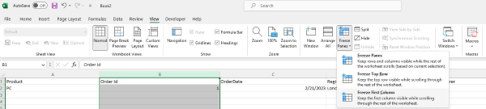

## **Introduction**  

In this article, we will learn how to freeze left column(s). When you have a huge amount of data in a row, you may be unable to see the left columns when horizontally scrolled down the worksheet. You can freeze and lock first column(s) so that you can see that frozen portion even when the rest of the data is being scrolled. You can easily see headers in the left columns.  

## **Freeze Columns In Excel**  

****  

1. If you want to freeze left column(s), then first select the column under the column that needs to be frozen.
2. Click View > Freeze Panes.
3. On the drop-down menu, click Freeze First column.
4. If you scroll down, the first column is always in the left view.

****  

As you can see, the 1st column is frozen, and the first column is always locked at the top of the view when you scroll horizontally.

Freeze Columns let you view your long data without any hassle of keeping track of the first column.

## **Freeze Columns with Aspose.Cells for JavaScript via C++**  
It's simple to freeze first column(s) with Aspose.Cells for JavaScript via C++.  
Please use the [**Worksheet.freezePanes(number, number, number, number)**](https://reference.aspose.com/cells/javascript-cpp/worksheet/#freezePanes-number-number-number-number-) method to freeze column(s) at the selected column.  
1. Construct Workbook to open the file or create an empty file.
2. Freeze the first column with Worksheet.freezePanes() method.
3. Save the file.

```html
<!DOCTYPE html>
<html>
    <head>
        <title>Aspose.Cells Freeze Panes Example</title>
    </head>
    <body>
        <h1>Freeze Panes Example</h1>
        <input type="file" id="fileInput" accept=".xls,.xlsx,.csv" />
        <button id="runExample">Run Example</button>
        <a id="downloadLink" style="display: none;">Download Result</a>
        <div id="result"></div>
    </body>

    <script src="aspose.cells.js.min.js"></script>
    <script type="text/javascript">
        const { Workbook, SaveFormat, Utils } = AsposeCells;
        
        AsposeCells.onReady({
            license: "/lic/aspose.cells.enc",
            fontPath: "/fonts/",
            fontList: [
                "arial.ttf",
                "NotoSansSC-Regular.ttf"
            ]
        }).then(() => {
            console.log("Aspose.Cells initialized");
        });

        document.getElementById('runExample').addEventListener('click', async () => {
            const fileInput = document.getElementById('fileInput');
            if (!fileInput.files.length) {
                document.getElementById('result').innerHTML = '<p style="color: red;">Please select an Excel file.</p>';
                return;
            }

            const file = fileInput.files[0];
            const arrayBuffer = await file.arrayBuffer();

            // Instantiate a new Workbook from the uploaded file
            const workbook = new Workbook(new Uint8Array(arrayBuffer));

            // Freezing panes at the second column on the first worksheet
            const worksheet = workbook.worksheets.get(0);
            worksheet.freezePanes("B1", 0, 1);

            // Saving the file and preparing download link
            const outputData = workbook.save(SaveFormat.Xlsx);
            const blob = new Blob([outputData], { type: 'application/vnd.openxmlformats-officedocument.spreadsheetml.sheet' });
            const downloadLink = document.getElementById('downloadLink');
            downloadLink.href = URL.createObjectURL(blob);
            downloadLink.download = 'frozen.xlsx';
            downloadLink.style.display = 'block';
            downloadLink.textContent = 'Download Frozen Excel File';

            document.getElementById('result').innerHTML = '<p style="color: green;">Freeze panes applied successfully! Click the download link to get the modified file.</p>';
        });
    </script>
</html>
```  

Attached [sample source Excel file](Freeze.xlsx).