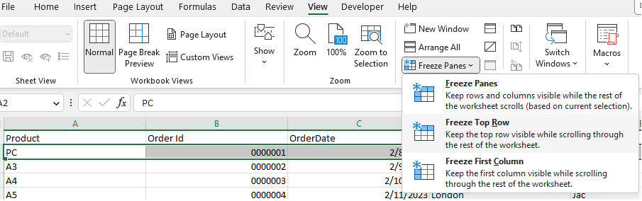
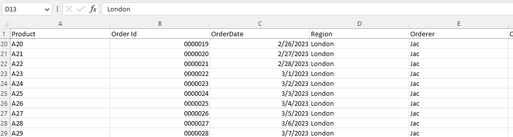

## **Introduction**

In this article, we will learn how to freeze top row(s). When you have a huge amount of data under a common heading, you are unable to see the heading when scrolling down the worksheet. You can freeze top row(s) so that you can see that frozen portion even when the rest of the data is being scrolled. You can easily see headers in the top rows.

## **Freeze Rows in Excel**

****

1. If you want to freeze top row(s), first select the row below the row that needs to be frozen.  
2. Click **View > Freeze Panes**.  
3. On the drop‑down menu, click **Freeze Top Row**.  
4. If you scroll down, the first row is always in the top view.

****

As you can see, the 1st row is frozen; the first row always stays at the top of the view when you scroll down.

Freeze rows let you view your large data without losing track of the row labels.

## **Freeze Rows with Aspose.Cells for JavaScript via C++**
It's simple to freeze row(s) with Aspose.Cells for JavaScript via C++.  
Please use the **Worksheet.freezePanes(number, number, number, number)** method to freeze row(s) at the selected row.

1. Construct a Workbook to open an existing file or create a new one.  
2. Freeze the first row with the **Worksheet.freezePanes()** method.  
3. Save the file.

```html
<!DOCTYPE html>
<html>
    <head>
        <title>Aspose.Cells Example - Freeze Panes</title>
    </head>
    <body>
        <h1>Freeze Panes Example</h1>
        <input type="file" id="fileInput" accept=".xls,.xlsx,.csv" />
        <button id="runExample">Run Example</button>
        <a id="downloadLink" style="display: none;">Download Result</a>
        <div id="result"></div>
    </body>

    <script src="aspose.cells.js.min.js"></script>
    <script type="text/javascript">
        const { Workbook, SaveFormat, Worksheet, Cell, Utils } = AsposeCells;
        
        AsposeCells.onReady({
            license: "/lic/aspose.cells.enc",
            fontPath: "/fonts/",
            fontList: [
                "arial.ttf",
                "NotoSansSC-Regular.ttf"
            ]
        }).then(() => {
            console.log("Aspose.Cells initialized");
        });

        document.getElementById('runExample').addEventListener('click', async () => {
            const fileInput = document.getElementById('fileInput');
            if (!fileInput.files.length) {
                document.getElementById('result').innerHTML = '<p style="color: red;">Please select an Excel file.</p>';
                return;
            }

            const file = fileInput.files[0];
            const arrayBuffer = await file.arrayBuffer();

            // Instantiate a new Workbook from the uploaded file
            const workbook = new Workbook(new Uint8Array(arrayBuffer));

            // Freezing panes at cell A2 on the first worksheet
            const worksheet = workbook.worksheets.get(0);
            worksheet.freezePanes("A2", 1, 0);

            // Saving the file and providing a download link
            const outputData = workbook.save(SaveFormat.Xlsx);
            const blob = new Blob([outputData]);
            const downloadLink = document.getElementById('downloadLink');
            downloadLink.href = URL.createObjectURL(blob);
            downloadLink.download = 'frozen.xlsx';
            downloadLink.style.display = 'block';
            downloadLink.textContent = 'Download Frozen Excel File';

            document.getElementById('result').innerHTML = '<p style="color: green;">Freeze panes applied successfully! Click the download link to get the modified file.</p>';
        });
    </script>
</html>
```

Attached [sample source Excel file](../Freeze.xlsx).