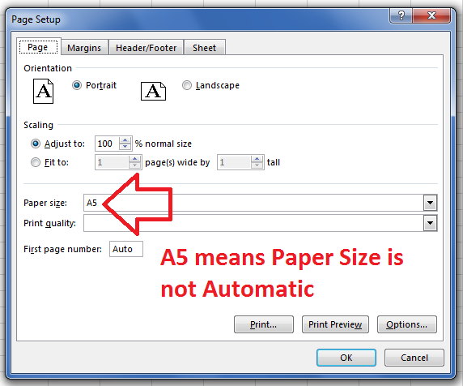

## **Possible Usage Scenarios**

Most of the time, the paper size of the worksheet is automatic. When it is automatic, it is often set as *Letter*. Sometimes the user sets the paper size of the worksheet as per their requirements. In this case, the paper size is not automatic. You can find if the worksheet paper size is automatic or not using the [**Worksheet.isAutomaticPaperSize()**](https://reference.aspose.com/cells/javascript-cpp/pagesetup/#isAutomaticPaperSize--) property.

## **Determine if Paper Size of Worksheet is Automatic**

The sample code given below loads the following two Excel files

- [samplePageSetupIsAutomaticPaperSize-False.xlsx](48496681.xlsx)
- [samplePageSetupIsAutomaticPaperSize-True.xlsx](48496682.xlsx)

and find if the paper size of their first worksheet is automatic or not. In Microsoft Excel, you can check if the paper size is automatic or not via the Page Setup window as shown in this screenshot.



## **Sample Code**

```html
<!DOCTYPE html>
<html>
    <head>
        <title>Aspose.Cells Example - PageSetup IsAutomaticPaperSize</title>
    </head>
    <body>
        <h1>PageSetup IsAutomaticPaperSize Example</h1>
        <p>Select two Excel files to compare the PageSetup.isAutomaticPaperSize property:</p>
        <input type="file" id="fileInput1" accept=".xls,.xlsx,.csv" />
        <input type="file" id="fileInput2" accept=".xls,.xlsx,.csv" />
        <br/><br/>
        <button id="runExample">Run Example</button>
        <a id="downloadLink" style="display: none;">Download Result</a>
        <div id="result"></div>
    </body>

    <script src="aspose.cells.js.min.js"></script>
    <script type="text/javascript">
        const { Workbook, SaveFormat, Worksheet, Cell, Utils } = AsposeCells;
        
        AsposeCells.onReady({
            license: "/lic/aspose.cells.enc",
            fontPath: "/fonts/",
            fontList: [
                "arial.ttf",
                "NotoSansSC-Regular.ttf"
            ]
        }).then(() => {
            console.log("Aspose.Cells initialized");
        });

        document.getElementById('runExample').addEventListener('click', async () => {
            const fileInput1 = document.getElementById('fileInput1');
            const fileInput2 = document.getElementById('fileInput2');
            const resultDiv = document.getElementById('result');

            if (!fileInput1.files.length || !fileInput2.files.length) {
                resultDiv.innerHTML = '<p style="color: red;">Please select both Excel files.</p>';
                return;
            }

            const file1 = fileInput1.files[0];
            const file2 = fileInput2.files[0];

            const arrayBuffer1 = await file1.arrayBuffer();
            const arrayBuffer2 = await file2.arrayBuffer();

            // Instantiating Workbook objects from uploaded files
            const wb1 = new Workbook(new Uint8Array(arrayBuffer1));
            const wb2 = new Workbook(new Uint8Array(arrayBuffer2));

            // Access first worksheet of both workbooks
            const ws11 = wb1.worksheets.get(0);
            const ws12 = wb2.worksheets.get(0);

            // Read the PageSetup.isAutomaticPaperSize property of both worksheets
            const isAuto1 = ws11.pageSetup.isAutomaticPaperSize;
            const isAuto2 = ws12.pageSetup.isAutomaticPaperSize;

            // Display results
            resultDiv.innerHTML = `
                <p>First Worksheet of First Workbook - IsAutomaticPaperSize: ${isAuto1}</p>
                <p>First Worksheet of Second Workbook - IsAutomaticPaperSize: ${isAuto2}</p>
            `;
        });
    </script>
</html>
```

## **Console Output**




First Worksheet of First Workbook - IsAutomaticPaperSize: False

First Worksheet of Second Workbook - IsAutomaticPaperSize: True

