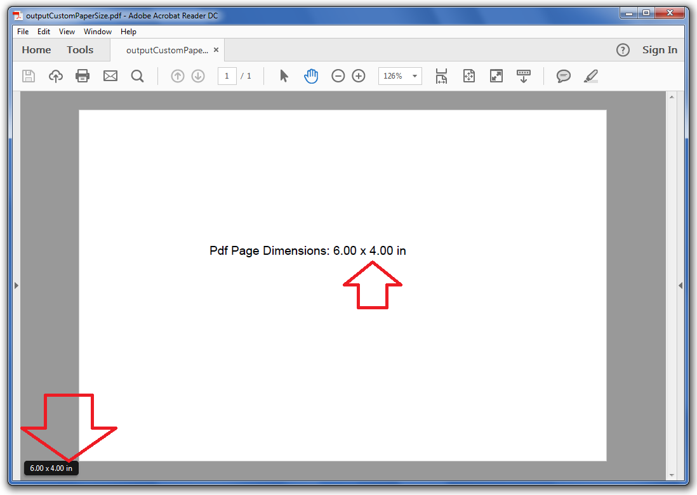

## **Possible Usage Scenarios**  

There is no direct option available to create custom paper sizes in MS Excel; however, you can set a custom paper size for your desired worksheets when rendering an Excel file to PDF format. This document explains how to set a custom paper size of a worksheet using Aspose.Cells APIs.  

## **Implement Custom Paper Size of Worksheet for Rendering**  

Aspose.Cells allows you to set your desired paper size for the worksheet. You may use the [**PageSetup.customPaperSize(number, number)**](https://reference.aspose.com/cells/javascript-cpp/pagesetup/#customPaperSize-number-number-) method of the [**PageSetup**](https://reference.aspose.com/cells/javascript-cpp/pagesetup/) class to specify a custom page size. The following sample code illustrates how to specify a custom paper size for the first worksheet in the workbook. Please also see the [output PDF](45056028.pdf) generated with the following code for reference.  

## **Screenshot**  

  

## **Sample Code**  

```html
<!DOCTYPE html>
<html>
    <head>
        <title>Aspose.Cells Example</title>
    </head>
    <body>
        <h1>Custom PDF Paper Size Example</h1>
        <input type="file" id="fileInput" accept=".xls,.xlsx,.csv" />
        <button id="runExample">Run Example</button>
        <a id="downloadLink" style="display: none;">Download Result</a>
        <div id="result"></div>
    </body>

    <script src="aspose.cells.js.min.js"></script>
    <script type="text/javascript">
        const { Workbook, SaveFormat, Utils } = AsposeCells;
        
        AsposeCells.onReady({
            license: "/lic/aspose.cells.enc",
            fontPath: "/fonts/",
            fontList: [
                "arial.ttf",
                "NotoSansSC-Regular.ttf"
            ]
        }).then(() => {
            console.log("Aspose.Cells initialized");
        });

        document.getElementById('runExample').addEventListener('click', async () => {
            const fileInput = document.getElementById('fileInput');
            if (!fileInput.files.length) {
                // If no file provided, create a new workbook as in the original JavaScript example
                const wb = new Workbook();

                // Access first worksheet
                const ws = wb.worksheets.get(0);

                // Set custom paper size in unit of inches
                ws.pageSetup.customPaperSize(6, 4);

                // Access cell B4
                const b4 = ws.cells.get("B4");

                // Add the message in cell B4
                b4.value = "Pdf Page Dimensions: 6.00 x 4.00 in";

                // Save the workbook in pdf format
                const outputData = wb.save(SaveFormat.Pdf);
                const blob = new Blob([outputData]);
                const downloadLink = document.getElementById('downloadLink');
                downloadLink.href = URL.createObjectURL(blob);
                downloadLink.download = 'outputCustomPaperSize.pdf';
                downloadLink.style.display = 'block';
                downloadLink.textContent = 'Download PDF File';

                document.getElementById('result').innerHTML = '<p style="color: green;">PDF created successfully! Click the download link to get the file.</p>';
                return;
            }

            // If a file is provided, open it and apply the same operations
            const file = fileInput.files[0];
            const arrayBuffer = await file.arrayBuffer();

            // Instantiate workbook from uploaded file
            const wb = new Workbook(new Uint8Array(arrayBuffer));

            // Access first worksheet
            const ws = wb.worksheets.get(0);

            // Set custom paper size in unit of inches
            ws.pageSetup.customPaperSize(6, 4);

            // Access cell B4
            const b4 = ws.cells.get("B4");

            // Add the message in cell B4
            b4.value = "Pdf Page Dimensions: 6.00 x 4.00 in";

            // Save the workbook in pdf format
            const outputData = wb.save(SaveFormat.Pdf);
            const blob = new Blob([outputData]);
            const downloadLink = document.getElementById('downloadLink');
            downloadLink.href = URL.createObjectURL(blob);
            downloadLink.download = 'outputCustomPaperSize.pdf';
            downloadLink.style.display = 'block';
            downloadLink.textContent = 'Download PDF File';

            document.getElementById('result').innerHTML = '<p style="color: green;">PDF created successfully! Click the download link to get the file.</p>';
        });
    </script>
</html>
```