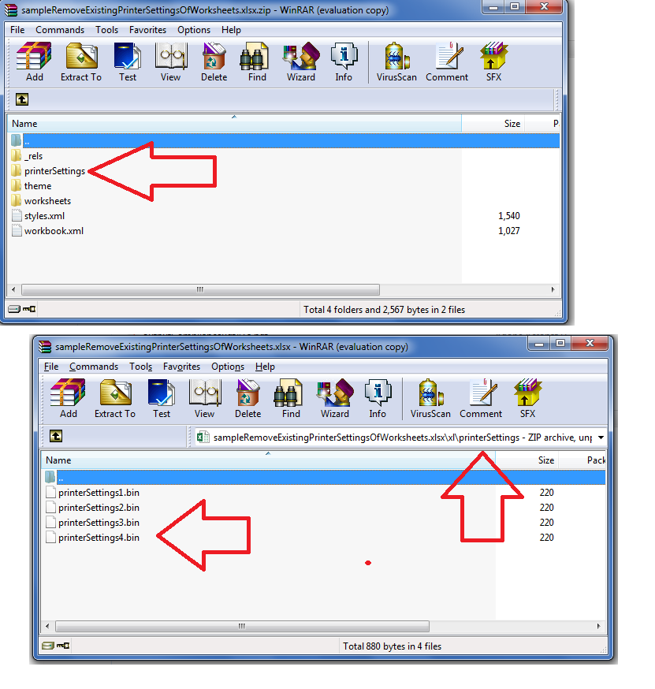

## **Possible Usage Scenarios**
Sometimes developers want to prevent Excel from including *.bin* files of printer settings in the saved XLSX files. Printer settings files are located under *“[file "root"]\xl\printerSettings”.* This document explains how to remove existing printer settings using Aspose.Cells APIs.

## **Remove Existing PrinterSettings of Worksheets in Excel file**
Aspose.Cells allows you to remove existing printer settings specified for different sheets in the Excel file. The following sample code illustrates how to remove existing printer settings for all the worksheets in the workbook. Please see the sample Excel file, the output Excel file, the console output, and the screenshot for reference.

## **Screenshot**


## **Sample Code**
```html
<!DOCTYPE html>
<html>
    <head>
        <title>Aspose.Cells Example - Remove Printer Settings</title>
        <meta charset="utf-8" />
        <style>
            body { font-family: Arial, sans-serif; margin: 20px; }
            #result { margin-top: 15px; white-space: pre-wrap; }
            input, button { margin-top: 10px; display: block; }
        </style>
    </head>
    <body>
        <h1>Remove Existing Printer Settings Of Worksheets</h1>
        <input type="file" id="fileInput" accept=".xls,.xlsx,.csv" />
        <button id="runExample">Run Example</button>
        <a id="downloadLink" style="display: none;">Download Result</a>
        <div id="result"></div>

    <script src="aspose.cells.js.min.js"></script>
    <script type="text/javascript">
        const { Workbook, SaveFormat, Utils } = AsposeCells;
        
        AsposeCells.onReady({
            license: "/lic/aspose.cells.enc",
            fontPath: "/fonts/",
            fontList: [
                "arial.ttf",
                "NotoSansSC-Regular.ttf"
            ]
        }).then(() => {
            console.log("Aspose.Cells initialized");
        });

        document.getElementById('runExample').addEventListener('click', async () => {
            const fileInput = document.getElementById('fileInput');
            const resultDiv = document.getElementById('result');
            resultDiv.innerHTML = '';

            if (!fileInput.files.length) {
                resultDiv.innerHTML = '<p style="color: red;">Please select an Excel file.</p>';
                return;
            }

            const file = fileInput.files[0];
            const arrayBuffer = await file.arrayBuffer();

            // Instantiating a Workbook object from the uploaded file
            const wb = new Workbook(new Uint8Array(arrayBuffer));

            // Get the sheet count of the workbook
            const sheetCount = wb.worksheets.count;

            const messages = [];
            // Iterate all sheets
            for (let i = 0; i < sheetCount; i++) {
                // Access the i-th worksheet
                const ws = wb.worksheets.get(i);

                // Access worksheet page setup
                const ps = ws.pageSetup;

                // Check if printer settings for this worksheet exist
                if (ps.printerSettings != null) {
                    // Log the following message
                    console.log("PrinterSettings of this worksheet exist.");
                    messages.push("PrinterSettings of this worksheet exist.");

                    // Log sheet name and its paper size
                    console.log("Sheet Name: " + ws.name);
                    console.log("Paper Size: " + ps.paperSize);
                    messages.push("Sheet Name: " + ws.name);
                    messages.push("Paper Size: " + ps.paperSize);

                    // Remove the printer settings by setting it to null
                    ps.printerSettings = null;
                    console.log("Printer settings of this worksheet are now removed by setting it to null.");
                    messages.push("Printer settings of this worksheet are now removed by setting it to null.");
                    messages.push("");
                }
            }

            // Save the workbook
            const outputData = wb.save(SaveFormat.Xlsx);
            const blob = new Blob([outputData]);
            const downloadLink = document.getElementById('downloadLink');
            downloadLink.href = URL.createObjectURL(blob);
            downloadLink.download = 'outputRemoveExistingPrinterSettingsOfWorksheets.xlsx';
            downloadLink.style.display = 'block';
            downloadLink.textContent = 'Download Modified Excel File';

            resultDiv.innerHTML = '<p style="color: green;">Operation completed successfully! Click the download link to get the modified file.</p><pre>' + messages.join('\n') + '</pre>';
        });
    </script>
    </body>
</html>
```

## **Console Output**


PrinterSettings of this worksheet exist.
Sheet Name: Sheet1
Paper Size: PaperLegal
Printer settings of this worksheet are now removed by setting it to null.

PrinterSettings of this worksheet exist.
Sheet Name: Sheet2
Paper Size: PaperEnvelopeB5
Printer settings of this worksheet are now removed by setting it to null.

PrinterSettings of this worksheet exist.
Sheet Name: Sheet3
Paper Size: PaperA6
Printer settings of this worksheet are now removed by setting it to null.

PrinterSettings of this worksheet exist.
Sheet Name: Sheet4
Paper Size: PaperA3
Printer settings of this worksheet are now removed by setting it to null.

