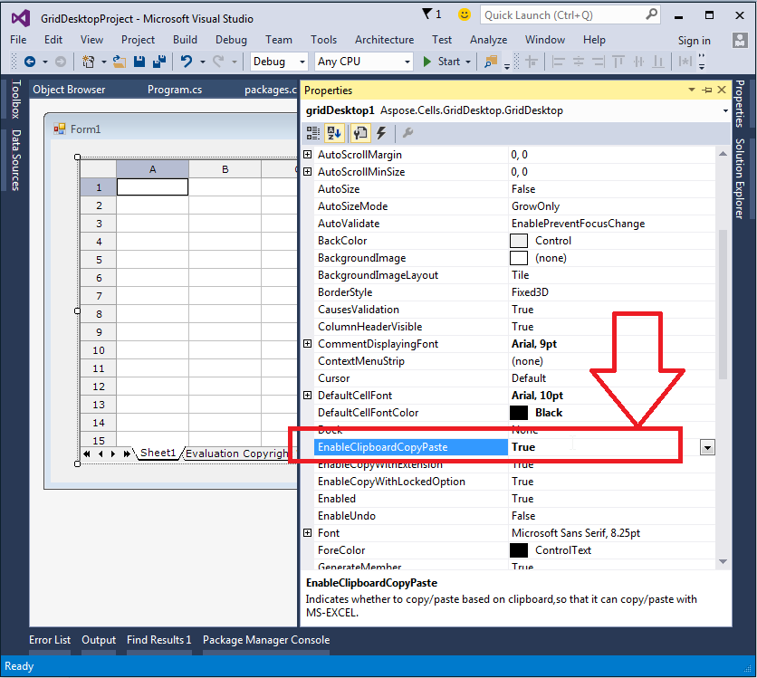
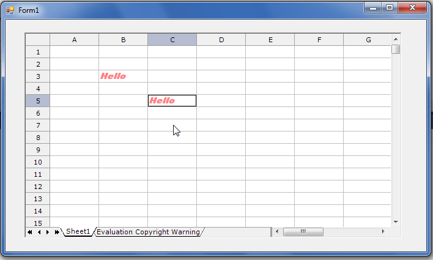
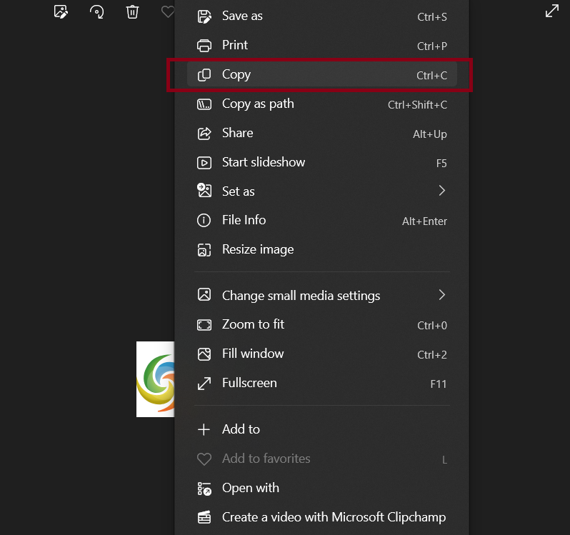
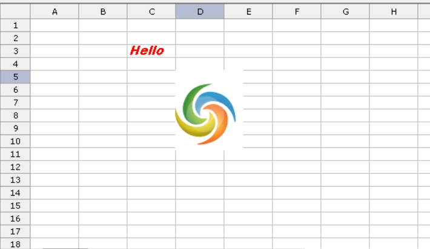

## **Possible Usage Scenarios**
GridDesktop provides different types of copy‑paste type options with Aspose.Cells.GridDesktop.GridDesktop.PasteType property. These options are specified with Aspose.Cells.GridDesktop.Data.GridPasteType enumeration. Some of these are as follows

- GridPasteType.All  

It copies and pastes everything from source cells to target cells.

- GridPasteType.Formulas  

It copies and pastes formulas from source cells to target cells.

- GridPasteType.Comments  

It copies and pastes comments from source cells to target cells.

- GridPasteType.RowHeights  

It copies and pastes row heights from source cells to target cells.

- GridPasteType.ColumnWidths  

It copies and pastes column widths from source cells to target cells.

etc.

## **Set EnableClipboardCopyPaste Property True To Enable PasteType Property**
Aspose.Cells.GridDesktop.GridDesktop.PasteType property works only if you set Aspose.Cells.GridDesktop.GridDesktop.EnableClipboardCopyPaste property to true, as shown in this screenshot.

## **Behavior Of EnableClipboardCopyPaste and PasteType Properties**
Given that EnableClipboardCopyPaste is false and PasteType is All, the following screenshot shows what happens when cell B3 is copied and pasted to cell C5.

Given that EnableClipboardCopyPaste is true and PasteType is All, after copying an image from Windows, the following screenshot shows that when cell B3 is copied and pasted to cell C5, the image is also copied to cell C5.

