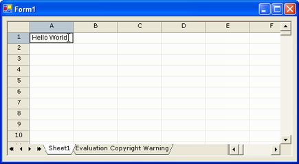

{} 

To make it easier for developers to upgrade, we maintain a document describing information critical to existing users, especially ones who have been using the older Aspose.Grid.Desktop and now need to upgrade to the new, or merged, Aspose.Cells.GridDesktop.

This topic provides a basic step‑by‑step guide for beginners to help them upgrade Aspose.Grid.Desktop to Aspose.Cells.GridDesktop Control and create and use the Aspose.Cells.GridDesktop control in Windows applications.

{} 
## **Upgrade from Aspose.Grid.Desktop to Aspose.Cells.GridDesktop Control**
Developers who worked with Aspose.Grid.Desktop might come across issues when using the new Aspose.Cells.GridDesktop after they upgrade to it. The following namespace has been renamed:

1. **Aspose.Grid.Desktop namespace has been renamed to Aspose.Cells.GridDesktop namespace.**
## **Creating & Using Aspose.Cells.GridDesktop Control**
### **Creating a Windows Application Project**
First of all, create a Windows application project in which to use the Aspose.Cells.GridDesktop control. Follow the following steps:

1. **Open the Visual Studio .NET IDE.**
2. **From the File menu, select New → Project.**
3. **Select Windows Application from the New Project dialog.**

After performing the above steps, a Windows application will be created with an empty form.
### **Adding GridDesktop Control to the Form**
Drag and drop the Aspose.Cells.GridDesktop control from the Toolbox to the form. After this, a control will appear on the form where you can perform several actions, such as **resizing**, **changing its properties**, **etc.**
### **Run the Application**
Finally, run the application by pressing **Ctrl+F5** or clicking the **Start** button. When the application runs, you will see a form containing an empty Aspose.Cells.GridDesktop control. Now you can add values to cells by clicking them. The following screenshot shows how your application will finally look.

It is not only possible to add values to the control, but also to perform other tasks, such as changing the height of a row or the width of a column, copying (Ctrl+C) or cutting (Ctrl+X) cell data to the clipboard, and pasting (Ctrl+V) data to a cell, etc. To perform more operations, right‑click the control to see its context menu. 

{} 

Aspose.Grid.Desktop has been renamed and become part of Aspose.Cells, so it is no longer possible to use older versions of Aspose.Grid.Desktop. To emphasize, there is not much work involved in upgrading to the latest version of the Aspose.Cells.GridDesktop component. There is no change in the API, as the classes with their members, structs, enumerations, etc., remain the same. The only change that has been made is to the control’s namespace.

{}
