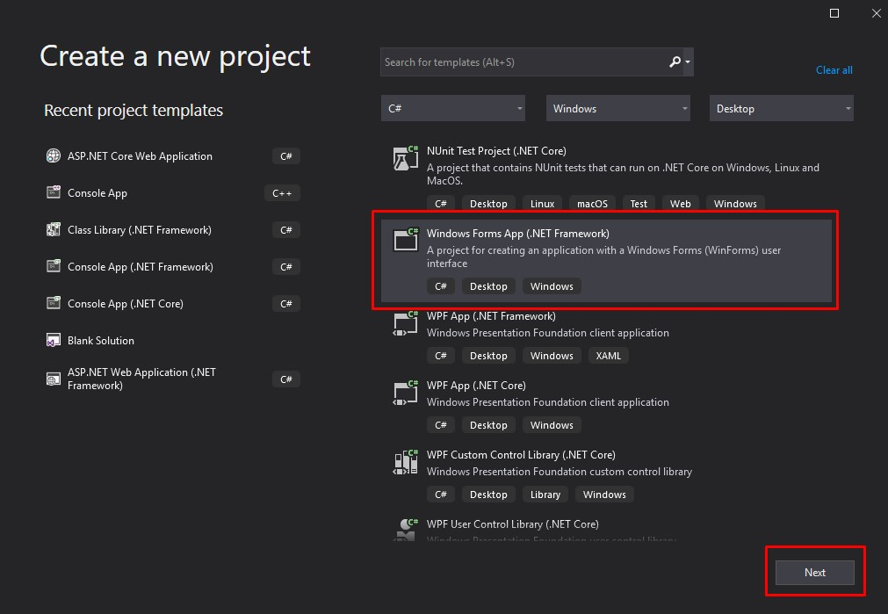
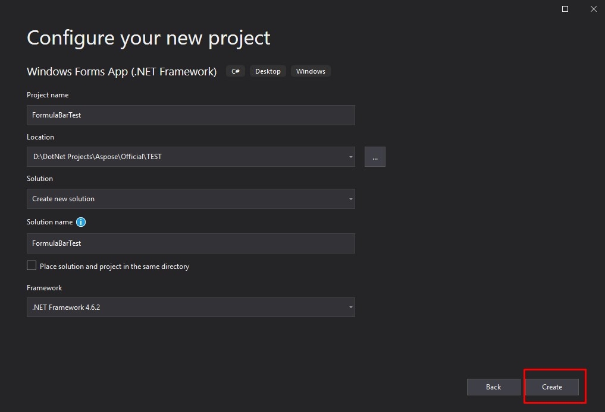
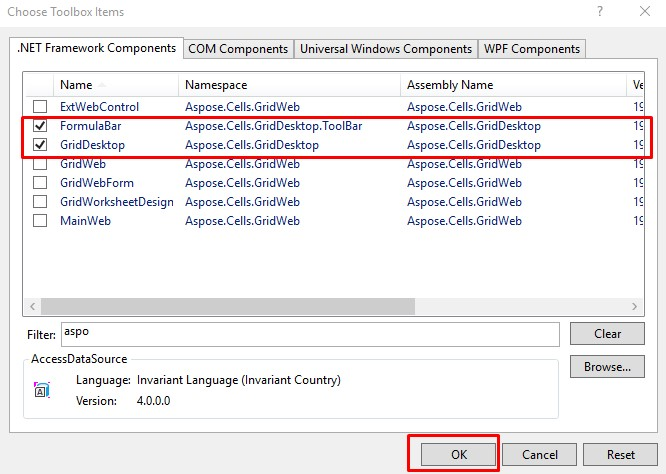
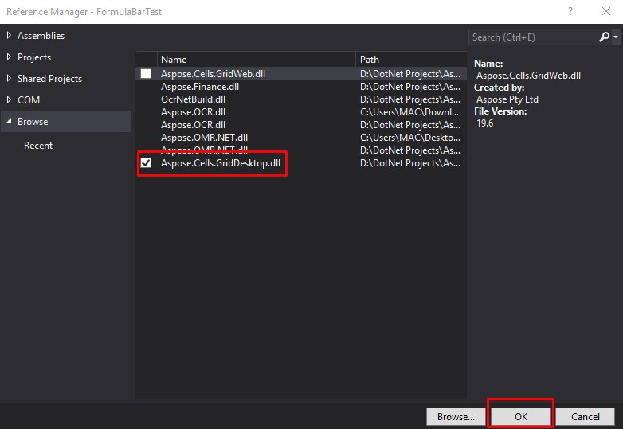
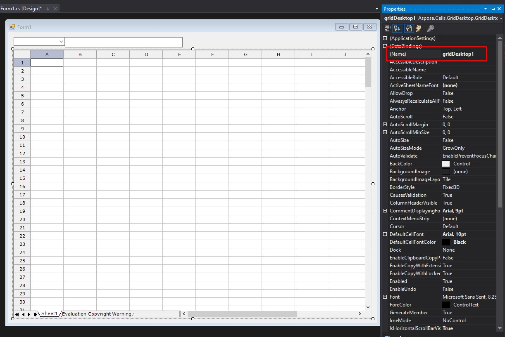
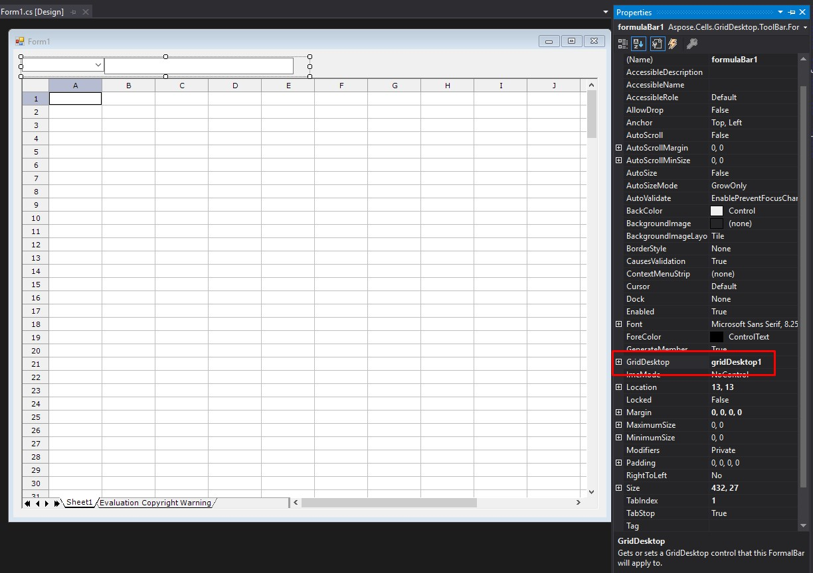
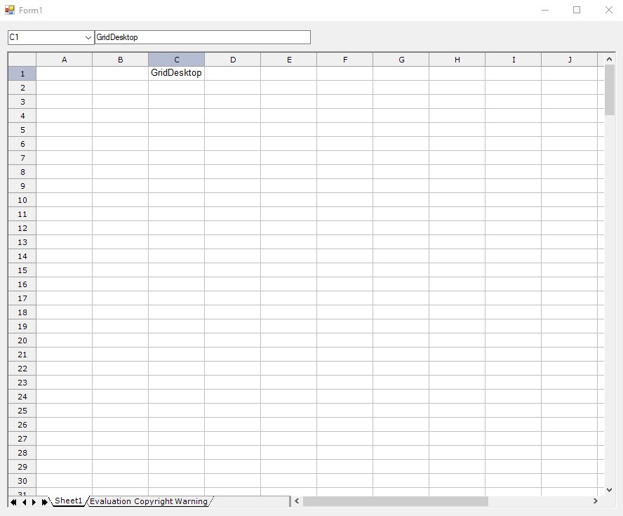

## **Using FormulaBar with Aspose.Cells.GridDesktop**
### **Step 1: Creating a New Project**
1. Open Visual Studio 2019.
1. From the **File** menu, select **New**, then **Project**.
   Create a new project dialog is opened.
1. Select **Windows Forms App(.NET Framework)** from Visual Studio installed project templates and click **Next**.

1. Specify a location where the location and the name of the project and click **Create**.

### **Step 2: Add controls to the toolbox**
1. Click on the **Toolbox**
1. Choose **Common Controls**, right-click, and select "**Choose Items...**" from the context menu.
1. In the **.NET Framework Components** tab of the **Choose Toolbox Items** window, scroll and select **GridDesktop** and **FormulaBar** components.

### **Step 3: Add controls to the form**
1. Drag GridDestop and FormulaBar controls to the form. This should add the reference to the Aspose.Cells.GridDesktop.dll in the project references. If the reference is not added, you may manually add the reference by right-clicking the references and selecting the "Add References" option. Browse to the location of the Aspose.Cells.GridDesktop.dll and add it.

1. Once the controls are added, set the name of the GridDesktop control in the properties tab.[this is required for linking the FormulaBar to the GridDesktop]

1. Link the FormulaBar to the GridDesktop control as shown in the following picture.

### **Step 4: Test the controls**
Run the application and test the controls. It will generate the output similar to the one shown in the following image. You can see in the output image that the FormulaBar and the GridDesktop are linked.

