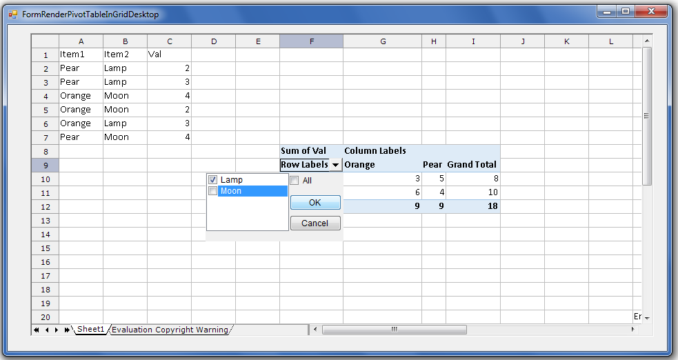

## **Possible Usage Scenarios**
If your Excel file has a Pivot Table, GridDesktop will be able to load and render the Pivot Table correctly. Besides, you will be able to interact **with** the Pivot Table in GUI and manipulate it.

## **Render PivotTable in GridDesktop**
The following sample code imports the [Sample Excel File containing the Pivot Table](48496686.xlsx). The screenshot shows the result of the execution of this sample code for a reference.

## **Sample Code**

